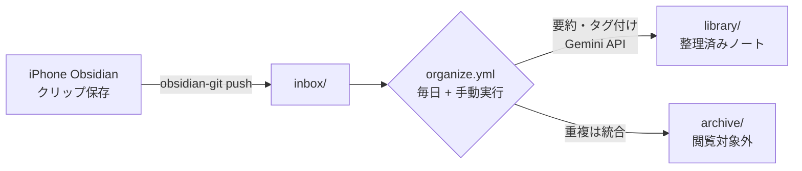

# tsundoku — 記事ストック自動整理Vault

iPhoneのObsidian(+ Obsidian Git)からクリップしたWeb記事・Xポストを、
GitHub Actions + Gemini API(無料枠)で毎日自動整理するObsidian Vaultです。

## 構成



| パス | 役割 |
|---|---|
| `inbox/` | クリップの着地点。ここに溜まったノートが整理対象 |
| `library/` | 整理済みノート。`YYYY-MM-DD-タイトル.md` に正規化され、frontmatter(url / created / type / tags / summary)付き |
| `archive/` | 重複などで不要になったノート。閲覧対象外 |
| `assets/` | ノートに紐づく画像・PDF・スライド実体の**作業ディレクトリ**(`.gitignore`対象)。このリポジトリはpublicなため、第三者コンテンツの実体はコミットせず、private側(tsundoku-siteの`vault-assets/`)に集約する。CI実行中のみ一時的にここへ同期される |
| `scripts/organize.py` | 整理スクリプト本体 |
| `scripts/media_types.py` | URL種別判定とメディア系コンテンツ取得(oEmbed / YouTube字幕 / PDF / スライドPDF・ページ画像) |
| `scripts/fetch_slides.py` | `type: slides`ノートのうちスライド実体(PDF+ページ画像)が未取得のものを取得・保存する独立スクリプト。既存ノートのバックフィルと取得失敗時のリカバリを兼ねる(冪等) |
| `scripts/llm_client.py` | LLM呼び出しモジュール(Gemini実装。将来Claude/OpenAIに差し替え可能) |
| `scripts/fm_edit.py` | frontmatterの単一フィールドを行レベルで編集するヘルパー(既存ノートへの安全なバックフィル用) |
| `scripts/build_embeddings.py` | `library/` 全ノートをチャンク化しGemini埋め込みを生成、`index/embeddings.json` へ出力(tsundoku-siteの `/api/ask` 用) |
| `scripts/detect_superseded.py` | 新規/更新ノートと類似度の高い既存ノートをLLMで突き合わせ、上書き/矛盾と判定されたノートに `status: superseded` を付与 |
| `scripts/backfill_shelf_life.py` | 既存ノートに情報の陳腐化目安(`shelf_life`)を一括分類してバックフィル |
| `scripts/merge_notes.py` | 短小ノート・高類似ノートの統合候補を検出(`suggest`、実行はしない)し、人間が承認した組だけを統合実行(`apply`)する。Actionsには組み込まずローカル手動実行専用(下記「運用」参照) |
| `scripts/seed_read_flags.py` | 既存ノートに `read: false` を一括シード(one-off) |
| `scripts/dispatch_site.sh` | tsundoku-siteへの再ビルド通知(`repository_dispatch`)を、前回送信時からVaultまたはembeddings.jsonに変更がある場合のみ送る(organize.yml / backfill.ymlの最終ステップから呼び出し) |
| `scripts/reverify.py` | `shelf_life`が経過したノートをGoogle Searchグラウンディングで再検証し、古い疑いがあれば`needs-recheck`タグを付与する(`status`は変更しない、人間レビュー前提)。手動実行専用(下記「運用」参照) |
| `.github/workflows/organize.yml` | 毎日(3:00 JST)+ 手動実行のワークフロー(整理 → 埋め込み生成 → superseded検知 → Release公開 → 変更があればサイト再ビルドをdispatch) |
| `.github/workflows/backfill.yml` | 手動実行専用。埋め込み/メタデータ/shelf_life/supersededの一括バックフィル |
| `.github/workflows/reverify.yml` | 手動実行専用。`scripts/reverify.py`によるノートの再検証 |
| `docs/future-reverification.md` | 定期再検証の設計と実装状況(実装済み。`scripts/reverify.py`参照) |

### クリップの形式

- 1行目: 元URL(bare URLでも `[タイトル](URL)` 形式でもよい)
- 空行を挟んで以降が本文
- x.com のURLだけで本文が空の場合、`publish.twitter.com/oembed`(認証不要)で本文取得を試みます
- 保存先フォルダ名は大文字小文字を区別しません(`Inbox/` でも `inbox/` と同様に処理対象になります)

### 整理処理の内容

1. `inbox/*.md`(+安全網としてルート直下のクリップ形式`.md`)を収集
2. URLから種別(`type`)を判定し、種別に応じてコンテンツを取得(下表参照)
3. Gemini APIで タイトル・3行要約・タグ(3〜5個)を生成
4. frontmatter(`url`, `created`, `type`, `tags`, `summary`)を付与
5. `library/` の既存ノートと突き合わせ、同一URLまたは内容が酷似する場合は統合
   (情報量の多い方を残し、他方のURLを `sources` に追記。重複側は `archive/` へ)
   ※ YouTubeは `youtu.be` / `watch?v=` / `shorts` の表記ゆれを同一URLとして扱います
6. `library/YYYY-MM-DD-タイトルスラッグ.md` へ移動

### frontmatter スキーマ

| フィールド | 内容 |
|---|---|
| `url` | 元URL(クリップ1行目から抽出) |
| `created` | クリップの作成日時(ファイル名 → git履歴 → mtime の順で解決) |
| `published_at` | 元コンテンツの発行日(ページ実測。JSON-LD/metaタグ/`<time>`の優先順で抽出、LLMには聞かない)。**3状態**: キー無し=未取得/到達不能(`backfill_published.py`が後日再試行)/ `''`=到達したが発行日なしと確定(再取得しない)/ `'YYYY-MM-DD'`(**必ずクォート付き** — 素の日付だとPyYAMLがdatetime化する)。`page_meta.sanitize_published`(収集日+2日以内・1995年以降)を通してから書く。tsundoku-site側は表示・期間フィルタ・ソートに使う(RAGの鮮度判定は従来どおり`created`) |
| `type` | URL種別。`video` / `slides` / `post` / `image` / `pdf` / `article` のいずれか |
| `tags` | LLM生成タグ(3〜5個)+ 必要に応じてシステムタグ(下記) |
| `summary` | 3行程度の要約 |
| `sources` | (統合時のみ)統合された他方のURL |
| `read` | 既読フラグ。tsundoku-siteからの書き戻しのみが変更する(新規作成時は常に`false`) |
| `shelf_life` | 情報が陳腐化するまでの目安。`short`(数日〜数週間)/ `medium`(数か月〜1年)/ `long`(長期間陳腐化しない)のいずれか |
| `status` | `superseded`(他ノートに内容が上書きされた)が付くことがある。`detect_superseded.py` が付与 |
| `superseded_by` | (`status: superseded`時のみ)上書きした新ノートの相対パス(`library/xxx.md`) |
| `last_verified` | 最後に`reverify.py`で再検証した日時(ISO8601、UTC offset付き)。未設定 = 一度も再検証されていない |
| `recheck_reason` | (`needs-recheck`タグ付与時のみ)`reverify.py`による判定理由(日本語1文) |

#### URL種別と処理内容

| `type` | 判定対象 | 処理 |
|---|---|---|
| `video` | youtube.com / youtu.be / vimeo.com / ニコニコ動画 | YouTubeはoEmbedでタイトル・チャンネル名を取得し、字幕(ja優先→en、自動生成可)をGeminiで要約。字幕が取れない場合はGeminiの動画URL直接入力にフォールバック。Vimeo・ニコ動はタイトル取得のみ+`needs-review` |
| `slides` | speakerdeck.com / slideshare.net / docswell.com | oEmbedでタイトル・作者を取得。SpeakerDeckはPDFを取得できればGeminiのPDF入力で要約(15MB上限)。加えて、ダウンロードできる場合はスライド実体(PDF原本+ページ画像)を取得しprivate側(tsundoku-siteの`vault-assets/`)へ保存する(詳細は下記「スライドセクション」参照)。SpeakerDeck/Docswellは元PDFをページ画像化、SlideShareはPDF非対応のためページ画像のみ。取得できなければ`needs-review` |
| `post` | x.com / twitter.com | oEmbedで本文取得。添付画像は本文中の `pbs.twimg.com` リンク(無ければ無認証のsyndication API)から実体を取得して `assets/` に保存し、Geminiの画像入力で「説明+文字の書き起こし(OCR)」を生成して本文の「## 画像の内容」セクションに残す(1枚5MB・1ノート4枚まで。動画は対象外) |
| `image` | 画像拡張子(.jpg/.png/.webp等)の直リンク | 画像実体を取得して `assets/` に保存し、Geminiで説明+OCRを生成。成功すれば `needs-review` は付かない |
| `pdf` | `.pdf` 直リンク | PDFを取得しGeminiのPDF入力で要約(15MB上限) |
| `article` | 上記以外 | 従来どおり(クリップ本文をGeminiで要約) |

#### システムタグ

- `needs-review`: コンテンツを自動取得できなかったノート。要約はタイトル・URLからの推測のみなので手動確認推奨。`type: slides`の場合を除き、**libraryに入った後に自動で再処理されることはありません**(`type: slides`は`fetch_slides.py`が日次で自動リトライします)
- `has-media`: 画像・動画添付があるノート。画像はノートから `` で参照されますが、実体はこのリポジトリにはコミットされず、private側(tsundoku-siteの`vault-assets/`)で管理されます(下記参照)。動画・PDFの実体は従来どおり非コミット(要約に使った一時データはワークフロー内で破棄)
- `needs-recheck`: `reverify.py`が「内容が古くなった/誤りの疑いがある」と判定したノート。`status`は変更されず、閲覧・検索からも除外されない。`recheck_reason`(判定理由)を確認し、人間が妥当と判断すれば`archive/`へ移動、誤判定なら`reverify.py --clear`でタグを解除する

#### 画像の内容セクション

添付画像を取得できたノートには、本文末尾に「## 画像の内容」セクションが付きます。
画像の埋め込みに続けて、Geminiが生成した「説明+画像内の文字の全文書き起こし」が入るため、
Obsidianの全文検索でスクリーンショットの中身までヒットするようになります
(同じテキストは要約・タグの生成にも反映されます)。
説明の生成に失敗した場合も画像自体は保存されます(セクションは埋め込みのみ)。

#### スライドセクション

`type: slides`ノートで、参照サイトからスライド実体をダウンロードできた場合、本文末尾に
「## スライド」セクションが付きます(PDFへのリンク + ページ画像の埋め込み)。
新規クリップ時(`organize.py`)は`media_types.py`が即座に取得を試み、失敗した場合や
既存ノートのバックフィルは`fetch_slides.py`が日次で自動リトライします
(`needs-review`が付いたままでも、次回実行時に自動で再挑戦されます)。

**バイナリ実体の保存場所について**: `assets/` はこのリポジトリでは`.gitignore`対象の
作業ディレクトリで、画像・PDF・スライドページ画像の実体はコミットされません。このリポジトリは
publicなため、第三者コンテンツ(クリップ元の画像・スライド)の再配布を避け、実体はすべて
private側の [`mrkxlia/tsundoku-site`](https://github.com/mrkxlia/tsundoku-site) リポジトリ
`vault-assets/` に集約しています。CI(`organize.yml` / `backfill.yml`)は実行中のみ
`vault-assets/` を `assets/` へ一時的に同期し、新規に書き出したファイルを同期し返します。
本文中の `../assets/...` 参照パス自体は従来どおりで、ローカルのObsidianからは解決できません
(手元で画像を見る場合は tsundoku-site リポジトリの `vault-assets/` を別途cloneしてください)。
ノートを手動削除しても対応する画像・スライド実体は自動削除されません。

※ YouTube字幕APIはGitHub ActionsのIPがブロックされることが多く、その場合はGeminiの
動画URL直接入力(無料枠は公開動画1日8時間まで)で要約します。それも失敗した場合は
タイトルのみ+`needs-review` になります。

### 埋め込み・鮮度管理・重複矛盾検知(tsundoku-site連携)

`organize.yml` は整理処理に続けて以下も実行し、tsundoku-siteの `/api/ask`(マルチモーダルRAG検索)
用のindexを更新します。

1. **埋め込み生成**(`build_embeddings.py`): `library/` を段落単位でチャンク化し、Gemini埋め込みで
   ベクトル化。文書側は `title: {title} | text: {text}` の接頭辞を付けて非対称検索の精度を確保。
   ノートごとのcontentHashで差分判定し、変更があったノートのみ再埋め込み(1回の実行では
   `MAX_EMBEDS_PER_RUN` 件まで、超過分は次回へ持ち越し)
2. **superseded検知**(`detect_superseded.py`): 今回新規/更新されたノートごとに、チャンク最大コサイン
   類似度0.80以上・自分より古い既存ノートの上位1〜2件をLLM(`judge_supersession`)で「内容を
   上書き/矛盾させるか」判定し、該当すれば旧ノートに `status: superseded` / `superseded_by` を付与
3. **メタデータ再同期**(`build_embeddings.py --metadata-only`): frontmatterの最新値(`status` /
   `shelf_life` 等)をindexへ反映
4. 上記で `library/` に変更があれば`main`へcommit・push → 生成物一式(`index/embeddings.json`)を
   GitHub Release `embeddings-index` へ `--clobber` アップロード(git管理外、iPhoneのObsidian Git
   同期には影響しない)→ `scripts/dispatch_site.sh` が「前回dispatch時からVaultのmain先頭SHA
   または `embeddings.json` のSHA-256に変更がある場合のみ」tsundoku-siteへ `repository_dispatch`
   で再ビルドを通知(状態は同じReleaseアセット `site-dispatch-state.json` に保存。
   変更なしの日は通知しない。dispatch失敗時は状態を更新しないため次回実行で必ず再送される)

`shelf_life` は新規ノート作成時に `generate_note_meta` の一部として同時取得されるため、追加の
API呼び出しは発生しません。既存ノートへのバックフィルは `backfill_shelf_life.py`(タイトル+要約の
みを渡す軽量な専用分類)を使います。

## セットアップ

### 1. Gemini APIキーの取得

1. [Google AI Studio](https://aistudio.google.com/) にGoogleアカウントでログイン
2. 「Get API key」→「APIキーを作成」でキーを発行(無料。クレジットカード不要)

### 2. GitHubへのSecrets登録

1. このリポジトリの **Settings → Secrets and variables → Actions** を開く
2. **New repository secret** で以下を登録
   - Name: `GEMINI_API_KEY`
   - Secret: 取得したAPIキー

スライド実体・画像アセットのprivate側(tsundoku-site)への書き戻しには別途
`SITE_CONTENT_TOKEN`(tsundoku-site Contents: Read and write権限のfine-grained PAT)の
登録が必要です。発行・登録手順は tsundoku-site リポジトリの `docs/setup.md`(Stage⑥)を
参照してください。

### 3. (任意)Variablesでの調整

同じ画面の **Variables** タブで登録すると挙動を変えられます(コード変更不要)。

| Variable | 既定値 | 説明 |
|---|---|---|
| `LLM_MODEL_CHAIN` | `gemini-3.7-flash,gemini-3.6-flash,gemini-3.5-flash-lite,gemma-4-26b-a4b-it` | 使用モデル(カンマ区切り)。先頭から試し、枠超過(429)時に次へフォールバック。AI Studioで使えるモデルを確認したらここを書き換えるだけで反映 |
| `LLM_LIGHT_MODEL_CHAIN` | `gemini-3.5-flash-lite,gemma-4-26b-a4b-it,gemini-3.6-flash` | 軽タスク(shelf_life分類・superseded/merge判定・クラスタラベル生成)専用チェーン。出力が短いタスクをflash-lite先頭で処理し、flash系のRPD(日次枠)をメタ生成に温存する。判定品質に問題が出たら`gemini-3.7-flash`先頭に設定するだけでロールバック可(ローカル実行の`merge_notes.py`にはVariablesは届かないため、必要ならローカルで環境変数を設定) |
| `GROUNDING_MODEL_CHAIN` | `gemini-2.5-flash` | `reverify.py`(グラウンディング)専用のモデルチェーン。グラウンディングの無料枠はモデル世代ごとに別枠で、`LLM_MODEL_CHAIN`の世代が使えていても枠0のことがある(下記「運用」参照)。`gemini-2.5-flash-lite`は新規アカウントでは廃止済み(404)のため含めていない。**注意**: RPD枯渇モデルのrun内スキップ(dead set)はモデル名単位のため、このチェーンと`LLM_MODEL_CHAIN`にモデルを重ねる構成にはしないこと(片方の枠枯渇が他方の生きた枠を誤スキップする) |
| `LLM_SLEEP_SECONDS` | `13` | API呼び出し間のスリープ秒数(無料枠のRPM対策。Flash系5RPMを想定) |
| `LLM_SLEEP_OVERRIDES` | `flash-lite=4,gemma=2` | モデル別スリープの上書き(モデル名のsubstring一致)。RPMはモデル別クォータのため、高RPMモデルまで13秒待つ必要はない。既定はflash-lite 15RPM→4秒、gemma 30RPM→2秒。テレメトリ(下記)に429(RPM)が出たら値を増やす。チェーン構成モデルのRPM実測とセットで見直すこと |
| `MAX_ITEMS_PER_RUN` | `20` | 1回の実行で処理する最大件数。超過分は次回実行へ持ち越し |
| `EMBEDDING_MODEL` | `gemini-embedding-2` | 埋め込みモデル名 |
| `EMBED_DIM` | `768` | 埋め込み次元数 |
| `EMBED_SLEEP_SECONDS` | `6` | 埋め込みAPI呼び出し間のスリープ秒数(生成系とは別枠)。[AI Studioのレート制限ページ](https://aistudio.google.com/rate-limit)で`EMBEDDING_MODEL`のembedContent無料枠RPMを確認し、RPM≥30なら`2`、RPM≥100なら`1`まで下げてよい(429が出れば戻す。リトライ+バックオフあり)。`LLM_SLEEP_SECONDS`(生成系)は無料枠5RPMの下限なので下げないこと |
| `MAX_EMBEDS_PER_RUN` | `20` | 1回の実行で新規に埋め込むノート数の上限。超過分は次回実行へ持ち越し |
| `MAX_SLIDES_PER_RUN` | `3` | `organize.yml`の日次実行1回あたりで`fetch_slides.py`が新規に取得するスライドノート数の上限。超過分は次回実行へ持ち越し |

### 4. iPhone(Obsidian)側の推奨設定

リポジトリ側からは `.obsidian/` に触らないため、端末側で設定してください。

- **設定 → ファイルとリンク → 新規ノートの作成場所** を `inbox` に
  (Obsidian Web Clipperを使う場合はClipper側の保存先も `inbox` に)
- **設定 → ファイルとリンク → 除外するファイル** に `archive/` を追加
  (検索・リンク候補から除外され、閲覧対象外になる)

※ 保存先がルートのままでも、安全網としてルート直下のクリップ形式ファイルは整理対象になります。

## 運用

- **自動実行**: 毎日 3:00 JST(18:00 UTC)に `main` ブランチで実行され、結果は直接コミットされます
- **手動実行**: GitHubの **Actions → Organize inbox → Run workflow**
- **バックフィル**: GitHubの **Actions → Backfill → Run workflow** で `task` を選択して手動実行
  (`embeddings`: 差分埋め込み / `metadata-only`: indexメタデータのみ再同期 / `shelf_life`: 既存ノートの
  鮮度分類バックフィル / `superseded`: 全ノートを対象にした重複矛盾の一括検知 / `slides`: 既存の
  `type: slides`ノートのうちスライド実体が未取得のものを取得。件数上限は`max_embeds`入力を流用)。
  いずれも `organize.yml` と同じ `concurrency` グループに参加するため、通常実行とは重なりません。
  複数バッチに分けて実行する場合、`dispatch_site` を途中バッチでは `false`、最終バッチでのみ
  `true`(既定)にすると、バッチごとにtsundoku-siteの再デプロイが走るのを防げます
  (途中バッチの変更は次に `dispatch_site=true` で実行した時にまとめて検知・通知されます)
- **並行実行防止**: `concurrency` 設定済み。実行が重なることはありません
- **関連ノートの統合**(`merge_notes.py`、ローカル手動実行専用):
  1. `gh release download embeddings-index --repo mrkxlia/tsundoku --pattern embeddings.json --dir index --clobber` で最新の埋め込みindexを取得
  2. `python scripts/merge_notes.py suggest` を実行。本文が薄い短小ノート(既定300字未満)の
     最近傍と、全ノート対の高類似ペア(既定0.85以上)を検出し、`index/embeddings.json`と同じ
     `index/`配下に `merge_plan.json`(git管理外)と人間可読レポートを出力する。**この時点では
     何も統合しない**
  3. レポートを確認し、統合してよい組だけ `merge_plan.json` の該当エントリを
     `"approved": true` に書き換える
  4. `python scripts/merge_notes.py apply` を実行。承認済みの組だけを統合し(情報量の多い側を
     残しファイル名は変更しない、統合される側は`archive/`へ)、変更を確認してからcommit・PRする
  5. index/サイトへの反映は次回の `organize.yml` 実行(または手動 `Backfill` の `embeddings`
     タスク)に任せる(このスクリプト自体はindexを更新しない)
- **古いノートの再検証**(`reverify.py`、`Actions → Reverify → Run workflow`):
  1. **グラウンディングの無料枠はモデル世代ごとに別枠**であり、通常の生成呼び出しが使えている
     モデルでも枠0のことがある。実行前に一度 [AI Studioのレート制限ページ](https://aistudio.google.com/rate-limit)
     で対象モデルの「検索によるグラウンディング」欄を確認すること(2026-08-18時点でこの
     アカウントはGemini 3系が枠0、Gemini 2.5系が有効だったため、`GROUNDING_MODEL_CHAIN`の
     既定値はGemini 2.5系にしてある)
  2. Google Searchグラウンディングの無料枠は変動しやすいため、**初回は`max_items`を10〜15
     程度に絞って**実行し、429の出方・所要時間を実測する
  3. 以後、無料枠に収まりそうであれば`max_items`を40〜50程度に広げ、対象がなくなるまで
     繰り返し実行する(`last_verified`から古い順に処理されるレジューム設計のため、同じ設定で
     連続実行すれば自然に全件を舐められる)
  4. 実行結果はcommitされ、`needs-recheck`タグ付きノートの一覧はジョブのartifact
     (`reverify_report.json`)とcommit差分の両方で確認できる
  5. `needs-recheck`が付いたノートをレビューし、妥当なら`archive/`へ手動移動(PR経由)、
     誤判定なら `python scripts/reverify.py --clear library/xxx.md` でタグを解除してcommit
  6. Gemini無料枠のTPM(トークン/分)超過を避けるため、`reverify.yml`は生成系より保守的な
     sleep(30秒)にしている。組織のアカウントで別の制限に当たった場合はワークフロー内の
     `LLM_SLEEP_SECONDS`/`GROUNDING_MODEL_CHAIN`の値を調整すること
- **費用**: Gemini無料枠のみを使用(¥0)。無料枠のレート制限
  (このアカウントの目安: Flash系 5RPM / Flash Lite系 15RPM / Gemma 4系 30RPM。
  [AI Studioのレート制限ページ](https://aistudio.google.com/rate-limit)で確認可)
  に収まるよう、呼び出し間スリープと処理件数上限を設けています。
  枠を使い切った場合はチェーン後段のモデルへ自動フォールバックし
  (429がRPD=日次枠の枯渇なら、そのrun中は当該モデルをスキップして待機を浪費しない)、
  それでも失敗したノートは `inbox/` に残って次回再試行されます。
  ※ RPM以外に1日あたりのリクエスト数(RPD)上限がある場合、backlogが多い日は
  上限に達することがあります。頻発する場合は `MAX_ITEMS_PER_RUN` を下げてください。
  なお画像付きノートは説明生成のためGemini呼び出しが1件につき1回追加されます
- **日次消費の目安(算術上限)**: `organize.yml` 1回のgenerate系呼び出しは最大
  「`MAX_ITEMS_PER_RUN`(20)×(メタ生成1+画像説明0〜1)+新規ノート数×2(superseded判定)」
  ≒ 通常日で数十回。embedContentは別枠で「新規/変更ノート×チャンク数(通常1〜3)」。
  AI StudioでRPD実測値を確認したら、この式と突き合わせて安全余裕を判断する
- **手動バッチの推奨実行窓(RPD対策)**: GeminiのRPD(日次枠)は**太平洋時間の深夜=
  日本時間16〜17時**にリセットされる。`reverify`や`Backfill`など消費の大きい手動実行は
  **朝6時〜16時JSTの間**に行うこと(当日3:00の日次organize・5:00の日次suggestは完了済みで、
  消費した枠は16〜17時に全リセットされ翌朝のorganizeへ持ち越さない)。長時間バッチは
  15時までに開始し16時のリセット境界をまたがない。逆に16時JST以降〜翌3時JSTの大量実行は、
  翌朝のorganize・suggestと同じPT日の枠を食い合うため避ける
- **月次チェックリスト(または429急増時)**: [AI Studioのレート制限ページ](https://aistudio.google.com/rate-limit)で
  各モデルのRPM/RPD/TPMと「検索によるグラウンディング」枠を確認し、変化があれば
  Variables(`LLM_MODEL_CHAIN`/`LLM_LIGHT_MODEL_CHAIN`/`GROUNDING_MODEL_CHAIN`/
  `LLM_SLEEP_OVERRIDES`/`LLM_SLEEP_SECONDS`)で調整する(コード変更不要)。
  確認結果はtsundoku-site側のチューニング台帳(`docs/tuning-2026-08.md`、未commit運用)に記録する

### ローカルでの動作確認

APIキーなしで動作確認できます(外部APIを呼ばずモックで処理)。

```bash
pip install -r requirements.txt
DRY_RUN=1 python scripts/organize.py
```

※ `DRY_RUN=1` でもファイルの移動・書き換えは実行されます(要約・タグはダミー)。
`inbox/`・`library/`を直接書き換えるため、動作確認は本リポジトリを`/tmp`等へコピーした
隔離環境で行い、実際の未処理クリップ・既存ノートには触れないでください。
`merge_notes.py apply`も同様にfrontmatter/本文を書き換えるため、隔離環境での検証を推奨します
(このリポジトリ自身に対しては`DRY_RUN=1`のまま`apply`しようとするとガードにより拒否されます)。

### トラブルシューティング

- **ノートが `inbox/` に残り続ける**: LLM呼び出しが失敗しています。Actionsのログを確認してください。頻発する場合は `LLM_MODEL_CHAIN` を見直すか `MAX_ITEMS_PER_RUN` を減らします
- **frontmatter付きのノートは処理されない**: 手書きノートを誤って書き換えないための仕様です。整理したい場合はfrontmatterを外してください
- **モデルが404/429になる**: 無料枠のモデル構成は変わることがあります。[AI Studio](https://aistudio.google.com/)で使えるモデルを確認し、`LLM_MODEL_CHAIN` を更新してください
- **テレメトリの読み方**: LLMを使う各ジョブのstep summary末尾に「LLM呼び出しテレメトリ」
  (モデル別の呼出/成功/429(RPM)/429(RPD)/429(不明)/5xx)が出ます
  (1ジョブ内で複数スクリプトが走る場合はステップごとに最大3表)。
  - **429(RPM)がflash-liteに出る** → `LLM_SLEEP_OVERRIDES`で`flash-lite=5`に増やす
  - **429(RPD)がflash系に出る** → 軽タスク振り分けが効いているか確認し、手動バッチの実行窓・件数を見直す
  - **チェーン2番目以降のモデルに呼出が立っている** → フォールバックが発生している
  - タイムアウトkill(SIGTERM)時は表が出ないため、ログ中の`[llm] ... HTTP 429(...)`行から復元する
- **軽チェーンの巻き戻しトリガー**: flash系の429(RPD)が数ヶ月0のまま、superseded/merge判定の
  誤判定を観測したら、`LLM_LIGHT_MODEL_CHAIN`を`gemini-3.7-flash`先頭に戻す(判定は
  reason付きでfrontmatterに残るため誤判定は後から発見できます)
- **クラスタラベルが「(先頭ノートのタイトル15字)」のまま**: ラベル生成の全モデルが
  失敗(RPD枯渇等)したrunの暫定ラベルです。`labelPending`フラグ付きで保存されるため、
  次回のsuggest実行(毎日5:00 JST。急ぐ場合は枠の回復後に **Actions → Suggest similar
  sites → Run workflow** を手動実行)で自動的に再生成されます(`recluster`は不要)
