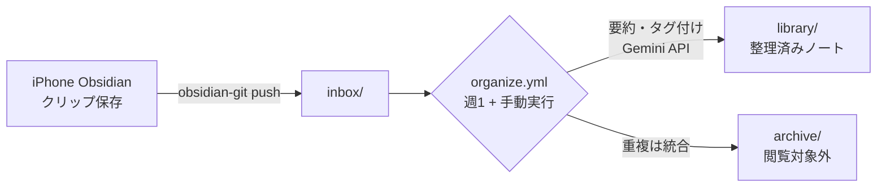

# tsundoku — 記事ストック自動整理Vault

iPhoneのObsidian(+ Obsidian Git)からクリップしたWeb記事・Xポストを、
GitHub Actions + Gemini API(無料枠)で週1回自動整理するObsidian Vaultです。

## 構成



| パス | 役割 |
|---|---|
| `inbox/` | クリップの着地点。ここに溜まったノートが整理対象 |
| `library/` | 整理済みノート。`YYYY-MM-DD-タイトル.md` に正規化され、frontmatter(url / created / tags / summary)付き |
| `archive/` | 重複などで不要になったノート。閲覧対象外 |
| `scripts/organize.py` | 整理スクリプト本体 |
| `scripts/llm_client.py` | LLM呼び出しモジュール(Gemini実装。将来Claude/OpenAIに差し替え可能) |
| `.github/workflows/organize.yml` | 週1(日曜3:00 JST)+ 手動実行のワークフロー |

### クリップの形式

- 1行目: 元URL(bare URLでも `[タイトル](URL)` 形式でもよい)
- 空行を挟んで以降が本文
- x.com のURLだけで本文が空の場合、`publish.twitter.com/oembed`(認証不要)で本文取得を試みます

### 整理処理の内容

1. `inbox/*.md`(+安全網としてルート直下のクリップ形式`.md`)を収集
2. Gemini APIで タイトル・3行要約・タグ(3〜5個)を生成
3. frontmatter(`url`, `created`, `tags`, `summary`)を付与
4. `library/` の既存ノートと突き合わせ、同一URLまたは内容が酷似する場合は統合
   (情報量の多い方を残し、他方のURLを `sources` に追記。重複側は `archive/` へ)
5. `library/YYYY-MM-DD-タイトルスラッグ.md` へ移動

## セットアップ

### 1. Gemini APIキーの取得

1. [Google AI Studio](https://aistudio.google.com/) にGoogleアカウントでログイン
2. 「Get API key」→「APIキーを作成」でキーを発行(無料。クレジットカード不要)

### 2. GitHubへのSecrets登録

1. このリポジトリの **Settings → Secrets and variables → Actions** を開く
2. **New repository secret** で以下を登録
   - Name: `GEMINI_API_KEY`
   - Secret: 取得したAPIキー

### 3. (任意)Variablesでの調整

同じ画面の **Variables** タブで登録すると挙動を変えられます(コード変更不要)。

| Variable | 既定値 | 説明 |
|---|---|---|
| `LLM_MODEL_CHAIN` | `gemini-3.6-flash,gemini-3.5-flash-lite,gemma-4-26b-a4b-it` | 使用モデル(カンマ区切り)。先頭から試し、枠超過(429)時に次へフォールバック。AI Studioで使えるモデルを確認したらここを書き換えるだけで反映 |
| `LLM_SLEEP_SECONDS` | `13` | API呼び出し間のスリープ秒数(無料枠のRPM対策。Flash系5RPMを想定) |
| `MAX_ITEMS_PER_RUN` | `20` | 1回の実行で処理する最大件数。超過分は次回実行へ持ち越し |

### 4. iPhone(Obsidian)側の推奨設定

リポジトリ側からは `.obsidian/` に触らないため、端末側で設定してください。

- **設定 → ファイルとリンク → 新規ノートの作成場所** を `inbox` に
  (Obsidian Web Clipperを使う場合はClipper側の保存先も `inbox` に)
- **設定 → ファイルとリンク → 除外するファイル** に `archive/` を追加
  (検索・リンク候補から除外され、閲覧対象外になる)

※ 保存先がルートのままでも、安全網としてルート直下のクリップ形式ファイルは整理対象になります。

## 運用

- **自動実行**: 毎週日曜 3:00 JST(土曜 18:00 UTC)に `main` ブランチで実行され、結果は直接コミットされます
- **手動実行**: GitHubの **Actions → Organize inbox → Run workflow**
- **並行実行防止**: `concurrency` 設定済み。実行が重なることはありません
- **費用**: Gemini無料枠のみを使用(¥0)。無料枠のレート制限
  (このアカウントの目安: Flash系 5RPM / Flash Lite系 15RPM / Gemma 4系 30RPM。
  [AI Studioのレート制限ページ](https://aistudio.google.com/rate-limit)で確認可)
  に収まるよう、呼び出し間スリープと処理件数上限を設けています。
  枠を使い切った場合はチェーン後段のモデルへ自動フォールバックし、
  それでも失敗したノートは `inbox/` に残って次回再試行されます

### ローカルでの動作確認

APIキーなしで動作確認できます(外部APIを呼ばずモックで処理)。

```bash
pip install pyyaml
DRY_RUN=1 python scripts/organize.py
```

※ `DRY_RUN=1` でもファイルの移動・書き換えは実行されます(要約・タグはダミー)。

### トラブルシューティング

- **ノートが `inbox/` に残り続ける**: LLM呼び出しが失敗しています。Actionsのログを確認してください。頻発する場合は `LLM_MODEL_CHAIN` を見直すか `MAX_ITEMS_PER_RUN` を減らします
- **frontmatter付きのノートは処理されない**: 手書きノートを誤って書き換えないための仕様です。整理したい場合はfrontmatterを外してください
- **モデルが404/429になる**: 無料枠のモデル構成は変わることがあります。[AI Studio](https://aistudio.google.com/)で使えるモデルを確認し、`LLM_MODEL_CHAIN` を更新してください
