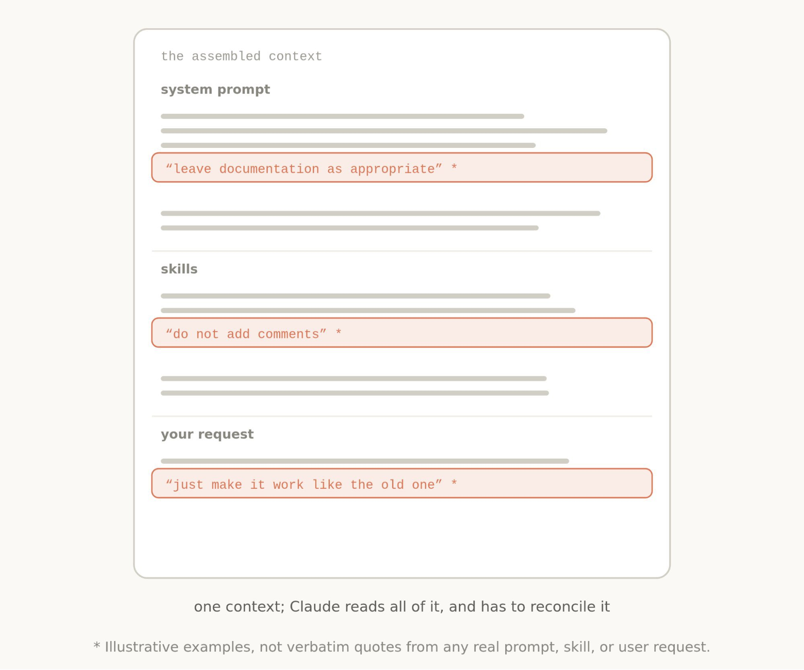
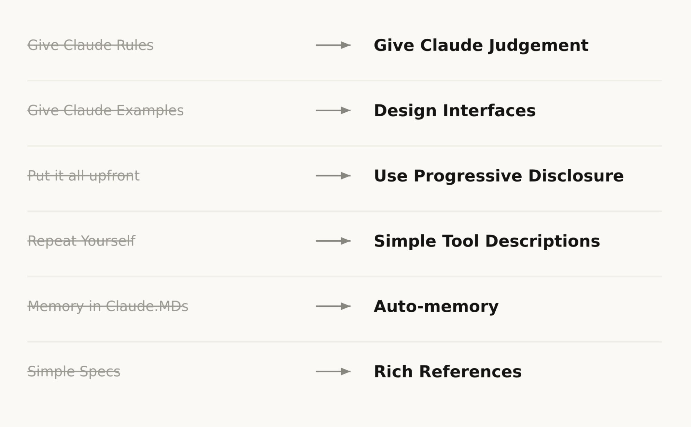
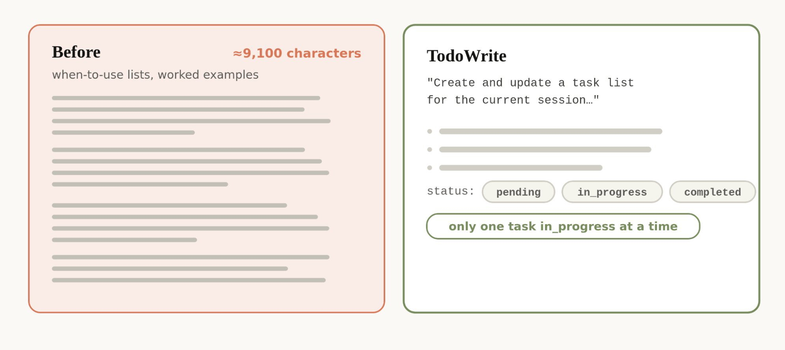
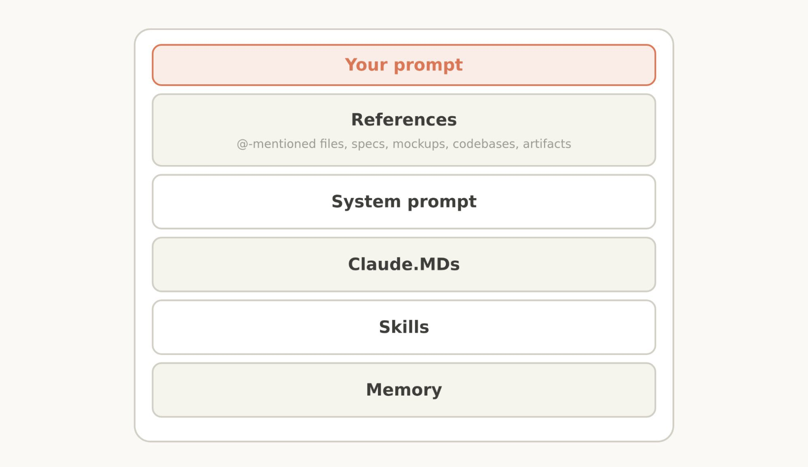

# Post by @oikon48 on X
2026-08-11
【Claude 5世代モデル向けコンテキストエンジニアリングの新しいルール】

Claude 5世代（Opus 5 / Fable 5など）では、過度な制約を大幅に減らすことが効果的。

以前: 細かいルールをたくさん与える  
↓  
今: Claudeの判断力に任せる

以前: ツールの使い方を例で詳しく示す  
↓  
今: インターフェースをうまく設計する

以前: すべての情報を最初に載せる  
↓  
今:段階的開示（progressive disclosure） を使う

以前: 同じ指示を何度も繰り返す  
↓  
今:ツール説明をシンプルにする

以前: CLAUDE.mdに手動でメモリを書く  
↓  
今: Auto memoryに任せる

以前: シンプルなマークダウンを使う  
↓  
今:リッチな参照（HTMLアーティファクト、コード、ルーブリックなど）を使う

実践的なポイント:

・システムプロンプト: モデルがどの製品で動作し、何をしているかを伝える。Claude Code以外の独自のエージェントハーネスを構築する場合は、ここに多くの時間を費やすべき

・CLAUDE.md: 短く保ち、リポジトリの「落とし穴」だけを書く。当たり前のことは書かない

・Skills: 軽量なガイドとして設計し、長くなったらファイルを分割して段階的に読み込ませる

・参照: コードやHTMLモックアップなど、Claudeが直接理解しやすい形で渡すのが良い。コンフリクトする指示（「コメントを書け」と「コメントを書くな」など）を減らすと、Claudeが余計な思考をしなくて済む

   

## 画像の内容

### 画像1
システムプロンプトやスキル、ユーザーリクエストが1つのコンテキストとしてClaudeに読み込まれる仕組みを図解した画像です。下部には、Claudeがこれらすべてを読み込んで調整する必要がある旨や、イラストの例である注記が記載されています。
the assembled context
system prompt
"leave documentation as appropriate" *
skills
"do not add comments" *
your request
"just make it work like the old one" *
one context; Claude reads all of it, and has to reconcile it
* Illustrative examples, not verbatim quotes from any real prompt, skill, or user request.

### 画像2
Claudeへの指示の与え方や設計の変更点を対比して示すリストの画像です。左側の古いアプローチから右側の新しいアプローチへの移行が矢印で表されています。
Give Claude Rules ⟶ Give Claude Judgement
Give Claude Examples ⟶ Design Interfaces
Put it all upfront ⟶ Use Progressive Disclosure
Repeat Yourself ⟶ Simple Tool Descriptions
Memory in Claude.MDs ⟶ Auto-memory
Simple Specs ⟶ Rich References

### 画像3
約9,100文字におよぶ長文の「Before」と、シンプルな構成の「TodoWrite」を比較した画像です。TodoWriteではセッション用のタスクリスト作成やステータス管理機能が示されています。
Before ≈9,100 characters
when-to-use lists, worked examples
TodoWrite
"Create and update a task list for the current session..."
status: pending in_progress completed
only one task in_progress at a time

### 画像4
プロンプトや各種設定・参照情報が階層的に整理された構成を示す画像です。最上部の「Your prompt」から、参照情報、システムプロンプト、Claude.MDs、スキル、メモリへと順に並んでいます。
Your prompt
References
@-mentioned files, specs, mockups, codebases, artifacts
System prompt
Claude.MDs
Skills
Memory
