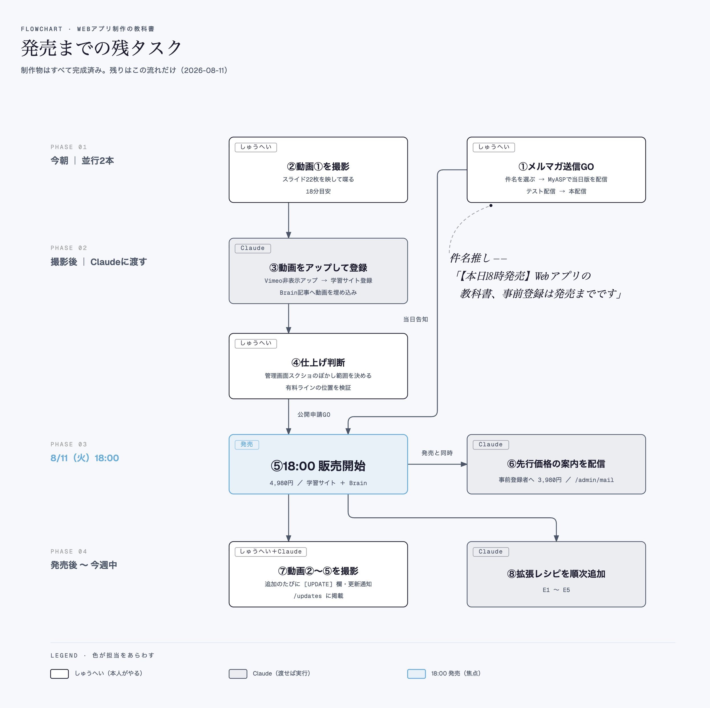

# Post by @shupeiman on X
2026-08-11
このGithub神すぎました！Claude Codeにリンクそのまま渡して、フロー図解スキルとして登録。開発状況とかTODOまで、Claudeが図解にしてくれるので仕事が捗ります！何やってるかぐちゃぐちゃになる人はぜひ使ってみて！ https://t.co/WiABlk1cfA

## 画像の内容

### 画像1
Webアプリ制作の教科書の発売に向けた残タスクをフェーズごとに整理したフローチャート。担当者ごとにタスクや作業内容が詳細に記述されています。

FLOWCHART ・ WEBアプリ制作の教科書
発売までの残タスク
制作物はすべて完成済み。残りはこの流れだけ（2026-08-11）

PHASE 01
今朝 ｜ 並行2本

PHASE 02
撮影後 ｜ Claudeに渡す

PHASE 03
8/11（火）18:00

PHASE 04
発売後 〜 今週中

【タスク内容の書き起こし】
・しゅうへい
②動画①を撮影
スライド22枚を映して喋る
18分目安

・Claude
③動画をアップして登録
Vimeo非表示アップ → 学習サイト登録
Brain記事へ動画を埋め込み

・しゅうへい
④仕上げ判断
管理画面スクショのぼかし範囲を決める
有料ラインの位置を検証

・発売
⑤18:00 販売開始
4,980円 ／ 学習サイト ＋ Brain

・しゅうへい＋Claude
⑦動画②〜⑤を撮影
追加のたびに[UPDATE]欄・更新通知
/updates に掲載

・しゅうへい
①メルマガ送信GO
件名を選ぶ → MyASPで当日版を配信
テスト配信 → 本配信

件名推し ——
「【本日18時発売】Web アプリの
教科書、事前登録は発売までです」

（当日告知）

・Claude
⑥先行価格の案内を配信
事前登録者へ 3,980円 / /admin/mail

（発売と同時）

・Claude
⑧拡張レシピを順次追加
E1 〜 E5

LEGEND ・ 色が担当をあらわす
□ しゅうへい（本人がやる）
□ Claude（渡せば実行）
□ 18:00 発売（焦点）
