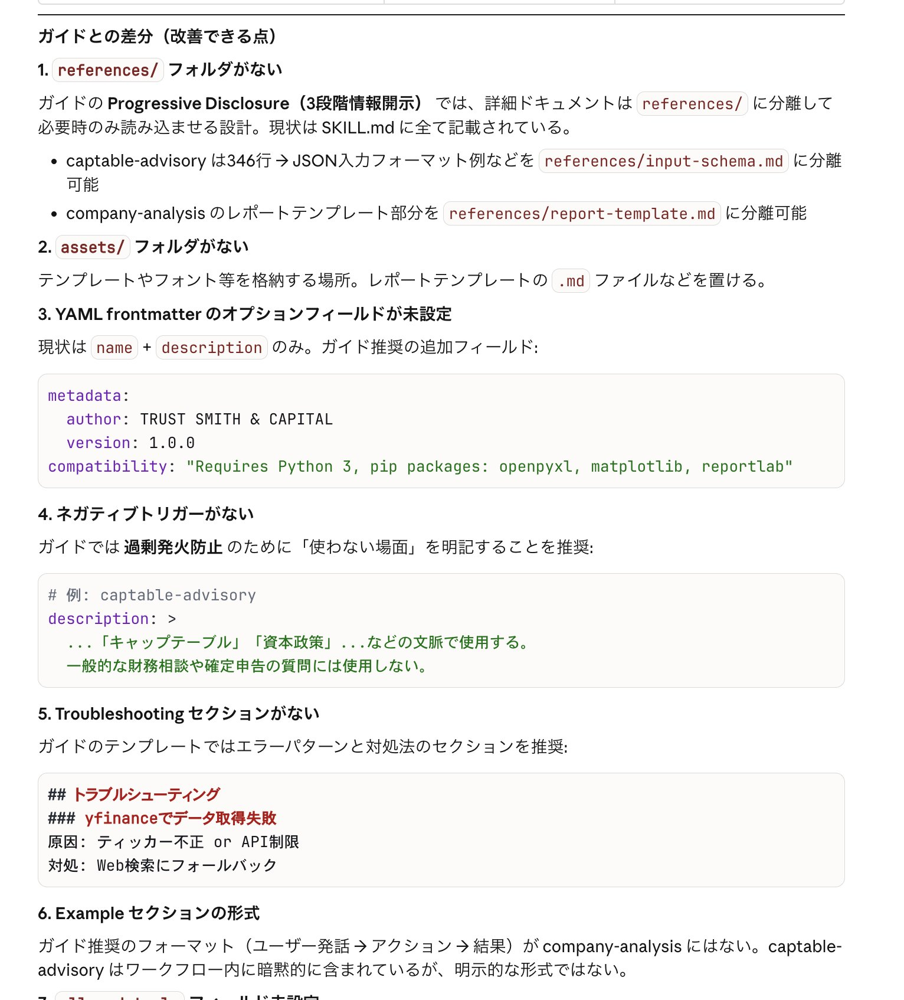
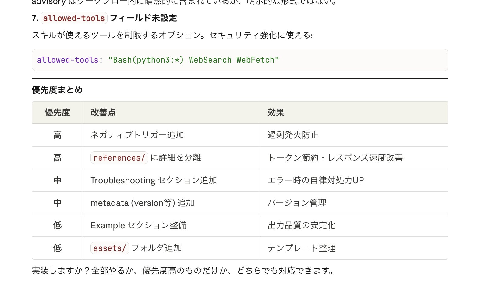

# Post by @shocolt on X
2026-08-11
「Anthropic公式が出してるガイドの内容と、自分の今のAIエージェントとの差分をAIに聞いて、構成に差分があれば組み込んで欲しい！」と伝えたら、

「references/」 フォルダを新たに作成し、SKILL.mdとの分離をすることで、トークン節約・レスポンス速度を改善したり、

「Troubleshooting セクション」を追加することで、エラー時の自律対処力をUPしてくれた。

SKILL.mdのトークン節約については、

①必要な情報を  
②必要なタイミングで  
③必要な分だけ読み込む」

という仕組み(Progressive Disclosure)を最適化するだけで、

SKILL.md のトークン消費量が、約40-45%削減されたとのこと！

これは、全員絶対やるべき！！！

The Complete Guide to Building Skills for Claude  
[https://t.co/aJlE5rjfLV](https://t.co/aJlE5rjfLV)

 

## 画像の内容

### 画像1
ガイドとの差分や改善できる点として、references/フォルダやassets/フォルダの欠如、YAML frontmatterのオプションフィールド未設定などがリスト形式で解説されています。

ガイドとの差分（改善できる点）
1. references/ フォルダがない
ガイドの Progressive Disclosure（3段階情報開示）では、詳細ドキュメントは references/ に分離して必要時のみ読み込ませる設計。現状は SKILL.md に全て記載されている。
- captable-advisor は346行 → JSON入力フォーマット例などを references/input-schema.md に分離可能
- company-analysis のレポートテンプレート部分を references/report-template.md に分離可能
2. assets/ フォルダがない
テンプレートやフォント等を格納する場所。レポートテンプレートの .md ファイルなどを置ける。
3. YAML frontmatter のオプションフィールドが未設定
現状は name + description のみ。ガイド推奨の追加フィールド：

metadata:
  author: TRUST SMITH & CAPITAL
  version: 1.0.0
  compatibility: "Requires Python 3, pip packages: openpyxl, matplotlib, reportlab"

4. ネガティブトリガーがない
ガイドでは過剰発火防止のために「使わない場面」を明記することを推奨：

# 例: captable-advisor
description: >
  ...「キャップテーブル」「資本政策」...などの文脈で使用する。
  一般的な財務相談や確定申告の質問には使用しない。

5. Troubleshooting セクションがない
ガイドのテンプレートではエラーパターンと対処法のセクションを推奨：

## トラブルシューティング
### yfinanceでデータ取得失敗
原因：ティッカー不正 or API制限
対処：Web検索にフォールバック

6. Example セクションの形式
ガイド推奨のフォーマット（ユーザー発話→アクション→結果）が company-analysis にはない。captable-advisor はワークフロー内に暗黙的に含まれているが、明示的な形式ではない。

### 画像2
スキル設定の続きとして「allowed-tools」フィールドの未設定についての解説があり、その後ろに優先度（高・中・低）ごとの改善点と効果をまとめた表が掲載されています。

7. allowed-tools フィールド未設定
スキルが使えるツールを制限するオプション。セキュリティ強化に使える：

allowed-tools: "Bash(python3:*) WebSearch WebFetch"

優先度まとめ

| 優先度 | 改善点 | 効果 |
|---|---|---|
| 高 | ネガティブトリガー追加 | 過剰発火防止 |
| 高 | references/ に詳細を分離 | トークン節約・レスポンス速度改善 |
| 中 | Troubleshooting セクション追加 | エラー時の自律対処力UP |
| 中 | metadata (version等) 追加 | バージョン管理 |
| 低 | Example セクション整備 | 出力品質の安定化 |
| 低 | assets/ フォルダ追加 | テンプレート整理 |

実装しますか？全部やるか、優先度高のものだけか、どちらでも対応できます。
