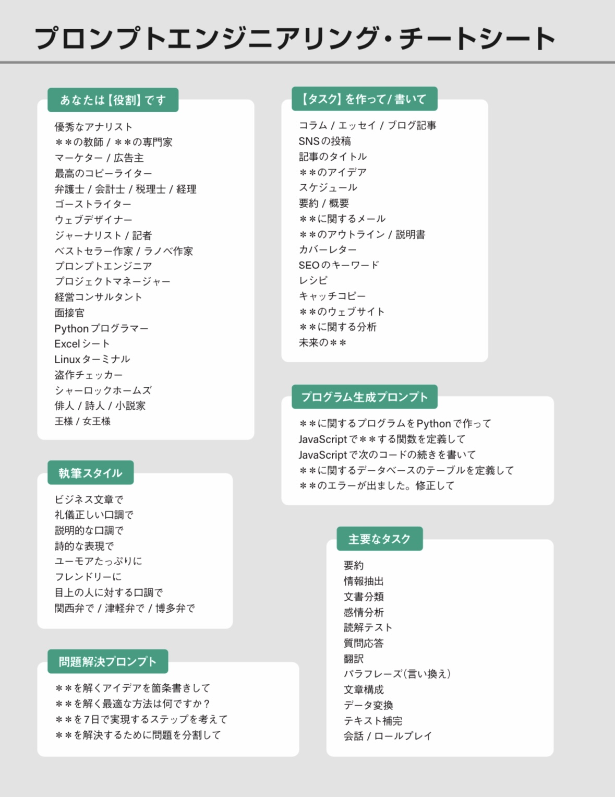
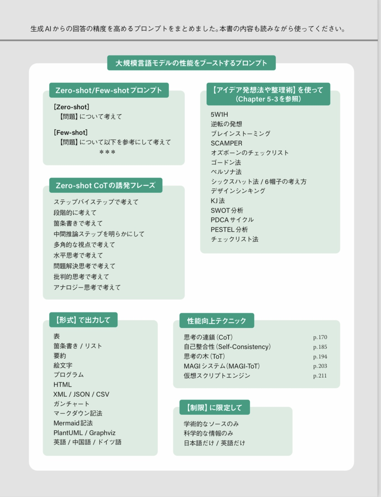

# Post by @chatgptair on X
2026-08-11
マイナビが公開したAIへの指示の仕方まとめ： https://t.co/u42jtC6Arj

 

## 画像の内容

### 画像1
プロンプトエンジニアリングのチートシートをまとめた表形式の画像です。役割、タスク、執筆スタイル、プログラム生成、問題解決、主要なタスクの分類ごとに具体的なフレーズや項目が記載されています。

プロンプトエンジニアリング・チートシート

あなたは【役割】です
優秀なアナリスト
＊＊の教師／＊＊の専門家
マーケター／広告主
最高のコピーライター
弁護士／会計士／税理士／経理
ゴーストライター
ウェブデザイナー
ジャーナリスト／記者
ベストセラー作家／ラノベ作家
プロンプトエンジニア
プロジェクトマネージャー
経営コンサルタント
面接官
Python プログラマー
Excelシート
Linuxターミナル
盗作チェッカー
シャーロックホームズ
俳人／詩人／小説家
王様／女王様

【タスク】を作って／書いて
コラム／エッセイ／ブログ記事
SNSの投稿
記事のタイトル
＊＊のアイデア
スケジュール
要約／概要
＊＊に関するメール
＊＊のアウトライン／説明書
カバーレター
SEOのキーワード
レシピ
キャッチコピー
＊＊のウェブサイト
＊＊に関する分析
未来の＊＊

プログラム生成プロンプト
＊＊に関するプログラムをPythonで作って
JavaScriptで＊＊する関数を定義して
JavaScriptで次のコードの続きを書いて
＊＊に関するデータベースのテーブルを定義して
＊＊のエラーが出ました。修正して

執筆スタイル
ビジネス文章で
礼儀正しい口調で
説明的な口調で
詩的な表現で
ユーモアたっぷりに
フレンドリーに
目上の人に対する口調で
関西弁で／津軽弁で／博多弁で

問題解決プロンプト
＊＊を解くアイデアを箇条書きして
＊＊を解く最適な方法は何ですか？
＊＊を7日で実現するステップを考えて
＊＊を解決するために問題を分割して

主要なタスク
要約
情報抽出
文書分類
感情分析
読解テスト
質問応答
翻訳
パラフレーズ(言い換え)
文章構成
データ変換
テキスト補完
会話／ロールプレイ

### 画像2
生成AIからの回答の精度を高めるためのプロンプトやテクニックをまとめたチートシートの画像です。

生成AIからの回答の精度を高めるプロンプトをまとめました。本書の内容も読みながら使ってください。

大規模言語モデルの性能をブーストするプロンプト

Zero-shot/Few-shotプロンプト
[Zero-shot]
【問題】について考えて

[Few-shot]
【問題】について以下を参考にして考えて
＊＊＊

Zero-shot CoTの誘発フレーズ
ステップバイステップで考えて
段階的に考えて
箇条書きで考えて
中間推論ステップを明らかにして
多角的な視点で考えて
水平思考で考えて
問題解決思考で考えて
批判的思考で考えて
アナロジー思考で考えて

【アイデア発想法や整理術】を使って（Chapter 5-3 を参照）
5W1H
逆転の発想
ブレインストーミング
SCAMPER
オズボーンのチェックリスト
ゴードン法
ペルソナ法
シックスハット法／6帽子の考え方
デザインシンキング
KJ法
SWOT分析
PDCAサイクル
PESTEL分析
チェックリスト法

【形式】で出力して
表
箇条書き／リスト
要約
絵文字
プログラム
HTML
XML / JSON / CSV
ガンチャート
マークダウン記法
Mermaid記法
PlantUML / Graphviz
英語／中国語／ドイツ語

性能向上テクニック
思考の連鎖 (CoT) p.170
自己整合性 (Self-Consistency) p.185
思考の木 (ToT) p.194
MAGIシステム (MAGI-ToT) p.203
仮想スクリプトエンジン p.211

【制限】に限定して
学術的なソースのみ
科学的な情報のみ
日本語だけ／英語だけ
