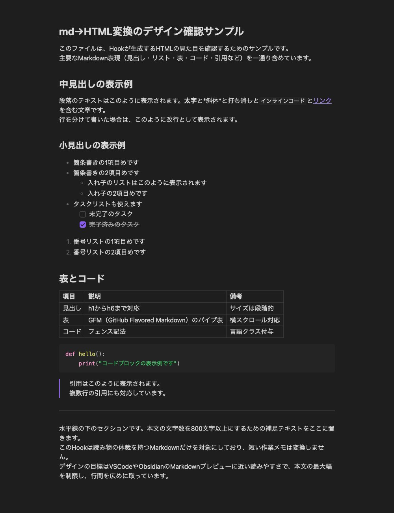

# 認知負荷を下げるための工夫。ノーコストでmd⇨HTML変換
2026-08-12


## はじめに

AIエージェントが作ったmdファイル、表や画像が入ってくると読みにくくて、結局「HTMLにして」と頼み直したりすることはありませんか。 私も少し前まで、読みたい文書が出てくるたびに同じお願いをしていました。

この記事では、mdファイルを保存した瞬間に、同じフォルダへ読みやすいHTMLが自動生成される仕組みを紹介します。 仕組みといっても、AIツールのHookという機能へ変換スクリプトを1本登録するだけです。 そして記事の後半に、このHookをあなたのAIエージェント自身に作らせるプロンプトを記載しています。 Claude CodeやCodex、Cursorを使っている人なら、貼り付けて実行するだけで自分の環境に同じものを作れます。

## 毎回「HTMLにして」と頼んでいた

AIエージェントに調査レポートや提案書の下書きを作らせると、成果物はたいていmdで出てきます。 短いメモならそのまま読めるので、困りません。 ただ、表が横に伸びたり、画像やコードが混ざったりした長い文書になると、mdのままでは急に読みにくくなります。

そこで「これHTMLにして」と頼むと読みやすくはなるものの、同じ本文をもう一度出力させるので、その分のトークンと待ち時間が掛かります。 かといって頼まずにmdのまま我慢して読むと、今度は内容が頭に入ってきません。 読みたい文書が出てくるたびに、「頼むか、我慢するか」と頭を悩ませていました。

## 保存したら勝手にHTMLになる、を作った

今の私の環境では、AIエージェントがmdファイルを保存すると、同じフォルダへ同名のHTMLが自動で生成されます。 その間、私は何も頼んでいませんし、AIも変換作業をしていません。 ファイルをダブルクリックすると、ダークモードの読み物レイアウトで文書が開きます。

次の画像が、実際にHookが変換したHTMLです。 見出し・リスト・タスクリスト・表・コードブロック・引用を含むサンプルmdを保存すると、この見た目のHTMLが同じフォルダにできあがります。


Hookが自動生成したHTML（ダークモード表示）

効果は2つありました。

1つ目はコストで、変換はローカルのスクリプトが行うため、AIの利用料が一切掛かりません。 HTML化のためのやりとりが消えたので、チャットの往復も減りました。

2つ目は認知負荷で、頼むか我慢するかを迷うまでもなく、意識せずにHTMLを読むようになりました。

1回ごとの節約は小さくても、毎日何十回とmdを読む生活では、この差が積み重なります。

## 仕組みはPostToolUse Hookにスクリプト1本

この変換に使っているのは、AIコーディングツールのHookという機能です。 Hookは、エージェントの動作の前後に自分のスクリプトを差し込む仕組みで、その中のPostToolUseは「ツールの実行直後」に走ります。 つまり、エージェントがWriteやEditでファイルを書き込んだ直後に、毎回スクリプトを呼べます。

そこへ「書き込まれたファイルがmdなら、同名のHTMLを作る」というPythonスクリプトを登録しました。 Hookへスクリプトを一つ登録するだけです。 変換スクリプトはPythonの標準ライブラリだけで動くので、外部パッケージのインストールも要りません。

私はClaude CodeのPostToolUseで動かし始めましたが、同様の方法を他のツールへ流用することも可能です。 たとえばCursorにもpostToolUseというHookがあり、私は同じスクリプトをそのまま登録して動かしています。 Codexには同じ形のHookがないため、私はイベント通知を受けて同じスクリプトを呼ぶ仕組みを別途作りました。 これから試すなら、まずClaude CodeかCursorから始めるのが簡単です。

## 発動条件とデザインについて

すべてのmdを変換すると、作業メモや設定ファイルまでHTMLになってフォルダが散らかります。 そこで私は、「読み物の体裁を持つmdだけ」を変換するよう条件を絞っています。

- 本文の最初の行が「# 見出し」で始まるか、front matterに「title:」がある
- 本文が800文字以上あるか、画像参照「!\[」を含む
- 設定フォルダやnode\_modulesなど、読み物を置かないフォルダの配下でない

この条件は私の運用に合わせた一例なので、正解ではありません。 たとえば「特定のフォルダ配下だけ変換する」「文字数の下限を変える」のように、自分の使い方へ寄せてください。

デザインも同じく私の好みです。 私はObsidianというメモアプリの画面に慣れているので、その標準テーマの配色や余白をCSSへ写しました。 さらに設定ファイルのキー1つで、ダークとライトを切り替えられるようにしています。 ここもGitHub風の見た目でも、社内標準のデザインでもかまいません。 大事なのは「mdの保存を合図に、ローカルのスクリプトが自動で変換する」という骨組みの方です。

## あなたのAIエージェントにこのHookを作らせるプロンプト

ここまでの仕組みは、手動で設定せずにAIエージェントへ作ってもらいましょう。 下のプロンプトをClaude CodeやCodex、Cursorへそのまま貼ると、環境の調査から登録、動作確認までを一気にやってくれます。

```
「Markdownファイルを保存したら自動でHTMLに変換されるHook」をこの環境に作ってください。

## 目的
- AIが作成したmdファイルを、人がすぐ読める見た目のHTMLで開けるようにします
- 変換にAIを使わず、ローカルのスクリプトだけで完結させます（利用料と待ち時間を増やさないため）

## 作るもの
1. md→HTML変換スクリプト（Python3の標準ライブラリのみで書き、外部パッケージを入れない）
2. あなた自身が動いているツールのHook設定への登録

## 変換スクリプトの要件
- ファイル書き込み系ツール（Write / Editなど）の実行直後に呼ばれ、標準入力のJSONから対象ファイルのパスを読み取ります
- 次のすべてを満たすときだけ変換します（条件は後から変えやすいように、スクリプト冒頭の定数にまとめてください）
  - 拡張子が .md である
  - .gitやnode_modules、ツールの設定フォルダなど、読み物を置かないフォルダの配下でない
  - front matterを除いた本文の最初の行が「# 見出し」であるか、front matterに「title:」がある
  - 本文が800文字以上あるか、画像参照「![」を含む
- 同じフォルダへ同名の .html を生成し、保存のたびに上書きします
- CSSはHTMLへインラインで埋め込み、1ファイルだけで開けるようにします
- ローカル画像はbase64でHTML内へ埋め込みます
- 見出し、段落、リスト、タスクリスト、表、コードブロック、引用、リンク、画像、太字・斜体・インラインコードへ対応します
- デザインは本文の最大幅700px前後の読み物レイアウトにし、ライト・ダークはブラウザ設定（prefers-color-scheme）に追従させます
- どんな例外が起きても終了コード0で終わり、エージェント本体の作業を止めません
- チャットへの通知やメッセージは出しません

## 登録の要件
- あなたが動いているツール（Claude Code / Codex / Cursorなど）のHookや、それに相当する仕組みの公式な設定方法を調べ、ファイル書き込み直後のイベントへ登録してください
- 既存のHook設定は変更せず、追記だけを行ってください

## 動作確認
- 見出し・表・コードブロック・タスクリストを含む1000文字程度のサンプルmdを作って保存し、同名のHTMLが生成されることを確認してください
- 条件を満たさない短いメモのmdでは、HTMLが生成されないことも確認してください
- 確認が終わったら、サンプルのmdとHTMLは削除してください
```

実行前の注意を2つだけ書いておきます。 1つ目に、Hookの設定はエージェントの動作へ直接影響するので、実行前にプロジェクトをgitでコミットしておくと安全です。 2つ目に、生成されたスクリプトと登録先の設定は、内容をひととおり自分の目で確認してください。 特に「終了コード0で終わる」要件が守られていないと、変換の失敗がエージェント本体の作業を止めることがあります。

一度動けば、あとは条件やデザインの変更も「変換条件に◯◯を追加して」「配色を◯◯風にして」とAIへ頼むだけです。 私のObsidian風デザインも、AIに配色を調べさせて作りました。

## 「頼む」から「勝手になっている」へ

AIに頼めばできることでも、毎回頼んでいると、トークンと迷いが静かに積み重なっていきます。 そういう「毎回頼んでいること」こそ、Hookでエージェント側の自動処理へ移してしまいましょう。 中でもmd⇨HTML変換は結果が目に見えるので、最初のHookの題材としてちょうどよいと感じています。

あなたの環境にも、「毎回AIに頼んでいる定型作業」が1つや2つあるはずです。 まずはこの記事のプロンプトでmd⇨HTML変換を動かして、Hookの感触をつかんでみてください。

## 画像の内容




### 画像1
白背景に黒い太字でタイトルが配置されたアイキャッチ画像です。「認知負荷を下げるための工夫」についてのグラフィックとなっています。

NO-COST MD TO HTML
認知負荷を下げるための工夫。
ノーコストで md→HTML 変換

### 画像2
MarkdownからHTMLへの変換結果を確認するためのサンプル画面です。ダークモードの背景に、見出し、箇条書きリスト、表、コードブロック、引用などの装飾スタイルが整然と表示されています。

md→HTML変換のデザイン確認サンプル
このファイルは、Hookが生成するHTMLの見た目を確認するためのサンプルです。
主要なMarkdown表現（見出し・リスト・表・コード・引用など）を一通り含めています。

中見出しの表示例
段落のテキストはこのように表示されます。太字と*斜体*と打ち消しとインラインコードとリンクを含む文章です。
行を分けて書いた場合は、このように改行として表示されます。

小見出しの表示例
・箇条書きの1項目目です
・箇条書きの2項目目です
◦入れ子のリストはこのように表示されます
◦入れ子の2項目目です
・タスクリストも使えます
未完了のタスク
完了済みのタスク
1. 番号リストの1項目目です
2. 番号リストの2項目目です

表とコード
項目 説明 備考
見出し h1からh6まで対応 サイズは段階的
表 GFM (GitHub Flavored Markdown) のパイプ表 横スクロール対応
コード フェンス記法 言語クラス付与

def hello():
    print("コードブロックの表示例です")

引用はこのように表示されます。
複数行の引用にも対応しています。

水平線の下のセクションです。本文の文字数を800文字以上にするための補足テキストをここに置きます。
このHookは読み物の体裁を持つMarkdownだけを対象にしており、短い作業メモは変換しません。
デザインの目標はVSCodeやObsidianのMarkdownプレビューに近い読みやすさで、本文の最大幅を制限し、行間を広めに取っています。
