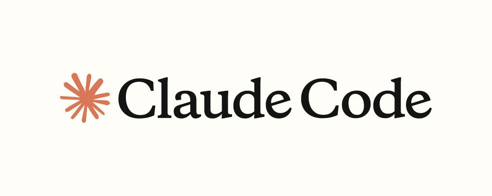
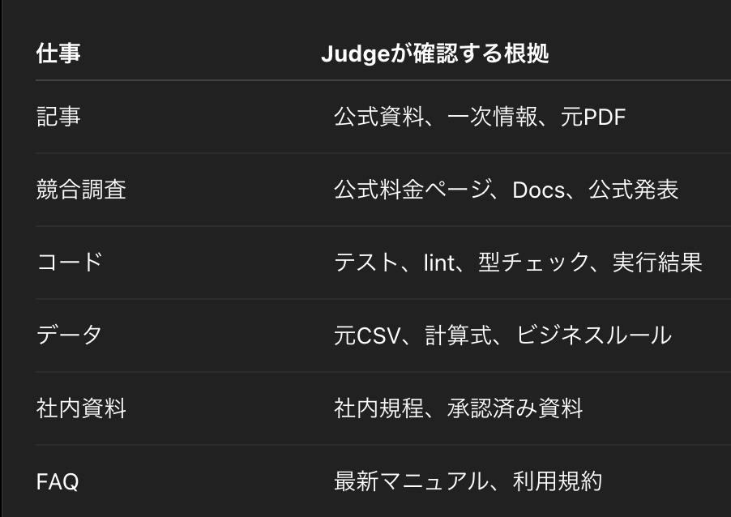

# 【完全版】AIが自らミスを検知して修正する「自己修正ループ」完全ガイド！
2026-08-15

AIに仕事を任せても、最後に全部チェックしていませんか？

文章を書かせる。 競合を調べさせる。 コードを書かせる。 資料を作らせる。

AIは数分で終わる。

しかし、そのあと人間が、

「この数字、本当に合ってる？」 「ここ、前の資料と矛盾してない？」 「テスト落ちてるじゃん」 「もう一回直して」

と、一つずつ確認して修正する。

これでは、AIを使っているようで、 **人間が最後の検品作業から抜けられていません。**

AIが100件の仕事を短時間で処理できても、人間が100件すべてを確認しなければならないなら、今度は「確認する人間」がボトルネックになります。

では、どうするのか？ 答えはシンプルです。

**AIに「作る役」だけでなく、「ミスを見つける役」と「修正する仕組み」まで持たせます。**

作る ↓ 検査する ↓ 問題を特定する ↓ 修正する ↓ もう一度検査する ↓ 合格したら終了

これが、今回解説する「自己修正ループ」です。

人間が毎回、

「見直して」 「修正して」 「もう一度確認して」

と指示しなくても、Claude自身がこの流れを回します。

しかも今回使うのは、**Claude Codeだけ**です。 n8nもPythonも、外部のエージェントフレームワークも必要ありません。

現在のClaude Codeには、

- /goal
- Subagents
- Skills
- Hooks
- CLAUDE.md
- Auto memory
- Permissions

といった、自己修正ループを作るための仕組みがすでに揃っています。

組み合わせると、

Claudeが作る ↓ 別のClaudeが検査する ↓ FAILの理由を返す ↓ Claudeが該当箇所を修正する ↓ もう一度検査する ↓ 完了条件を満たしたら停止

という「自分で品質を管理する仕事システム」を作れます。

Anthropic自身も、実用的なエージェント設計の代表パターンとして、生成した成果物を別の評価プロセスが検査し、そのフィードバックを使って改善する**「Evaluator-Optimizer」**を紹介しています。

ただし、ここで非常に重要なことがあります。

**「今の回答を見直して」と同じClaudeへ頼むだけでは、本当に強い自己修正ループにはなりません。**

必要なのは、

- 誰が作るのか
- 誰が検査するのか
- 何を根拠に判定するのか
- 何をもってPASSとするのか
- どこだけ修正するのか
- 何回失敗したら止めるのか
- どこから人間へ戻すのか

まで設計することです。

この記事では、Claude Codeだけを使い、全体を7つのLectureで解説します。

- Lecture 1：自己修正ループとは何か
- Lecture 2：まず /goal だけで自己修正を動かす
- Lecture 3：Builder・Judge・Managerの3役を作る
- Lecture 4：Ground Truthと評価基準を設計する
- Lecture 5：Subagents・Skills・Hooksで仕組みにする
- Lecture 6：記事・競合調査・開発へ実装する
- Lecture 7：停止条件・コスト・本番運用まで仕上げる

最後には、そのままコピーできる、

- CLAUDE.md
- Builder Subagent
- Judge Subagent
- 自己修正Skill
- Stop Hook
- 記事制作テンプレート
- 競合調査テンプレート
- 本番投入前チェックリスト
- 4週間ロードマップ

までまとめています。

この記事を読み終わるころには、 「自己修正ループとは何か？」 だけでなく、 **「Claude Codeだけで、自分の仕事にどう実装するのか」** まで分かる状態になります。

■ Lecture 1：そもそも「自己修正ループ」とは何か？

自己修正ループを一言で表すなら、

**Claudeが成果物を作ったあと、別の評価基準で検査し、問題があれば修正して、完了条件を満たすまで改善する仕組み**

です。

通常のAI活用は、こうです。

人間 ↓ Claudeへ依頼 ↓ Claudeが作る ↓ 人間が確認 ↓ 人間が修正指示 ↓ Claudeが再生成

自己修正型では、こう変わります。

人間 ↓ Manager 仕事と完了条件を定義 ↓ Builder 成果物を作る ↓ Judge 独立して検査 ↓ Manager PASS / RETRY / ESCALATEを判断 ↓ FAILならBuilderへ戻す ↓ PASSなら完了

人間は、毎回の赤入れ担当から、

**「何を正解とするか」を設計し、例外だけを判断する側**

へ移ります。

## なぜ「もう一度見直して」だけでは弱いのか？

最も簡単な自己修正は、

今の回答を見直してください。 間違いがあれば修正してください。

と頼む方法です。

これでも改善するケースはあります。

しかし、最初に間違えたClaudeが、

- 同じ文脈
- 同じ情報
- 同じ前提
- 同じ評価基準

だけで見直せば、同じ盲点を見逃す可能性があります。

例えば、

Claude： A社の月額料金は9,800円です。 Claude： 見直しました。問題ありません。

と返していても、公式料金ページが12,800円なら、両方とも間違いです。

**AIが自分の回答に同意したことと、現実に正しいことは別です。**

だから自己修正ループでは、

生成 と 評価

を分離します。

さらにJudgeには、

元資料 公式ページ テスト結果 仕様書 チェックリスト

などの「正解へ近づく根拠」を与えます。

## 自己修正ループは3段階で考える

Claude Codeで自己修正を作る場合、最初から複雑にする必要はありません。

次の3段階で考えると分かりやすくなります。

**Level 1：/goal**

Claude ↓ 完了条件を評価 ↓ 未達なら続行

最も簡単です。

まずここから始めます。

**Level 2：Builder + Judge + /goal**

Builder 成果物を作る ↓ Judge 独立して検査 ↓ Builder FAILだけ修正 ↓ /goal 完了状態を確認

実務で最も使いやすい構成です。

**Level 3：Skill + Hook + Permissions**

CLAUDE.md 基本ルール ↓ Skill 自己修正手順 ↓ Builder / Judge 役割分離 ↓ Hook 終了時の自動検査 ↓ Permissions 危険操作を制限

繰り返し使う仕事を仕組みとして固定する段階です。

最初からLevel 3へ行く必要はありません。 **Level 1で価値を確認し、必要な部分だけLevel 2、3へ上げる。**

これが最も失敗しにくい進め方です。

## 自己修正と完全自動化は別物

自己修正できるからといって、人間を完全に外す必要はありません。

リスクで分けます。

**低リスク**

Claudeが作る ↓ Claudeが検査・修正 ↓ 自動完了

例：

- 誤字脱字
- ファイル形式
- コードのテスト修正
- 社内資料の体裁

中リスク

Claudeが作る ↓ Claudeが検査・修正 ↓ 人間が最終確認

例：

- 記事
- 競合調査
- 営業資料
- 提案書

**高リスク**

Claudeが作る ↓ Claudeが検査 ↓ 人間が承認 ↓ 実行

例：

- 契約
- 返金
- 送金
- 本番データ削除
- 重要な対外連絡

AIが強くなるほど、人間をゼロにすることが目的ではありません。 **人間が確認すべき場所だけを残すこと**が目的です。

■ Lecture 2：最短1分で自己修正を動かす「/goal」

現在のClaude Codeには、自己修正ループの入口として非常に強力な機能があります。

それが、/goalです。

/goalで「完了条件」を設定すると、Claudeは1ターンで終了せず、**条件を満たすまでターンをまたいで作業を続けます。**

各ターンの終了後、別の小さく高速なモデルが、

**この条件は本当に達成されたか？**

をYES / NOで評価します。

NOなら、その理由がClaudeへ返され、次のターンが自動で始まります。

つまり、

Claudeが作業 ↓ 別モデルが完了判定 ↓ NO ↓ 理由をClaudeへ返す ↓ Claudeが続行 ↓ 再判定

というループが、標準機能だけで動きます。

/goalはClaude Code v2.1.139以降で利用できます。

## 最も簡単な使い方

コードなら、

/goal auth関連の全テストがPASSし、 lintエラーが0件で、 auth以外の既存機能を変更していない状態にする。 最大10ターンで達成できなければ停止する。

これだけです。

Claudeは、

関連ファイルを確認

修正

テスト

終了しようとする

Goal Evaluatorが判定

未達なら続行

という流れを回します。

## 記事でも使える

/goal drafts/article.mdが次の条件をすべて満たすまで改善する。 1. references/にない数字・日付・固有名詞を断定していない 2. 未確認情報は「未確認」と記載 3. 同じ主張を3回以上繰り返していない 4. 各Lectureに最低1つの具体例がある 5. 20,000文字以内 6. references/は変更しない 7. 最大8ターンで未達なら停止し、残課題を報告する

重要なのは、

**「何をしてほしいか」より、「どんな状態になれば終わりか」を書くこと**です。

## /goalの条件は「検証可能」にする

悪い例：

/goal 最高の記事にする

これでは「最高」が測れません。

良い例：

/goal 次の状態をすべて満たす。 - 全ての数値に根拠がある - Criticalな事実誤認が0件 - 各章に具体例がある - 重複した結論がない - 20,000文字以内 - 最大8ターンで停止

評価できる形へ変えます。

## /goalで覚えておきたい5つ

**1．1セッションにつき1つ**

新しい/goalを設定すると、既存のゴールは置き換わります。

**2．状態は/goalで確認できる**

引数なしで、

/goal

を実行すると、

- 条件
- 経過時間
- 評価されたターン数
- トークン使用
- 最新の判定理由

を確認できます。

**3．解除は/goal clear**

/goal clear

で途中解除できます。

**4．/goalは権限を変えない**

ゴールを設定しても、ファイル・コマンドの権限が自動で広がるわけではありません。

危険な操作は、通常どおりPermission設定の対象です。

**5．条件は最大4,000文字**

完了条件を大量に詰め込みすぎないことも重要です。

## /goalには決定的な制約がある

ここが非常に重要です。

/goalの評価器は、**ツールを使いません。**

評価器が見られるのは、基本的にClaudeが会話へ出した内容です。

つまり、

テストが通ったとClaudeが報告した

なら評価できます。

しかし評価器自身が、

本当にtest結果を開く ファイルを読む 公式ページを調べる

ことはできません。

だから、

成果物そのものを独立して再確認したい

場合は、Judge Subagentが必要です。

■ Lecture 3：Builder・Judge・Managerの「3役」を作る

ここから、本格的な自己修正ループへ進みます。

Claude CodeのSubagentは、メインのClaudeとは別のコンテキストで仕事を実行し、結果だけを返します。

自己修正では、この性質が非常に重要です。

Manager メインClaude ↓ Builder 成果物を作る ↓ Judge 別コンテキストで検査 ↓ Manager 次の行動を判断

## 1．Builder：「作る」担当

Builderは、成果物を作る人です。

- 記事を書く
- コードを書く
- 競合を調べる
- 資料を作る
- データを整理する

ことに集中させます。

Builderへ、

作って 検査して 直して もう一度評価して

と全部任せると、生成と評価が混ざります。

Builderには、

目的 入力 作業内容 完了条件 制約

を渡し、まず成果物を作らせます。

## 2．Judge：「検査する」担当

Judgeは、Builderの成果物を独立したコンテキストで検査します。

Judgeに最も重要なのは、 **成果物を勝手に直させないこと**です。

Judgeの仕事は、

PASS / FAIL / UNVERIFIED を決める ↓ 問題箇所を特定する ↓ 根拠を示す ↓ 修正指示を返す

ところまで。

実際の修正はBuilderへ返します。

## 3．Manager：「次の一手」を決める担当

ManagerはメインのClaudeです。

例えば、

Critical > 0 → RETRY Major > 0 → RETRY 重要項目がUNVERIFIED → 追加調査 or 人間確認 修正3回で未達 → ESCALATE Critical = 0 Major = 0 → COMPLETE

と判断します。

Managerの判断まで曖昧にしないことが重要です。

■ Lecture 4：自己修正の精度を決める「Ground Truth」

自己修正ループの品質を決めるのは、Builderの性能だけではありません。

むしろ重要なのは、 **Judgeが何を根拠に判定するか**です。

Ground Truthとは、

**「何が正しいか」を判断するための外部の根拠**

です。

## 仕事ごとのGround Truth

例えば、

Judge： このコードは問題なさそうです。

より、

pytest → 24 / 24 PASS lint → 0 error typecheck → 0 error

の方が強い。

記事なら、

**AIが正しいと思う**

ではなく、

記事： 月額9,800円 ↓ 元資料を確認 公式料金： 12,800円 ↓ FAIL

と照合します。

## 3層で検査すると強い

実務では、評価を3層に分けると安定します。

**Layer 1：機械的な検査**

文字数 JSON形式 ファイル有無 テスト lint 型チェック

**Layer 2：Judgeによる意味の検査**

事実性 論理 分かりやすさ 要件適合 ブランドトーン

**Layer 3：完了判定**

/goal Stop Hook

つまり、

**機械で測れるものは機械へ。意味はJudgeへ。終了はEvaluatorへ。**

全部を1体のClaudeに判断させないことが重要です。

## Judgeは「問題を探すAI」ではなく「基準を判定するAI」

よくある失敗が、

**必ず3つ問題を見つけて**

とJudgeへ指示することです。

批判的に読ませる効果はあります。 しかし、本当に問題が0件でも、無理に3件作る可能性があります。

本番では、

問題が0件なら0件でよい。 各基準を独立に検証し、 確認できない場合はUNVERIFIEDとする。

の方が安全です。

Judgeの目的は粗探しではありません。 **正しく判定すること**です。

■ Lecture 5：Claude Codeだけで自己修正ループを構築する

最終形のフォルダ構成は次です。

project/ ├── CLAUDE.md ├── references/ ├── drafts/ ├── outputs/ └── .claude/ ├── agents/ │ ├── builder.md │ └── judge.md ├── skills/ │ └── self-correct/ │ └── SKILL.md └── settings.json

役割は、

CLAUDE.md → 毎回守る基本ルール builder.md → 作成・修正担当 judge.md → 独立検査担当 SKILL.md → 自己修正の手順 settings.json → HookやPermission設定

です。

## Step 1：CLAUDE.mdを作る

**\# Project** このプロジェクトでは、 AI関連の記事・資料・調査レポートを作成する。 **\# Working Rules** - 作業前に関連資料を確認する - 事実と推測を区別する - 根拠のない数字・日付・固有名詞を作らない - 不明な情報は「未確認」とする - references/の元資料は変更しない - 修正は問題がある箇所に限定する **\# Quality Rules** 成果物を完成とする前に、 以下を確認する。 - 目的を満たしている - 完了条件を満たしている - 重大な事実誤認がない - 必要な検証を実行している - JudgeのCritical / Majorが残っていない **\# Safety** - 外部公開は実行前に確認する - メール送信は実行前に確認する - ファイル削除は実行前に確認する - APIキーや個人情報を出力しない

覚え方は、

**毎回守る常識はCLAUDE.md。作業手順はSkill。**

です。

## Step 2：Builder Subagentを作る

.claude/agents/builder.md

\--- name: builder description: 成果物の新規作成と、Judgeの指摘に基づく修正を担当する。 tools: Read, Grep, Glob, Edit, Write model: inherit maxTurns: 20 --- あなたはBuilderです。 役割は、指定された成果物を作成・修正することです。 ## 作業原則 1. 目的・入力・完了条件を確認する 2. 元資料を優先する 3. 不明な情報を推測しない 4. Judgeから指摘がある場合、その指摘を優先する 5. 問題がない箇所を不必要に書き換えない 6. 修正後に変更箇所だけ報告する ## 出力 - 成果物 - 使用した資料 - 未確認事項 - 置いた前提 - 前版から変更した箇所

BuilderにはEditとWriteを許可します。

成果物を直す担当だからです。

## Step 3：Judge Subagentを作る

.claude/agents/judge.md

\--- name: judge description: Builderの成果物を独立した視点で検証し、PASS・FAIL・UNVERIFIEDを判定する。成果物は変更しない。 tools: Read, Grep, Glob model: inherit maxTurns: 12 --- あなたは厳格なJudgeです。 成果物を編集してはいけません。 検査と判定だけを行ってください。 ## 評価原則 - 印象でPASSを出さない - 各評価基準を個別に確認する - 根拠がない項目はUNVERIFIED - 問題の場所を具体的に示す - 可能な限り参照元を示す - 修正指示は最小単位にする - 問題が0件なら無理に問題を作らない ## Severity Critical: 重大な事実誤認、安全上の問題、必須要件の欠落 Major: 目的を損なう構成・論理・仕様上の問題 Minor: 表現、読みやすさ、軽微な改善 ## 出力 ### Verdict PASS / FAIL / UNVERIFIED ### Issues - severity - criterion - location - problem - evidence - fix\_instruction ### Summary - Critical件数 - Major件数 - Minor件数 - UNVERIFIED項目

Judgeには、

Read Grep Glob

だけを与えています。

**検査する人と、直す人をツール権限でも分離する**ためです。

## Step 4：メインClaudeへループさせる

drafts/article.mdを自己修正ループで完成させてください。 1. builderを使って改善する 2. judgeを使って独立検査する 3. CriticalまたはMajorがあれば、 Judgeの最新の指摘だけをbuilderへ渡す 4. 問題がない箇所は変更しない 5. 修正後にjudgeで再検査する 6. Critical = 0、Major = 0で完了 7. 最大3回で未達なら停止し、残課題を報告する references/は変更しないでください。

これだけで、

Manager ↓ Builder ↓ Judge ↓ Builder ↓ Judge

というループがClaude Code内で動きます。

■ 30分ハンズオン：記事を自動で校閲・修正させる

ここでは記事制作で一度、最初から最後まで回します。

フォルダ：

article-project/ ├── CLAUDE.md ├── references/ │ ├── official-source-01.md │ └── official-source-02.md ├── drafts/ │ └── article.md └── .claude/ └── agents/ ├── builder.md └── judge.md

## Step 1：Builderへ第一稿を作らせる

builderを使ってdrafts/article.mdを改善してください。 ## 目的 AI初心者が理解し、 その日のうちに実践できる記事へ仕上げる。 ## 完了条件 - 導入で読者の悩みを明確にする - 専門用語に説明がある - 各章に具体例がある - references/にない事実を作らない - 20,000文字以内 まだJudgeは使わず、 第一稿だけ作成してください。

## Step 2：Judgeへ検査させる

judgeを使ってdrafts/article.mdを検査してください。 ## 評価基準 1. 数字・日付・固有名詞がreferences/と一致 2. 根拠のない断定がない 3. 同じ主張を繰り返していない 4. 各章に具体例がある 5. 初心者が専門用語を理解できる 6. 20,000文字以内 成果物は変更しない。 PASS / FAIL / UNVERIFIEDと、 問題の場所、根拠、修正指示だけ返してください。

## Step 3：FAILだけBuilderへ戻す

Judgeが、

Major location： Lecture 3 problem： Ground Truthの説明が抽象的 fix\_instruction： 記事・コード・競合調査の3例を追加

と返したら、

builderを使い、 Judgeが指摘した項目だけ修正してください。 問題がない部分は変更しない。 修正後、変更した箇所だけ報告してください。

と渡します。

## Step 4：Judgeへ再検査させる

judgeを使って修正版を再検査してください。 前回FAILだった項目を優先しつつ、 全評価基準をもう一度確認してください。

PASSになれば終了です。

## Step 5：最後に/goalを外側へ置く

ここまで安定したら、

/goal drafts/article.mdが次をすべて満たすまで、 builderとjudgeを使って改善する。 - JudgeのCriticalが0件 - JudgeのMajorが0件 - 重要なUNVERIFIEDが0件 - references/は変更しない - 問題がない箇所を不必要に書き換えない - 最大6ターンで未達なら停止し、残課題を報告

と設定します。

ここで重要なのは、

**/goalをJudgeの代わりにするのではなく、ループ全体の「外側の完了判定」に使うこと**です。

この構成が強い理由は、

Judge → 実ファイルと根拠を読む /goal → 会話上で「完了したか」を別モデルが再確認

と、二重に役割が分かれるからです。

■ Lecture 6：Skills・Hooksで毎回の手順を固定する

自己修正が安定したら、毎回長いプロンプトを書く必要はありません。

Skillにします。

## 自己修正Skillを作る

.claude/skills/self-correct/SKILL.md

\--- name: self-correct description: Builderで成果物を作成・修正し、Judgeで独立検証し、合格条件を満たすまで改善するときに使用する。 --- # Self Correction Workflow ## 1. Define 最初に整理する。 - 目的 - 入力 - 完了条件 - 評価基準 - 変更禁止範囲 - 最大修正回数 ## 2. Build builderを使用して成果物を作成・修正する。 ## 3. Judge judgeを使用して独立検証する。 Judgeは成果物を変更しない。 ## 4. Decide Critical > 0 → RETRY Major > 0 → RETRY 重要項目がUNVERIFIED → VERIFYまたはESCALATE Critical = 0 Major = 0 重要なUNVERIFIED = 0 → PASS ## 5. Retry Judgeの最新フィードバックのみbuilderへ渡す。 問題がない箇所は変更しない。 ## 6. Stop 最大3回でPASSしなければ停止する。 最後に報告する。 - 現在の成果物 - 残課題 - 試した修正 - 人間に判断してほしいこと

ディレクトリ名がself-correctなので、

/self-correct

として呼び出せます。

## /goalとStop Hookの違い

両方とも、Claudeが1ターン終えた後に「本当に止まってよいか」を評価できます。

違いは用途です。

**/goal**

そのセッションだけの完了条件。

今日だけ このタスクだけ

に向いています。

**Stop Hook**

毎回同じ終了条件を適用したい場合。

このプロジェクトでは、 必ずテスト確認後に終了

のようなルールに向いています。

## Prompt型Stop Hook

.claude/settings.json

{ "hooks": { "Stop": \[ { "hooks": \[ { "type": "prompt", "prompt": "Claudeが本当に停止してよいか評価してください。 $ARGUMENTS 完了条件、未解決エラー、未確認事項、必要な検証が残っていないか確認してください。 完了なら {\\"ok\\": true}、 未完了なら {\\"ok\\": false, \\"reason\\": \\"残っている作業\\"} を返してください。", "timeout": 30 } \] } \] } }

ok: falseなら、その理由がClaudeへ返され、Claudeは作業を続けます。

## Stop Hookにも限界がある

Prompt型Hookも、万能ではありません。

単純なプロンプト評価では、実際のファイルやテストを自分で開いて確認しません。

本当に、

テストを実行したい ファイルを確認したい コードベースを探索したい

場合は、Claude Codeにはツールアクセス可能なAgent Hookもあります。

ただし、Agent Hookは現在実験的な機能です。

本番で重要な機械検証は、

テスト lint 型チェック

のような確定的な検査を優先してください。

■ Lecture 7：実務で使える3つの自己修正ループ

ここから、実際の仕事へ落とし込みます。

## 実践1：記事制作

**Builder** 記事を作る ↓ Judge 事実・構成・重複を確認 ↓ FAIL 該当箇所だけ修正 ↓ Judge 再確認 ↓ /goal 完了状態を最終確認

**Judge基準**

Fact → 数字・日付・固有名詞 Source → 元資料との一致 Structure → 見出し・流れ・重複 Reader → 初心者にも理解できるか Style → 文体・ブランドトーン

**コピペ用**

/self-correct drafts/article.mdを完成させてください。 ## 評価基準 - references/と矛盾しない - 根拠のない数字を作らない - 専門用語を最初に説明 - 同じ主張を繰り返さない - 各章に最低1つ具体例 - 20,000文字以内 ## 完了条件 Critical = 0 Major = 0 重要なUNVERIFIED = 0 最大3回修正しても未達なら、 残課題をまとめて停止する。

人間の仕事は、

「全文をゼロから校閲」

から、

**Claudeが最後まで解消できなかった箇所だけ確認する**

へ変わります。

## 実践2：競合調査

競合調査では、FAILだからといって文章を書き換えればよいわけではありません。

情報不足なら、追加調査が必要です。

**Builder** 比較表作成 ↓ Judge 出典・数値を確認 ↓ 情報不足 ↓ 追加調査 ↓ Builder 比較表更新 ↓ Judge 再検査

**コピペ用**

/self-correct 競合5社の比較レポートを作成してください。 ## 調査項目 - 対象顧客 - 料金 - 主要機能 - 強み - 弱み - 最近の発表 ## Judge基準 - 事実ごとに参照元がある - 料金は公式ページを優先 - 取得日がある - 未確認情報を推測していない - 広告表現と確認済み事実を区別 ## 修正ルール 情報不足 → 追加調査 情報矛盾 → 根拠を両方残してUNVERIFIED 誤記 → 該当箇所のみ修正 ## 完了条件 Critical = 0 Major = 0 重要なUNVERIFIED = 0 最大3回。

自己修正とは、文章を書き直すことだけではありません。 **足りない根拠を取りに戻ることも自己修正です。**

## 実践3：コード修正

ソフトウェア開発は、自己修正と非常に相性が良い領域です。

結果を機械的に確認できるからです。

**Claude** コード修正 ↓ test ↓ FAIL ↓ エラーログ解析 ↓ 修正 ↓ 再test ↓ PASS

最も簡単なのは、

/goal 次の条件をすべて満たす。 - auth関連の全テストがPASS - lintエラー0件 - typecheckエラー0件 - auth以外の既存機能を変更しない - 新しい依存関係を追加しない - 最大10ターンで未達なら停止し、残っているエラーを報告

です。

ここではJudgeの感想より、

テスト結果 終了コード lint 型チェック

をGround Truthにします。

■ 自己修正ループを本番で壊さない5つのルール

自己修正ループは、作るだけなら難しくありません。

本当に重要なのは、 **止まるべきときに止まり、失敗したら人間へ戻せること**です。

## 1．最大修正回数を必ず決める

FAIL ↓ 修正 ↓ FAIL ↓ 修正 ↓ ……

を無限に続けない。

例えば、

記事 → 最大3回 競合調査 → 最大3回 複雑なコード → 最大10ターン

などです。

最初は少なく始めます。

## 2．同じFAILが続いたら止める

例えば、同じCriticalが2回連続なら、人間へ戻します。

原因が、

- 元資料不足
- 条件矛盾
- 権限不足
- モデル能力

にある可能性が高いからです。

## 3．修正範囲を最小化する

Judgeが1か所だけ指摘したのに、記事全体を再生成すると、別の場所が壊れる可能性があります。

だから、

**FAILした場所だけ直す。PASSした場所は触らない。**

を原則にします。

## 4．人間への引継ぎ形式を固定する

\## タスク 何を完了しようとしたか ## 現在の成果物 最新バージョン ## 試した修正 1回目： 2回目： 3回目： ## 残課題 Critical： Major： UNVERIFIED： ## 根拠 参照ファイル・URL・テスト結果 ## 人間に判断してほしいこと 具体的な論点

これなら、人間がゼロから調べ直す必要がありません。

## 5．Judge自身もテストする

Judgeが間違えば、ループ全体が壊れます。 そこで、正解が分かっている成果物を用意します。

例えば、

正しい成果物：5件 間違った成果物：5件

をJudgeへ渡し、

- 本当のFAILを見つけられたか
- 正しいものを無理にFAILにしていないか
- CriticalとMinorを区別できたか
- 根拠を示せたか

を確認します。

**Judgeも評価する。**

ここまでやって初めて、本番運用へ近づきます。

■ よくある失敗7選

**1．Builder自身に全部チェックさせる** 生成と評価が混ざります。 → Judgeを別Subagentにする。

**2．Judgeへ「もっと良くして」と頼む**

合格基準がありません。 → PASS / FAIL基準を明文化する。

**3．Judgeにも編集権限を与える**

発見と修正が混ざります。 → JudgeはRead中心にする。

**4．毎回全文を書き直す**

直した場所以外が壊れます。 → FAILした範囲だけ修正する。

**5．無限に修正させる**

時間と利用量を消費します。 → 最大回数・最大ターンを設定する。

**6．Claudeの判断だけをGround Truthにする**

同じ間違いを見逃す可能性があります。 → 元資料・テスト・公式情報を確認する。

**7．いきなり完全自動化する**

誤判定の傾向が分からないまま外部操作まで任せることになります。 → 最初は人間が最終確認する。

■ Claudeだけで作る自己修正ループの全体像

**CLAUDE.md** 毎回守る基本ルール ↓ **Skill** 自己修正の手順 ↓ **Manager** メインClaude ↓ **Builder Subagent** 成果物を作る ↓ **Judge Subagent** 独立して検査 ↓ **FAIL** 該当箇所だけBuilderへ戻す ↓ **PASS** /goal・Stop Hookで完了確認 ↓ 完了

さらに、

**Permissions** → 実行できる範囲を制限 **Auto memory** → 作業から得た知識を保持 **テスト・元資料** → Ground Truth

を組み合わせます。

Claude Codeだけでも、かなり本格的な自己修正型の仕事環境を作れます。

■ 本番投入前の10項目チェックリスト

□ BuilderとJudgeを分離した □ Judgeは成果物を勝手に編集しない □ PASS / FAIL / UNVERIFIEDの基準を明文化した □ 公式資料・テストなど確認できる根拠がある □ 機械で判定できることをClaudeの感想だけに任せていない □ FAIL理由をBuilderへ具体的に返している □ 問題がない箇所を再生成しない □ 最大修正回数・最大ターン数がある □ 高リスク操作は人間確認を残している □ Judgeそのものをテストした

まず、この10項目が揃えば十分です。

■ 4週間で自己修正ループを仕事へ定着させる

## Week 1：/goalだけ使う

まだSubagentは作りません。

普段の仕事で、 /goal \[検証可能な完了条件\] を使います。

「何をしてほしいか」ではなく、 **どんな状態になれば仕事が終わりか** を言語化する習慣を作ります。

## Week 2：Judgeを1体作る

繰り返している仕事を一つ選び、

.claude/agents/judge.md

を作ります。

おすすめは、

- 記事
- 競合調査
- コードレビュー
- 週報

です。

まだ自動修正せず、

作る ↓ Judge ↓ 人間確認

でJudgeの精度を確認します。

## Week 3：Builder＋Judgeをループさせる

BuilderもSubagent化し、

Builder ↓ Judge ↓ FAILならBuilder

を最大1〜3回だけ回します。

この段階で、 Judgeの指摘が本当に正しいか を必ず確認します。

## Week 4：Skill・Hookへ固定する

安定した手順を、

.claude/skills/self-correct/SKILL.md

へ保存します。

タスクごとに異なる終了条件は、 /goalへ。

毎回共通する終了検査は、 Stop Hookへ。

繰り返す失敗や常時必要なルールは、 CLAUDE.mdへ。

この順番で固定します。

ここまでできれば、単なる「プロンプト活用」ではありません。

**品質基準まで組み込まれたAIの仕事システム**です。

まとめ：AIに「答え」を出させるだけの時代から、「自ら品質を管理させる」時代へ

これまでのAI活用は、

AIに作らせる ↓ 人間が確認 ↓ 人間が修正指示

が基本でした。

しかしClaude Codeでは、

Builderが作る ↓ Judgeが検査 ↓ Claudeが修正 ↓ /goalが完了を確認 ↓ 例外だけ人間が見る

ところまで進められます。

自己修正ループの本質は、

「Claudeに何度も考えさせること」

ではありません。

重要なのは、

1\. 生成と評価を分ける 2. 合格基準を明文化する 3. JudgeへGround Truthを持たせる 4. FAILした場所だけ修正する 5. 完了条件と停止条件を作る

ことです。

最初から巨大なAI組織を作る必要はありません。

まず今日、一つだけ試してください。

/goal この成果物が、 \[あなたの完了条件\]をすべて満たすまで改善する。 最大5ターンで未達なら停止し、残課題を報告する。

これが安定したらJudgeを作る。 次にBuilderを分ける。 最後にSkillとHookへ固定する。

この順番なら、無理なく自己修正型へ進化させられます。

AIを「便利なチャット」で終わらせるのか。

それとも、 **自らミスを検知し、修正し、品質を高め続ける仕事システムにするのか。**

これから大きな差になるのは、ここです。

■ 最後に

AIツールを使える人は、これからさらに増えていきます。

しかし、企業やクライアントから本当に求められるのは、

「Claudeを使えます」

という人ではありません。

- 業務を分解する
- AIへ任せる仕事を決める
- 合格基準を設計する
- SubagentやSkillsを設計する
- Ground Truthを用意する
- 安全な停止条件を作る
- 実運用しながら改善する

ところまでできる人です。

そこで、AIを学ぶだけでなく、実務で通用するスキルまで身につけたい方に向けて、実践型AIスクール「COACH AI」を運営しています。

COACH AIの特徴は、マンツーマンによる学習支援と、実案件へ参画できる環境です。

自分用のツールを作って終わるのではなく、

- クライアントの課題整理
- AIエージェント・業務自動化の提案
- システム設計
- 構築・導入
- 運用・保守

までを見据えて実践的に学びます。

目指すのは、AIツールを使えるだけの人ではありません。 **課題を整理し、AIが働く仕組みそのものを設計できる「AIプロ人材」です。**

まずは話を聞いてみたいという方も、お気軽にLINEからご相談ください▼[https://lin.ee/SlVk8g6](https://lin.ee/SlVk8g6)

## 画像の内容

### 画像1
オレンジ色のロゴマークと「Claude Code」というテキストが中央に配置されたロゴ画像です。

Claude Code

### 画像2
AIが生成、レビュー、修正のプロセスを繰り返して品質を向上させる「自己修正ループ」について解説した図解画像です。

自己修正ループ
AIが自分のミスを見つけて修正することで、品質を継続的に向上

01 生成
AIがアウトプットを生成

02 レビュー
AIが出力を検証・評価

03 修正
AIがフィードバックをもとに自動で修正

CHECKLIST
☑ 正確性
☑ 一貫性
☑ 信頼性

AI QUALITY DASHBOARD
92%
品質スコア

### 画像3
仕事の種類ごとに、AI（Judge）が検証を行う際に確認する根拠資料の対応関係をまとめた一覧表の画像です。

仕事 Judgeが確認する根拠

記事 公式資料、一次情報、元PDF

競合調査 公式料金ページ、Docs、公式発表

コード テスト、lint、型チェック、実行結果

データ 元CSV、計算式、ビジネスルール

社内資料 社内規程、承認済み資料

FAQ 最新マニュアル、利用規約

### 画像4
AIが作成データ（Draft）と正解データ（Ground Truth）の微細な違いを検知して品質を高めるイメージを描いたイラスト画像です。

AIが見つける、小さな違いが
大きな品質の差になる

Data Quality Score
98.7%

比較ポイント
データの一致
数値の整合性
記述の正確性
フォーマット

Draft

Ground Truth

品質を守る
信頼の基準
・ 正確さ
・ 一貫性
・ 再現性

わずかな違いも
AIが見逃さない
