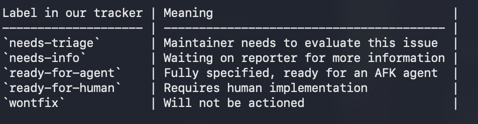

# Post by @gogo_tanaka on X
2026-08-11
AI駆動開発、

\- /grill-with-docs で実装  
\- docs/adr にコンテキスト残す  
\- 課題管理はgithub issuesのみ  
\- human用のviewがどうしても欲しいなら最小のproject作る  
\- ラベルを画像のように設計して、PdMはひたすらneeds-xxx をさばく

が最強だと確信した日曜日だった。 https://t.co/JJOWnRDMFa

## 画像の内容

### 画像1
トラッカーで使用されるラベルとそれぞれの意味をまとめた表形式のテキストが表示されています。

Label in our tracker | Meaning
----------------------------------------|--------------------------------------------------------
`needs-triage` | Maintainer needs to evaluate this issue
`needs-info` | Waiting on reporter for more information
`ready-for-agent` | Fully specified, ready for an AFK agent
`ready-for-human` | Requires human implementation
`wontfix` | Will not be actioned
