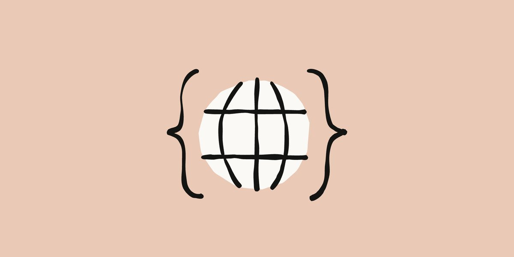
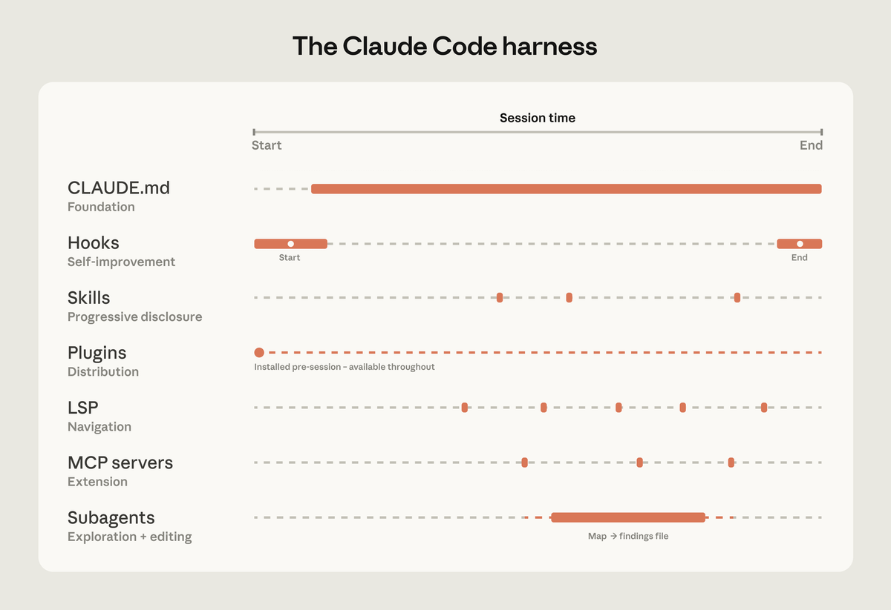
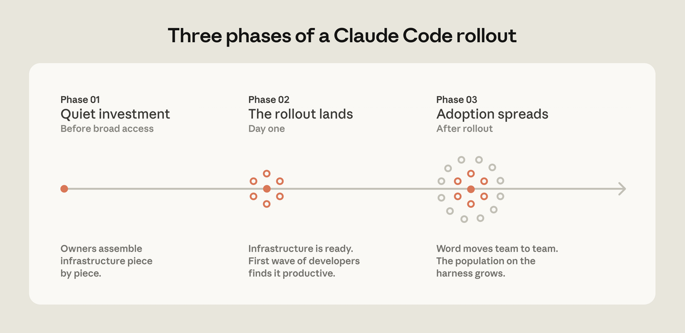
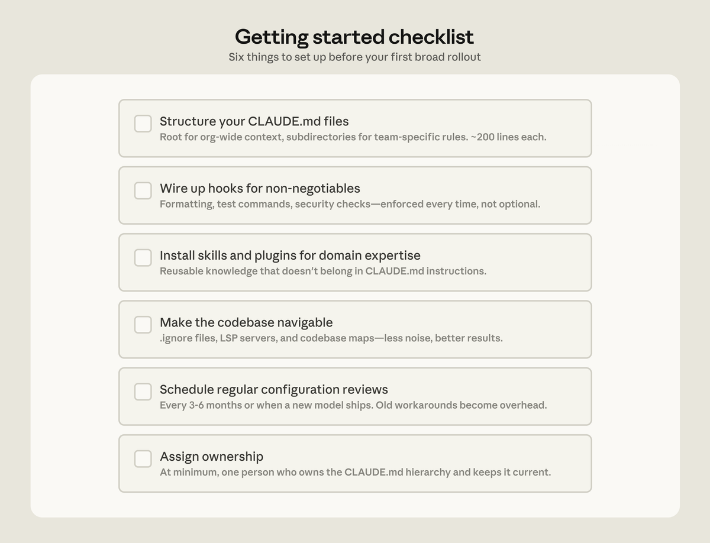

# Post by @ClaudeCode_love on X
2026-08-11
【速報】  
ええええ、Anthropic公式が  
「Claude Codeで重い処理する時ののベストプラクティス」  
を記事1本にまとめて公開してた😳  
・数百万行のモノレポでも崩れないcontextの渡し方  
・LSP連携で関数の呼び出し関係まで正確に追わせる  
・並列セッション・非対話モードで複数タスクを同時進行  
・テストとLintのフィードバックループで自己修正させる  
ガチで大規模やる人だけじゃなく、これからAIコーディングを『仕組み』で動かしたい個人開発勢ほど一度読む価値ある内容👇  
[https://t.co/FCRAAvoMES](https://t.co/FCRAAvoMES)  
で、これ読んで「Claude Codeで大規模開発やるぞ」となった人ほど、次に絶対ぶつかるのが『トークン枯渇問題』  
数百万行のコードベースを触る時に、 毎回ぜんぶ読ませたり、 雑にcontextを投げたりすると、 一瞬でチャットが重くなる。  
Claude Codeは強いけど、 トークンを無限に使えるわけじゃない。  
だから、大規模開発に入る前に 「どうやってトークンを節約しながら動かすか」 は先に押さえておいた方がいいです。  
そのための引用に記事をおいてます👇  
500いいね以上獲得して反響も最高です。  
この記事の次に読むと、かなり理解がつながるはず。ぜひ！

   

## 画像の内容

### 画像1
ペールオレンジの背景に、地球儀のイラストを波括弧で囲んだシンプルなアイコン画像が描かれている。文字はない。

### 画像2
セッションタイムラインにおけるClaude Codeの各コンポーネント（ハーネス）の役割や活動期間を示す図解である。
The Claude Code harness
Session time
Start
End
CLAUDE.md
Foundation
Hooks
Self-improvement
Start
End
Skills
Progressive disclosure
Plugins
Distribution
Installed pre-session - available throughout
LSP
Navigation
MCP servers
Extension
Subagents
Exploration + editing
Map → findings file

### 画像3
Claude Codeのロールアウトにおける3つの段階を示したタイムライン形式の図解である。
Three phases of a Claude Code rollout
Phase 01
Quiet investment
Before broad access
Owners assemble infrastructure piece by piece.
Phase 02
The rollout lands
Day one
Infrastructure is ready. First wave of developers finds it productive.
Phase 03
Adoption spreads
After rollout
Word moves team to team. The population on the harness grows.

### 画像4
最初の本格的なロールアウトの前に設定すべき6つの項目をまとめたチェックリストである。
Getting started checklist
Six things to set up before your first broad rollout
Structure your CLAUDE.md files
Root for org-wide context, subdirectories for team-specific rules. ~200 lines each.
Wire up hooks for non-negotiables
Formatting, test commands, security checks—enforced every time, not optional.
Install skills and plugins for domain expertise
Reusable knowledge that doesn't belong in CLAUDE.md instructions.
Make the codebase navigable
.ignore files, LSP servers, and codebase maps—less noise, better results.
Schedule regular configuration reviews
Every 3-6 months or when a new model ships. Old workarounds become overhead.
Assign ownership
At minimum, one person who owns the CLAUDE.md hierarchy and keeps it current.
