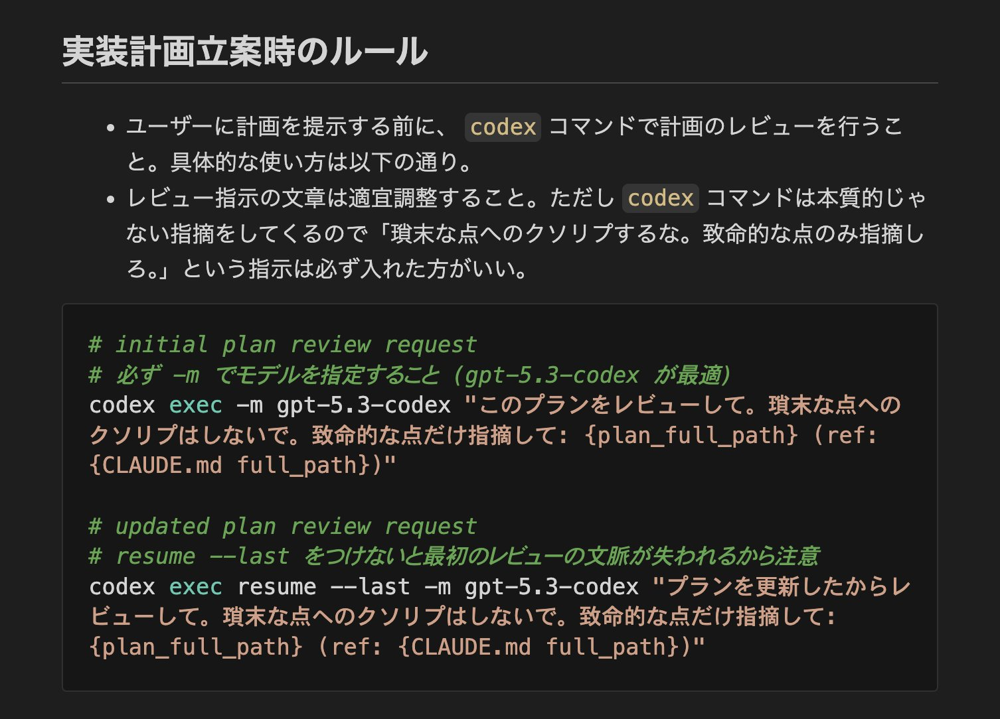

# Post by @MLBear2 on X
2026-08-11
Claude Code が Plan 提示する前に自動でCodexにレビューさせる方法確立できた。調べてみたら codex に resume --last ってオプションあったし一瞬でできたわ、さっさとやっておけばよかった😇 https://t.co/9jOL4CNk17

## 画像の内容

### 画像1
実装計画立案時のルールと、codexコマンドを使ったレビュー手順の具体的なコード例が記載されています。

実装計画立案時のルール
- ユーザーに計画を提示する前に、codex コマンドで計画のレビューを行うこと。具体的な使い方は以下の通り。
- レビュー指示の文章は適宜調整すること。ただし codex コマンドは本質的じゃない指摘をしてくるので「瑣末な点へのクソリプするな。致命的な点のみ指摘しろ。」という指示は必ず入れた方がいい。

# initial plan review request
# 必ず -m でモデルを指定すること (gpt-5.3-codex が最適)
codex exec -m gpt-5.3-codex "このプランをレビューして。瑣末な点へのクソリプはしないで。致命的な点だけ指摘して: {plan_full_path} (ref: {CLAUDE.md full_path})"

# updated plan review request
# resume --last をつけないと最初のレビューの文脈が失われるから注意
codex exec resume --last -m gpt-5.3-codex "プランを更新したからレビューして。瑣末な点へのクソリプはしないで。致命的な点だけ指摘して: {plan_full_path} (ref: {CLAUDE.md full_path})"
