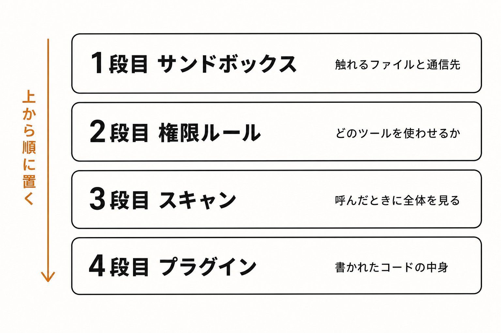

# Claude Codeのセキュリティ、やる順番を全部書く（Claude公式推奨法）
2026-08-12
公式のセキュリティプラグインを2ヶ月動かして、ログを17,385行ぜんぶ読みました。25本ある検知ルールのうち、実際に鳴ったのは1本だけでした。

でもこれ、プラグインの出来が悪いという話ではありません。順番が逆だっただけです。プラグインは4段ある防衛線の4段目で、上の3段を置いていないと、そもそも出番が来ない。

はじめまして、tatsuki と申します。中小企業向けにAIの活用サポートをしていて、自分でもClaude Codeを1日中走らせています。

**この記事では、Anthropic公式が実際に推している対策を優先度の高い順に4つ並べます。**そのうえで、公式の手順どおりにやっても残る穴が2つあるので、それを塞ぐ設定ファイルを全文載せます。コピーすれば今日のうちに終わります。

効くのは、順番です。

**記事の最後で、Claudeで高品質なスライドを作れるデザインキットを配布しています。**

## ルール25本中1本。公式プラグインを2ヶ月動かして分かったこと

多くの人が最初に手を出すのが security-guidance という公式プラグインです。Anthropicが無料で配っていて、全プランで使えます。Claudeが書いたコードを3層でレビューしてくれる、よくできた仕組みです。僕もこれを2ヶ月動かしていました。

発火したのは25本中1本だけだった

プラグインは動作ログを残します。それが17,385行たまっていたので、ぜんぶ解析しました。

- ターン終了時のレビューが起動: 416回
- うちレビュー対象が無く空振り: 322回（77%）
- 実際にLLMレビューまで走った: 38回（全体の9%）
- そのレビューが報告した指摘: 0件
- 正規表現によるパターン検知: 7回
- 鳴ったルールの種類: 25種類中1種類

平均2.93秒で終わって、何も見つけない。それが38回続いていました。

鳴った1本は、中身を見ないルールだった

その1本を追いかけたら、もっと面白い結果でした。

github\_actions\_workflow という名前のルールです。25本のソースをぜんぶ読んだのですが、これだけは中身を一切見ません。.github/workflows/ の下の yml を触った、という事実だけで鳴ります。危険なコードを書いたから鳴ったのではない。ファイルを開いたから鳴った。残り24本は2ヶ月間ずっと沈黙していました。

プラグインは4段目。上流が無いと出番が来ない

正確を期すと、僕がログを取ったのはドキュメントや記事作成が中心のリポジトリ群です。コードを大量に書く環境なら発火率は上がります。この数字で「プラグインは効かない」と言うのは不正確です。

ただ、順番の話は別です。

このプラグインが見ているのは「Claudeが書いたコードの中身」だけ。Claudeが読めるファイルの範囲も、どこに通信できるかも、守備範囲の外です。鍵が置いてある場所と、外に出ていく経路。そこは誰も見ていません。

僕の感覚だと、多くの人がここを取り違えています。入れた時点で「守った」と思う。でも塞がっているのは4段目だけです。

## Claude Codeのセキュリティ機能は4段ある

では上流の3段とは何か。公式ドキュメントが、そのものずばり4段の表を出しています。

Claude Codeのセキュリティ4段。上から順にサンドボックス、権限ルール、スキャン、プラグイン

1段目のサンドボックス（/sandbox）と2段目の権限ルール（permissions）は常時動きます。3段目のスキャンは呼んだときだけ、4段目のプラグインはセッション中に動きます。

3段目には、2026年7月22日にベータ公開された Claude Security という別プラグインも入ります。マルチエージェントでリポジトリ全体を走査するもので、有料プラン向け。僕はまだ実測していないので、ここでは名前と位置づけだけ挙げておきます。

大事なのは上の2段です。個人や小規模なら、1段目と2段目を置けば守りの大半は完成します。逆にそこを飛ばして4段目だけ入れると、さっきのログのようになります。時間がない人は、この先の「第1段」と「第2段」だけ読んで設定してください。それで十分に効きます。

## 第1段 サンドボックスを有効にする

地図が見えたところで、上から順に置いていきます。

Anthropicが「Built-in protections」の筆頭に挙げているのは、プラグインではなくサンドボックス化されたBashツールです。Claudeが走らせるコマンドが触れるファイルと通信先を、OSレベルで囲います。そして初期状態では無効です。

有効化はセッション中に1コマンド。パネルが開くので、Modeタブで auto-allow を選びます。

/sandbox

macOSは何もインストールしません。元から入っている Seatbelt を使うためです。LinuxとWSL2は2つ必要になります。Windowsはそのままでは動かないので、WSL2の中で動かしてください。

sudo apt-get install bubblewrap socat

有効化した瞬間に止まるもの

前後で何が変わるかを測りました。macOS、Claude Code v2.1.220、auto-allowモードでの結果です。

ホームディレクトリ直下にファイルを作る、.zshrc と同じ階層にファイルを作る、~/.ssh の中身を一覧する。有効化前はこの3つとも通りました。有効化後は3つともブロックされます。作業ディレクトリへの書き込みだけが、前後どちらでも通ります。

2つ目が地味に効きます。シェル設定を書き換えられる位置に、もう手が届かない。ここに1行仕込まれると次にターミナルを開いた瞬間に何でも走ります。その経路がコマンド1つで閉じます。

代わりに壊れるものがある

正直に書くと、壊れるものもあります。僕の環境で実際に踏んだのがこれです。

- open と osascript が error -600 で失敗する（Apple Eventsが止まるため）
- gh gcloud terraform がmacOSでTLS検証に失敗することがある
- docker は非対応

僕はレビュー用のHTMLを open でブラウザに投げていたので、これが最初に止まりました。

ただ、放置しなくて大丈夫です。逃がし方が3つあります。特定のコマンドだけ excludedCommands で外に出す。allowAppleEvents を true にする（そのぶん隔離は弱くなります）。あるいは、ブラウザを開く作業をClaudeにやらせないと割り切る。

僕は1つ目です。次の設定ファイルにも入れてあります。

## 第2段 残る2つの穴を塞ぎ、触らせないものを宣言する

ここが、この記事でいちばん書きたかったところです。

サンドボックスを有効にすると、書き込みは止まります。では読み取りと通信はどうか。実際に測ったら、公式ドキュメントを読んだだけでは気づけない穴が2つ残っていました。

サンドボックス有効化の前後比較。書き込みとSSH鍵はブロックされるが、GitHubトークンと外部通信は素通りのまま

穴1 認証情報は、自動では守られない

有効化後にもう一度測ったとき、~/.ssh はブロックされました。ここまでは期待どおりです。

ところが、~/.config/gh/hosts.yml は読めたままでした。

これは GitHub CLI が認証トークンを平文で置いているファイルです。SSHの秘密鍵は守られたのに、GitHubトークンは無防備。公式ドキュメントが例として挙げている ~/.ssh と ~/.aws は塞がっていて、例に挙がっていないファイルが残っていた、という状態です。

なぜこうなるのか。公式ドキュメントにはっきり書いてあります。

There is no built-in credential deny list, so only the files and variables you list are restricted.

組み込みの拒否リストは存在しない。自分が列挙したものだけが制限される。

ここから素直に導かれるのは、こういうことです。設定を書いていない環境では、誰のマシンでも、Claudeが走らせるコマンドから認証ファイルが読める。デフォルトの読み取り範囲はコンピュータ全体で、そこから除外されているのは「あなたが名前を書いたもの」だけだからです。

穴2 ネットワークは、auto-allowだと素通りする

もう1つが通信です。

公式ドキュメントには、事前に許可されたドメインは無く、新しいドメインに接続しようとすると初回に許可を求められる、と書かれています。それを確かめるために、5つのドメインへ順に接続してみました。

結果は、5つとも到達しました。しかも一度も許可を聞かれませんでした。

通信自体はサンドボックスのプロキシを通っていました。隔離の仕組みは動いています。ただ auto-allow モードでは、そのドメイン承認が自動で通ってしまう。

これが何を意味するか。ファイルの書き換えは止まるけれど、持ち出しは止まらない、ということです。読めるファイルと、出ていける経路。この2つが同時に開いていると、間をつなぐ一手が通った時点で終わります。

サンドボックスと権限ルールは、守備範囲が違う

もう1つ押さえておくことがあります。サンドボックスが囲うのは Bash コマンドとその子プロセスだけです。Claudeが Read や Edit や Write でファイルを扱うときは、サンドボックスではなく権限ルールのほうが効きます。

だから、この2つは両方書きます。片方だけだと、もう片方の経路が空いたままになります。

塞ぐ設定（そのままコピーできます）

~/.claude/settings.json に、次を足してください。ユーザー設定に置くのが重要です。あとで触れますが、リポジトリ側に書いても効かないキーがあります。

{ "sandbox": { "enabled": true, "excludedCommands": \["gh \*", "docker \*", "open \*"\], "credentials": { "files": \[ { "path": "~/.ssh", "mode": "deny" }, { "path": "~/.aws", "mode": "deny" }, { "path": "~/.config/gh", "mode": "deny" }, { "path": "~/.npmrc", "mode": "deny" }, { "path": "~/.kube", "mode": "deny" } \], "envVars": \[ { "name": "GITHUB\_TOKEN", "mode": "deny" }, { "name": "GH\_TOKEN", "mode": "deny" }, { "name": "NPM\_TOKEN", "mode": "deny" }, { "name": "OPENAI\_API\_KEY", "mode": "deny" }, { "name": "ANTHROPIC\_API\_KEY", "mode": "deny" } \] }, "network": { "strictAllowlist": true, "allowedDomains": \[ "\*.github.com", "[registry.npmjs.org](https://x.com/nobel_824/status/registry.npmjs.org)", "[pypi.org](https://x.com/nobel_824/status/pypi.org)", "[files.pythonhosted.org](https://x.com/nobel_824/status/files.pythonhosted.org)", "[api.anthropic.com](https://x.com/nobel_824/status/api.anthropic.com)" \] } }, "permissions": { "deny": \[ "Read(./.env)", "Read(./.env.\*)", "Read(./\*\*/\*.pem)", "Read(./\*\*/id\_rsa\*)", "Read(./\*\*/credentials.json)", "Bash(git push --force:\*)", "Bash(git push -f:\*)", "Bash(rm -rf:\*)" \] } }

上から順に何をしているかというと、excludedCommands はサンドボックスの外に逃がすコマンドです。さっき壊れた3つを置いています。使っていないものは消してください。ここは狭いほど安全です。

credentials.files が穴1を塞ぐ部分。ここに書いたパスがサンドボックスから読めなくなります。書いていないものは読めるままなので、自分が使うサービスの認証ファイルを足してください。credentials.envVars は環境変数です。サンドボックスの中のコマンドはあなたのシェルの環境変数をそのまま受け継ぐので、APIキーを環境変数に置いている人はここに書かないと素通しです。

network が穴2を塞ぐ部分。strictAllowlist を true にすると、リストに無いドメインへの接続を聞かずに拒否します。allowedDomains は本当に使うものだけに絞ってください。広げるほど持ち出しの経路が広がります。

permissions.deny はサンドボックスの外側で、Read や Edit で触られる経路を塞ぎます。

1つ注意点があります。strictAllowlist はユーザー設定・管理者設定・CLIの --settings からしか効きません。リポジトリの .claude/settings.json に書いても無視されます。ここが効いてしまうと、クローンしてきたリポジトリに自分のネットワーク方針を書き換えられてしまうからです。チームに配るなら管理者設定として配る形になります。

## 第3段 プラグインの守備範囲を自分で広げる

ここまででClaudeが触れる範囲は囲えました。ようやく、最初に崩したプラグインの出番です。

上の2段を置いたうえで足すと、意味が変わります。「これで守った」ではなく「書かれるコードの中身も一応見ておく」になる。順番が正しくなると、道具として使えます。導入は1行です。

/plugin install security-guidance@claude-plugins-official

公式25ルールが見ているもの、見ていないもの

ソースを開いて25本ぜんぶ読んだので、中身を書きます。

対象言語は JavaScript / TypeScript、Python、Go の3つだけ。PHP、Ruby、Java、Rails は1本も入っていません。そして正規表現の層には、ハードコードされた認証情報の検知も、SQLインジェクションの検知も入っていません。READMEには「hardcoded secrets」と書かれているのですが、実装の25本を数えると該当するルールがない。これらはLLMレビュー側の担当で、パターンマッチの層は素通りします。

もう1つ。プラグインがコミットをレビューするのは、Claudeが自分でコミットしたときだけです。あなたが自分のシェルで打った git commit は対象外。! を付けてセッション内から打ったものも入りません。

足りない分を書き足す

プラグインは自分でルールを足せます。1つ目は ~/.claude/security-patterns.yaml で、パターンマッチの層に追加するものです。

patterns: - rule\_name: hardcoded\_api\_key substrings: \["sk-", "sk\_live\_", "AKIA", "ghp\_", "xoxb-"\] reminder: "APIキーらしき文字列が直書きされています。環境変数かシークレットマネージャに移してください。" - rule\_name: sql\_string\_concat regex: "(SELECT|INSERT|UPDATE|DELETE)\[^\\"';\]{0,80}(\\\\+|%s|\\\\$\\\\{|f\\")" reminder: "SQLを文字列連結で組み立てています。プレースホルダを使ったパラメータ化クエリに変えてください。" - rule\_name: php\_command\_exec regex: "\\\\b(shell\_exec|passthru|proc\_open|popen)\\\\s\*\\\\(" paths: \["\*\*/\*.php"\] reminder: "PHPのコマンド実行関数です。公式25ルールはPHPを対象外にしているため、ここで拾います。" - rule\_name: rails\_raw\_sql regex: "\\\\.(where|find\_by\_sql|execute)\\\\s\*\\\\(\\\\s\*\[\\"'\]\[^\\"'\]\*#\\\\{" paths: \["\*\*/\*.rb"\] reminder: "Rubyの文字列展開でSQLを組み立てています。プレースホルダ形式に変えてください。" - rule\_name: env\_file\_commit regex: "git\\\\s+add\\\\s+\[^\\\\n\]\*\\\\.env" reminder: ".env をコミット対象に入れようとしています。.gitignore を確認してください。"

substrings は文字列そのまま、regex は正規表現、paths は適用するファイルを絞るためのものです。上限は50本なので、自分のスタックに合わせて足してください。

2つ目は ~/.claude/claude-security-guidance.md です。こちらは日本語の文章で書けて、LLMレビュー側に追加のチェック観点として渡されます。

セキュリティ方針 \[認証情報\] ・APIキー・トークン・パスワードの直書きを検出したら、環境変数かシークレットマネージャへの移行を指摘する ・.env / credentials.json / \*.pem / id\_rsa\* を git add やコミットの対象に入れる流れを検出したら強く警告する ・ログにトークンを平文で出すコードを指摘する（先頭4文字までのマスキングは可） ・Next.js の NEXT\_PUBLIC\_ 付き環境変数に秘密を入れていないか確認する \[破壊的な操作\] ・rm -rf、shutil.rmtree、fs.rmSync の recursive 指定を指摘する ・git push --force を指摘し、--force-with-lease への置き換えを提案する ・本番DBへの DELETE / UPDATE / DROP を WHERE 句なしで実行するクエリを指摘する ・決済・メール送信・SNS投稿など外部への書き込みに dry-run の分岐が無いコードを指摘する \[認可\] ・/admin や /api/internal 配下に認可チェックが無いエンドポイントを指摘する ・Access-Control-Allow-Origin: \* と Allow-Credentials: true の同時指定を指摘する

コツが1つ。ここに書けるのは「追加」だけで、「無視して」は書けません。findings を抑制する指示は効かない仕様になっています。だから汎用的な脆弱性の話より、自分のコードベース固有のこと（どのテーブルはレプリカ経由か、どの内部ドメインは安全か）を書くほど効きます。

## まとめ

長くなったので、やることだけ並べます。

- 1段目。/sandbox を打って auto-allow を選ぶ。macOSなら準備なしで終わる
- 2段目。~/.claude/settings.json に credentials と network を書く。組み込みの拒否リストは存在しないので、書いたものだけが守られる
- 2段目の続き。permissions.deny で Read や Edit の経路も塞ぐ
- 3段目。プラグインを入れて、security-patterns.yaml で自分のスタック向けのルールを足す
- 順番を守る。4段目から入れると、上が開いたまま「守った気」になる

ここで画面を閉じると、明日もいつも通り、認証ファイルが読める状態のままClaudeを走らせることになります。今日15分だけ使って設定を1回書くか、それとも今のまま走らせ続けるか。分かれ目はここです。

最初の1ステップは /sandbox の1コマンドだけです。それだけでも、シェル設定を書き換えられる経路は今日閉じます。

ひとつだけ、正直に付け加えておきます。この設定は放っておくと古くなる。この記事に出てくるキーのいくつかは、ここ数ヶ月で追加されたものです。仕様の変化が速いぶん、一度書いて終わりにはできません。

そのあたりを、同じようにClaude Codeを毎日走らせている人たちと突き合わせる場をやっています。自分の設定が今のバージョンでまだ効いているかを確認したい方は、こちらからどうぞ。

オプチャに参加：[https://t.co/90omRA4UQ7](https://t.co/90omRA4UQ7)

一緒に、AI時代を武器を持ってサバイブしましょう。

Claudeでスライド作成を、劇的に変えるデザインシステムキットを配布中

▼LINE登録で「Claude Design デザインシステムキット」を受け取る[https://t.co/90omRA4UQ7](https://t.co/90omRA4UQ7)

**オプチャ（LINE のオープンチャット）に参加いただき、その後ノートに記載の公式LINEから**

デザインシステム

と送っていただけると、特典を受け取ることができます。

## 画像の内容

### 画像1
さまざまなデザインの作例やウェブクリップが01から30までグリッド状に並べられた一覧画像です。多様なタイポグラフィやレイアウト表現がコレクションされています。

01 罪悪感の夜食レシピ 本気で、でも反省しない。 MIDNIGHT GUILTY RECIPES
02 時を、所有する。 Horology 機械式時計の美学
03 静けさを、点てる。
04 CITY & FORM 都市は、かたちで語る。
05 おうちでゆるっとセルフケア 今日の自分をいたわる、小さな習慣
06 ゼロから始めるビート
07 触って変わる、日常のガジェット
08 CHROME NIGHT 2000 深夜だけの音楽。
09 かたちで遊ぶ、色で語る
10 引く、という設計。
11 手を動かす、開発の夜
12 季節を、纏う。
13 珈琲と、ゆっくりの時間
14 つくる人の、設計思考。
15 はじめる、を軽くする。
16 山と、静かに向き合う。
17 時代は、静かに折り返す 日々新聞
18 愚かに、長くなる夜
19 続く人の、勉強のコツ。
20 NO EXCUSES. 言い訳を、置いていけ。
21 信頼を、仕組みにする。
22 暮らしを、ことばにする。
23 光を、継ぐ。 Haute Joaillerie 一般の系譜
24 今夜、事件は起きる
25 もてなしを、しつらえる。
26 限界を、更新する。
27 余白のある、暮らし。
28 素材が、時間をつくる。
29 なんで？を、たのしむ。
30 記録は、記憶になる

### 画像2
「Claude Design デザインシステムキット」の無料特典を告知するPR画像です。左側に冊子のイメージ、右側に説明文、下部にLINE配布用の案内が配置されています。

無料特典
Claude Design
デザインシステムキット
Claude Design
デザインシステムキット.
Aa
資料のトーンをそろえる
デザインの土台を、
すぐ使える形で。
LINE LINEで無料配布中
今すぐ受け取る

### 画像3
「Claude Code スターターキット」の特典内容を紹介するプロモーション画像です。ブランド設定シート、記入例つきテンプレ、セミナースライド用テンプレの3点がイラスト付きで解説されています。

特典内容
キットに入っているもの
そのまま埋めて、Claude Designで使える
Claude Code
スターターキット
01
ブランド設定シート
色・フォント・余白・禁止リスト
02
記入例つきテンプレ
迷わず埋められるサンプル入り
03
セミナースライド用テンプレ
すぐ試せる実務向けフォーマット
LINE LINEで無料配布中
気になる方は今すぐ受け取ってください

### 画像4
上から順に配置する4つの構成要素（サンドボックス、権限ルール、スキャン、プラグイン）をわかりやすく整理した図解画像です。

上から順に置く
1段目 サンドボックス
触れるファイルと通信先
2段目 権限ルール
どのツールを使わせるか
3段目 スキャン
呼んだときに全体を見る
4段目 プラグイン
書かれたコードの中身
