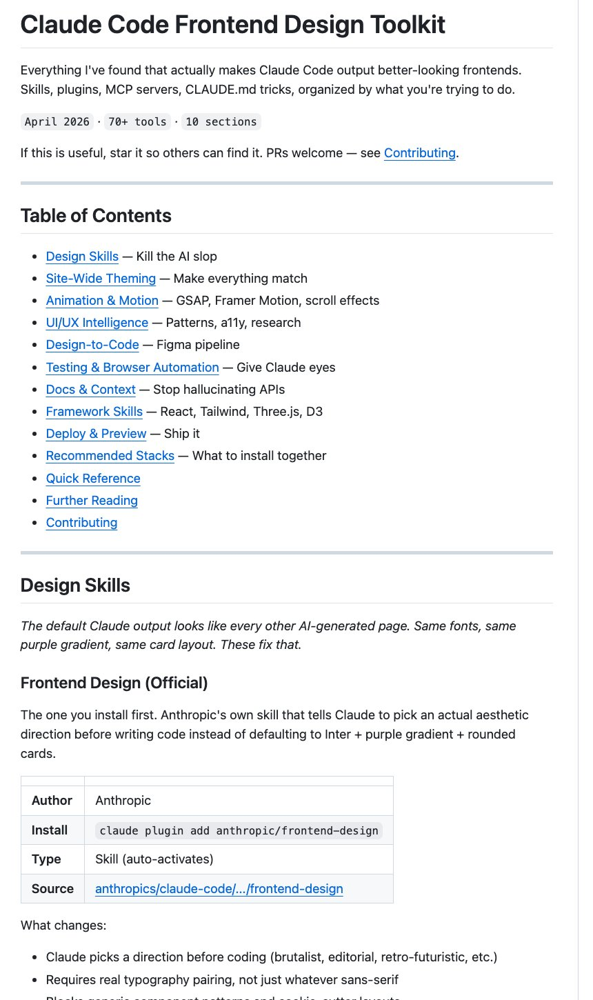

# Post by @wsl8297 on X
2026-08-11
用 Claude Code 写前端，功能通常不难，难的是别一眼看上去就像 AI 生成的模板页。Claude Code Frontend Design Toolkit 收的就是这类“让页面更像人做的”工具。

GitHub：[https://t.co/wh727IdTg9](https://t.co/wh727IdTg9)

它不是单个组件库，而是一份围绕 Claude Code 前端工作流整理的工具箱，重点放在设计风格、视觉判断、浏览器测试和上下文补全上。

主要内容：

\- Design Skills，用来减少常见的 AI 前端味  
\- 站点级主题和 Design Token，让页面风格统一  
\- 动效工具，比如 GSAP、Framer Motion、滚动效果  
\- UI/UX Intelligence，用来补模式、可访问性和研究资料  
\- Figma 到代码的设计转开发流程  
\- 浏览器测试和自动化，让 Claude Code 有“眼睛”检查页面  
\- Docs & Context，减少 API 幻觉  
\- React、Tailwind、Three.js、D3 等框架相关 Skill  
\- Recommended Stacks，按场景组合工具

已经在用 Claude Code 做前端的人，可以把它当成一份前端审美和工作流补丁。

## 画像の内容

### 画像1
Claude Codeのフロントエンドデザインツールキットを紹介するWebページのスクリーンショットです。目次やデザインスキルに関するセクションが含まれています。

Claude Code Frontend Design Toolkit

Everything I've found that actually makes Claude Code output better-looking frontends. Skills, plugins, MCP servers, CLAUDE.md tricks, organized by what you're trying to do.

April 2026 70+ tools 10 sections

If this is useful, star it so others can find it. PRs welcome — see Contributing.

Table of Contents

• Design Skills - Kill the Al slop
• Site-Wide Theming - Make everything match
• Animation & Motion - GSAP, Framer Motion, scroll effects
• UI/UX Intelligence - Patterns, a11y, research
• Design-to-Code - Figma pipeline
• Testing & Browser Automation - Give Claude eyes
• Docs & Context - Stop hallucinating APIs
• Framework Skills - React, Tailwind, Three.js, D3
• Deploy & Preview - Ship it
• Recommended Stacks - What to install together
• Quick Reference
• Further Reading
• Contributing

Design Skills

The default Claude output looks like every other Al-generated page. Same fonts, same purple gradient, same card layout. These fix that.

Frontend Design (Official)

The one you install first. Anthropic's own skill that tells Claude to pick an actual aesthetic direction before writing code instead of defaulting to Inter + purple gradient + rounded cards.

Author: Anthropic
Install: claude plugin add anthropic/frontend-design
Type: Skill (auto-activates)
Source: anthropics/claude-code/.../frontend-design

What changes:

• Claude picks a direction before coding (brutalist, editorial, retro-futuristic, etc.)
• Requires real typography pairing, not just whatever sans-serif
