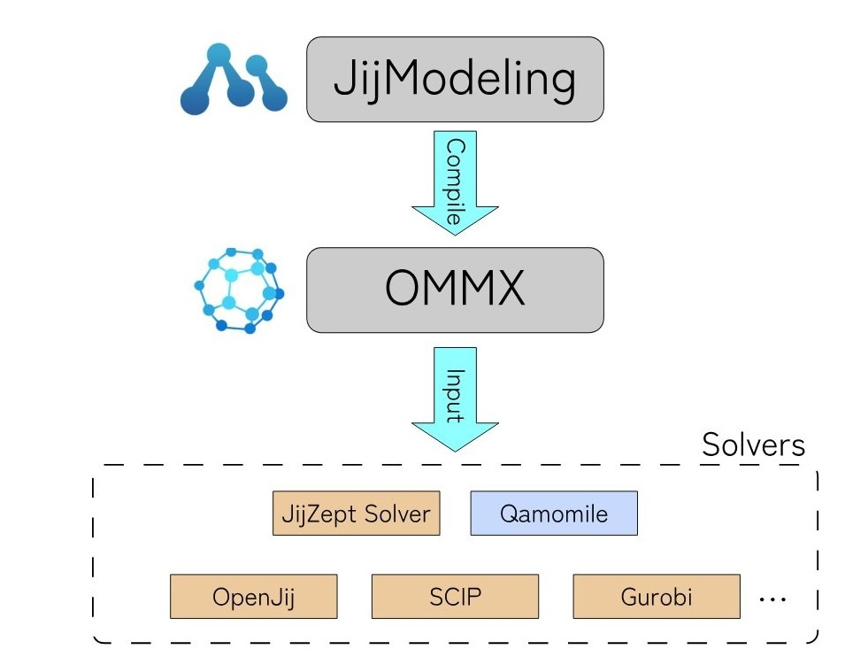

数理最適化モデリングツール「JijModeling 2」の新バージョンをリリースしました 🚀

コンパイラ内部表現として Flat AST を採用し、コンパイル時間とメモリ使用量を大幅に削減しました。当初計画では実装からローンチまで2ヶ月程度を見込んでいましたが、Claude Fable 5により初期実装は実働2日程度で完了✨  
その後、開発メンバーによる徹底的なレビュー、リファクタリングを経て1ヶ月弱でリリースまでこぎつけることができました！ Thank you @claudeai 🙌

詳しくは近日公開予定のPodcast や公式ドキュメントをご覧ください👉[https://t.co/PytrOvMhpp](https://t.co/PytrOvMhpp)

#JijModeling #MathematicalOptimization

## 画像の内容

### 画像1
JijModelingからOMMXへコンパイルされ、多様なソルバーに入力される仕組みを示したワークフロー図。
JijModeling
Compile
OMMX
Input
Solvers
JijZept Solver
Qamomile
OpenJij
SCIP
Gurobi
...
