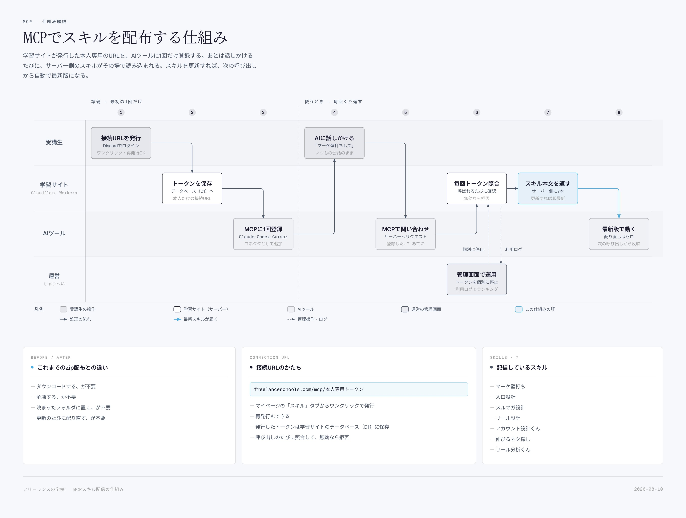

# Post by @shupeiman on X
2026-08-11
スキル配布をzipとかで渡すと「アップデートしたので再ダウンロードしてください問題」が発生する。

結論、MCPで解決しました。いまいちMCPサーバって使い所わからんかったけど、「ファイル配布不要になる」ということがわかって概念が変わった。

・講座で配ってきたClaude用スキル7本を、MCPサーバーでの配信に切り替えた  
・ファイルを配る必要がない  
・スキル本文はサーバーに置いたまま、受講生には本人専用の接続URLを1本渡すだけ  
・今までは配るたびにzip→DL→解凍→決まったフォルダに置く（この置き場所の質問がいちばん多かった）  
・今はURLをClaudeやCodexに1回登録したら、あとは「マーケの壁打ちして」と話しかけるだけ  
・スキルを直したら、次に呼ばれた瞬間から全員が最新版  
・再配布の手間がゼロになる  
・誰がどのスキルを何回使ったかログに残る  
・人気スキルランキングまで作れる  
・受講生じゃなくなった人の分は、サーバー側でそのURLだけ止められる

ただの配布コストの削減じゃなくて、使用体験のスムーズさと利用データで改善まで回せるのがデカい！

## 画像の内容

### 画像1
MCPを用いて学習サイトからAIツールへスキルを自動配布する仕組みを、準備段階と利用時のフローに分けて解説した図解です。

MCP・仕組み解説
MCPでスキルを配布する仕組み
学習サイトが発行した本人専用のURLを、AIツールに1回だけ登録する。あとは話しかけるたびに、サーバー側のスキルがその場で読み込まれる。スキルを更新すれば、次の呼び出しから最新版になる。

準備 - 最初の1回だけ
1:
受講生
接続URLを発行
Discordでログイン
ワンクリック・再発行OK

2:
学習サイト
Cloudflare Workers
トークンを保存
データベース（D1）へ
本人だけの接続URL

3:
AIツール
MCPに1回登録
Claude・Codex・Cursor
コネクタとして追加

使うとき - 毎回くり返す
4:
受講生
AIに話しかける
「マーケ壁打ちして」
いつもの会話のまま

5:
AIツール
MCPで問い合わせ
サーバーへリクエスト
登録したURLあてに

6:
学習サイト
Cloudflare Workers
毎回トークン照合
呼ばれるたびに確認
無効なら拒否

7:
学習サイト
Cloudflare Workers
スキル本文を返す
サーバー側に7本
更新すれば最新

8:
AIツール
最新版で動く
配り直しはゼロ
次の呼び出しから反映

運営
しゅうへい

管理画面で運用
トークンを個別に停止
利用ログでランキング
（管理画面・ログ、個別に停止、利用ログ）

凡例
受講生の操作
学習サイト（サーバー）
AIツール
運営の管理画面
この仕組みの肝
処理の流れ
最新スキルが届く
管理操作・ログ

BEFORE / AFTER
これまでのzip配布との違い
- ダウンロードする、が不要
- 解凍する、が不要
- 決まったフォルダに置く、が不要
- 更新のたびに配り直す、が不要

CONNECTION URL
接続URLのかたち
- `freelanceschools.com/mcp/本人専用トークン`
- マイページの「スキル」タブからワンクリックで発行
- 再発行もできる
- 発行したトークンは学習サイトのデータベース（D1）に保存
- 呼び出しのたびに照合して、無効なら拒否

SKILLS · 7
配信しているスキル
- マーケ壁打ち
- 入口設計
- メルマガ設計
- リール設計
- アカウント設計くん
- 伸びるネタ探し
- リール分析くん

フリーランスの学校 MCPスキル配信の仕組み
2026-08-10
