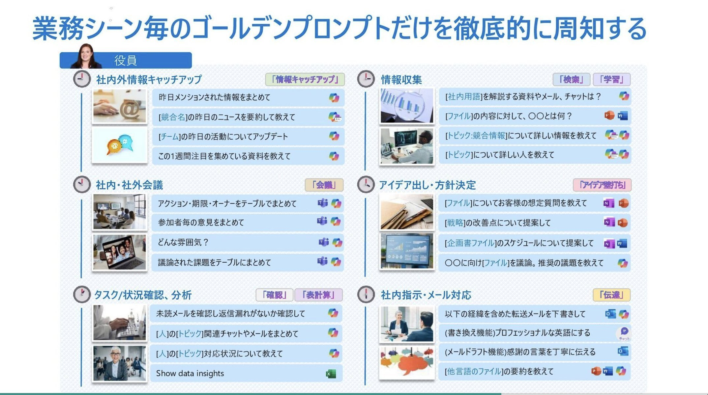

# Post by @SuguruKun_ai on X
2026-08-11
MicrosoftがAIで『一人当たり17時間の業務時間削減』を達成したゴールデンプロンプトが参考になる： https://t.co/WnYKN4SPYS

## 画像の内容

### 画像1
業務シーンごとのゴールデンプロンプトの活用例と、各シーンに応じた具体的な質問文の一覧を示した資料です。

業務シーン毎のゴールデンプロンプトだけを徹底的に周知する
役員
社内外情報キャッチアップ 「情報キャッチアップ」
昨日メンションされた情報をまとめて
[競合名]の昨日のニュースを要約して教えて
[チーム]の昨日の活動についてアップデート
この1週間注目を集めている資料を教えて
情報収集 「検索」「学習」
[社内用語]を解説する資料やメール、チャットは？
[ファイル]の内容に対して、〇〇とは何？
[トピック:競合情報]について詳しい情報を教えて
[トピック]について詳しい人を教えて
社内・社外会議 「会議」
アクション・期限・オーナーをテーブルでまとめて
参加者毎の意見をまとめて
どんな雰囲気？
議論された課題をテーブルでまとめて
アイデア出し・方針決定 「アイデア壁打ち」
[ファイル]についてお客様の想定質問を教えて
[戦略]の改善点について提案して
[企画書ファイル]のスケジュールについて提案して
〇〇に向け[ファイル]を議論。推奨の議題を教えて
タスク/状況確認、分析 「確認」「表計算」
未読メールを確認し返信漏れがないか確認して
[人]の[トピック]関連チャットやメールをまとめて
[人]の[トピック]対応状況について教えて
Show data insights
社内指示・メール対応 「伝達」
以下の経緯を含めた転送メールを下書きして
(書き換え機能)プロフェッショナルな英語にする
(メールドラフト機能)感謝の言葉を丁寧に伝える
[他言語のファイル]の要約を教えて
