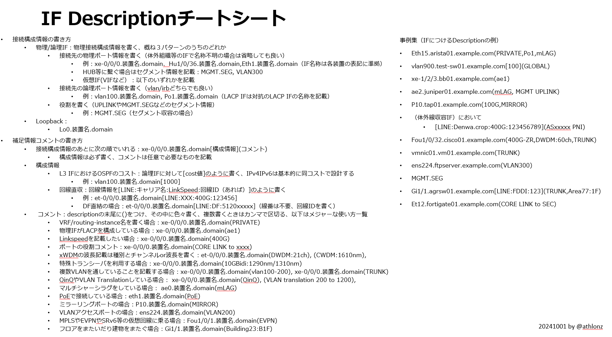

# Post by @athlonz on X
2026-08-11
NW機器のIFにつけるDescriptionチートシート作ったので放流しておく。大抵の場合これで賄えると思います。追加不足これ入れろやがあったらコメント下さい。 https://t.co/89uaWKyJAq

## 画像の内容

### 画像1
ネットワーク機器のインターフェース（IF）のDescriptionの書き方や構成情報をまとめたチートシートの画像です。右側には具体的な事例集が掲載されています。

IF Descriptionチートシート

- 接続構成情報の書き方
  - 物理/論理IF：物理接続構成を書く、概ね3パターンのうちのどれか
    - 接続先の物理ポート情報を書く（体外組織等のIFの場合は省略しても良い）
      - 例：xe-0/0/0.装置名.domain、Hu1/0/36.装置名.domain、Eth1.装置名.domain（IF名称は各装置の表記に準拠）
      - HUB等に繋ぐ場合はセグメント情報を記載：MGMT.SEG, VLAN300
      - 仮想IF(VIFなど）：以下のいずれかを記載
    - 接続先の論理ポート情報を書く（vlan/irbどちらでも良い）
      - 例：vlan100.装置名.domain, Po1.装置名.domain（LACP IFは対抗のLACP IFの名称を記載）
    - 役割を書く（UPLINKやMGMT.SEGなどのセグメント情報）
      - 例：MGMT.SEG（セグメント収容の場合）
  - Loopback：
    - Lo0.装置名.domain
- 補足情報コメントの書き方
  - 接続構成情報のあとに次の順でいれる：xe-0/0/0.装置名.domain[構成情報](コメント)
    - 構成情報は必ず書く、コメントは任意で必要なものを記載
  - 構成情報
    - L3 IFにおけるOSPFのコスト：論理IFに対して[cost値]のように書く、IPv4IPv6は基本的に同コストで設計する
      - 例：vlan100.装置名.domain[1000]
    - 回線直収：回線情報を[LINE:キャリア名:LinkSpeed:回線ID（あれば）]のように書く
      - 例：et-0/0/0.装置名.domain[LINE:XXX:400G:123456]
      - DF直結の場合：et-0/0/0.装置名.domain[LINE:DF:5120xxxxx]（線番は不要、回線IDを書く）
  - コメント：descriptionの末尾に()をつけ、その中に色々書く、複数書くときはカンマで区切る、以下はメジャーな使い方一覧
    - VRF/routing-instance名を書く場合：xe-0/0/0.装置名.domain(PRIVATE)
    - 物理IFがLACPを構成している場合：xe-0/0/0.装置名.domain(ae1)
    - Linkspeedを記載したい場合：xe-0/0/0.装置名.domain(400G)
    - ポートの役割コメント：xe-0/0/0.装置名.domain(CORE LINK to xxxx)
    - xWDMの波長記載は種別とチャンネルor波長を書く：et-0/0/0.装置名.domain(DWDM:21ch), (CWDM:1610nm),
    - 特殊トランシーバを利用する場合：xe-0/0/0.装置名.domain(10GBidi:1290nm/1310nm)
    - 複数VLANを通していることを記載する場合：xe-0/0/0.装置名.domain(vlan100-200), xe-0/0/0.装置名.domain(TRUNK)
    - QinQやVLAN Translationしている場合：xe-0/0/0.装置名.domain(QinQ), (VLAN translation 200 to 1200),
    - マルチシャーシラグをしている場合：ae0.装置名.domain(mLAG)
    - PoEで接続している場合：eth1.装置名.domain(PoE)
    - ミラーリングポートの場合：P10.装置名.domain(MIRROR)
    - VLANアクセスポートの場合：ens224.装置名.domain(VLAN200)
    - MPLSやEVPNやSRv6等の仮想回線に乗る場合：Fou1/0/1.装置名.domain(EVPN)
    - フロアをまたいだ建物をまたぐ場合：Gi1/1.装置名.domain(Building23:B1F)

事例集（IFにつけるDescriptionの例）
- Eth15.arista01.example.com(PRIVATE,Po1,mLAG)
- vlan900.test-sw01.example.com[100](GLOBAL)
- xe-1/2/3.bb01.example.com(ae1)
- ae2.juniper01.example.com(mLAG, MGMT UPLINK)
- P10.tap01.example.com(100G,MIRROR)
- （体外線収容IF）において
  - [LINE:Denwa.crop:400G:123456789](ASxxxxx PNI)
- Fou1/0/32.cisco01.example.com(400G-ZR,DWDM:60ch,TRUNK)
- vmnic01.vm01.example.com(TRUNK)
- ens224.ftpserver.example.com(VLAN300)
- MGMT.SEG
- Gi1/1.agrsw01.example.com[LINE:FDDI:123](TRUNK,Area77:1F)
- Et12.fortigate01.example.com(CORE LINK to SEC)

20241001 by @athlonz
