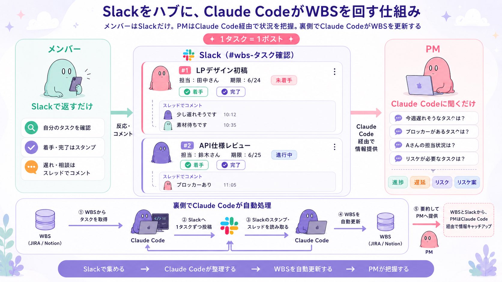

# Post by @suh_sunaneko on X
2026-08-11
誰も更新しなくなってしまうWBS問題。Slack ベースにしたWBS管理の仕組みを構築してプロジェクト管理を試みています。

いつものSlackだけでプロジェクトタスク管理をしてもらいAIで反映からリスク管理などを行う。どれだけ気軽にできるかが大事だと思う。 https://t.co/JHOehWtamT

## 画像の内容

### 画像1
Slackをハブに、Claude CodeがWBSを更新・管理する仕組みを図解した説明図です。メンバーはSlackでのスタンプやスレッドコメントでタスクを進め、PMはClaude Codeに質問して進捗を把握します。

Slackをハブに、Claude CodeがWBSを回す仕組み
メンバーはSlackだけ。PMはClaude Code経由で状況を把握。裏側でClaude CodeがWBSを更新する
✦ 1タスク＝1ポスト ✦
Slack (#wbs-タスク確認)
#1 LPデザイン初稿
担当：田中さん 期限：6/24 未着手
着手 完了
スレッドでコメント
少し遅れそうです 10:12
素材待ちです 10:35
#2 API仕様レビュー
担当：鈴木さん 期限：6/25 進行中
着手 完了
スレッドでコメント
ブロッカーあり 11:05
メンバー
Slackで返すだけ
自分のタスクを確認
着手・完了はスタンプ
遅れ・相談はスレッドでコメント
反応・コメント
PM
Claude Codeに聞くだけ
今週遅れそうなタスクは？
ブロッカーがあるタスクは？
Aさんの担当状況は？
リスケが必要なタスクは？
進捗 遅延 リスク リスケ案
Claude Code経由で情報提供
裏側でClaude Codeが自動処理
WBS (JIRA / Notion)
① WBSからタスクを取得
Claude Code
② Slackへ1タスクずつ投稿
③ Slackのスタンプ・スレッドを読み取る
Claude Code
④ WBSを自動更新
WBS (JIRA / Notion)
⑤ 要約してPMへ提供
PM
WBSとSlackから、PMはClaude Code経由で情報キャッチアップ
Slackで集める → Claude Codeが整理する → WBSを自動更新する → PMが把握する
