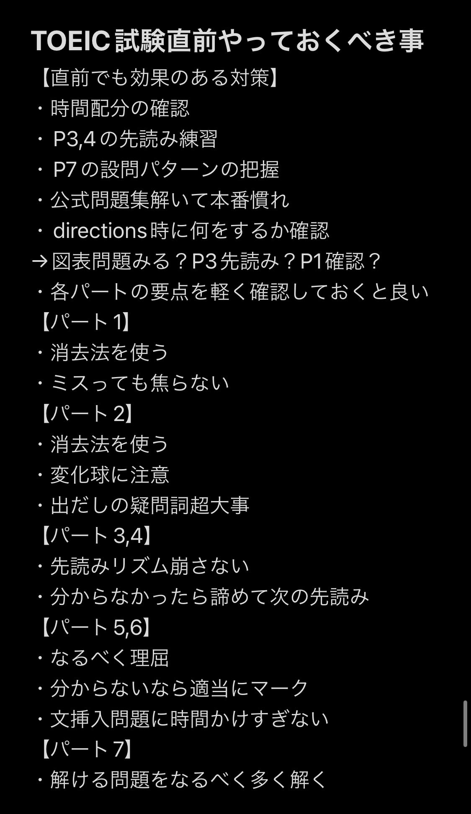

# Post by @bokitoeic on X
2026-08-11
TOEIC直前はこれ知ってるだけで点数上がる  
900点取った時も移動中にこのメモ見てた https://t.co/IwqrVGK7nP

## 画像の内容

### 画像1
TOEIC試験の直前に確認すべき対策や、各パートごとの注意点が黒地に白文字で箇条書きでまとめられています。

TOEIC試験直前やっておくべき事
【直前でも効果のある対策】
・時間配分の確認
・P3,4の先読み練習
・P7の設問パターンの把握
・公式問題集解いて本番慣れ
・directions時に何をするか確認
→図表問題みる？P3先読み？P1確認？
・各パートの要点を軽く確認しておくと良い
【パート1】
・消去法を使う
・ミスっても焦らない
【パート2】
・消去法を使う
・変化球に注意
・出だしの疑問詞超大事
【パート3,4】
・先読みリズム崩さない
・分からなかったら諦めて次の先読み
【パート5,6】
・なるべく理屈
・分からないなら適当にマーク
・文挿入問題に時間かけすぎない
【パート7】
・解ける問題をなるべく多く解く
