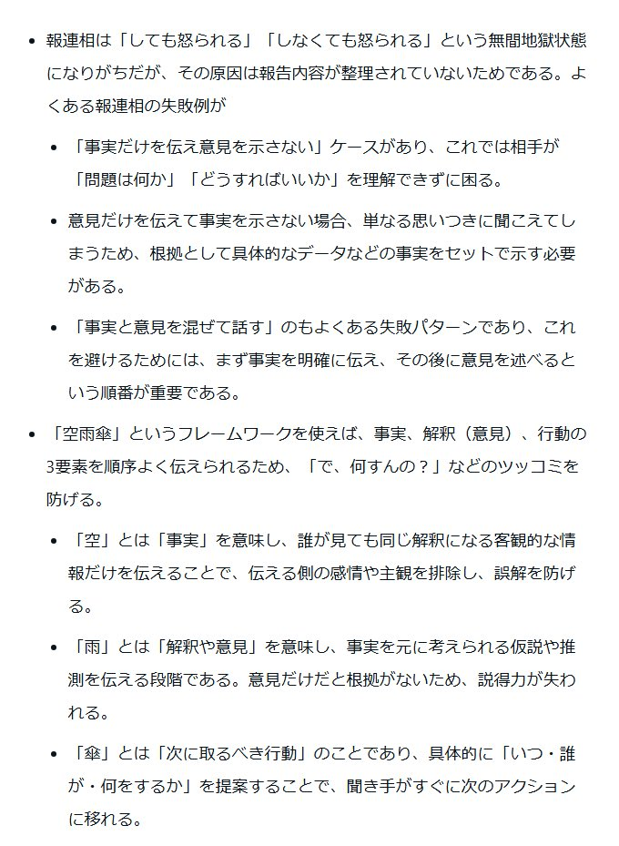

# Post by @ysk_motoyama on X
2026-08-11
コンサル時代に報連相が下手すぎて怒られたときのメモ https://t.co/HYQTrsVohr

## 画像の内容

### 画像1
報連相（報告・連絡・相談）の失敗例とその解決策として、事実・解釈（意見）・行動を整理して伝える「空雨傘」のフレームワークについて解説しているテキスト画像。

報連相は「しても怒られる」「しなくても怒られる」という無間地獄状態になりがちだが、その原因は報告内容が整理されていないためである。よくある報連相の失敗例が

「事実だけを伝え意見を示さない」ケースがあり、これでは相手が「問題は何か」「どうすればいいか」を理解できずに困る。

意見だけを伝えて事実を示さない場合、単なる思いつきに聞こえてしまうため、根拠として具体的なデータなどの事実をセットで示す必要がある。

「事実と意見を混ぜて話す」のもよくある失敗パターンであり、これを避けるためには、まず事実を明確に伝え、その後に意見を述べるという順番が重要である。

「空雨傘」というフレームワークを使えば、事実、解釈（意見）、行動の3要素を順序よく伝えられるため、「で、何すんの？」などのツッコミを防げる。

「空」とは「事実」を意味し、誰が見ても同じ解釈になる客観的な情報だけを伝えることで、伝える側の感情や主観を排除し、誤解を防げる。

「雨」とは「解釈や意見」を意味し、事実を元に考えられる仮説や推測を伝える段階である。意見だけだと根拠がないため、説得力が失われる。

「傘」とは「次に取るべき行動」のことであり、具体的に「いつ・誰が・何をするか」を提案することで、聞き手がすぐに次のアクションに移れる。
