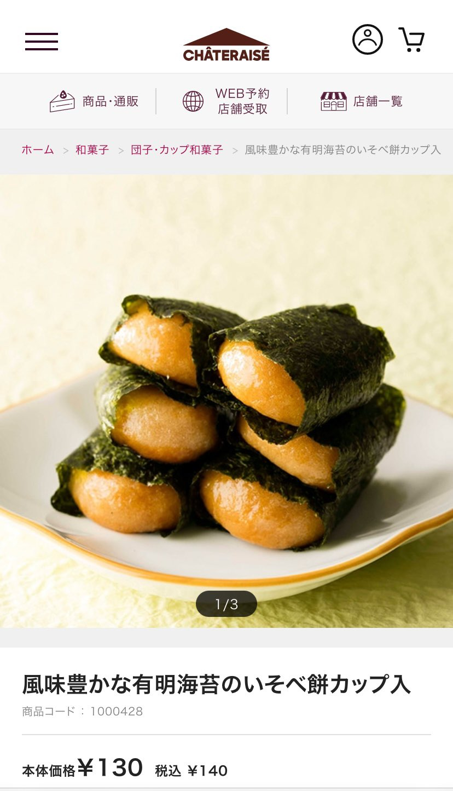

# Post by @crazyforyuyat on X
2026-08-11
コンサート前に大福食べるとお手洗い行かなくて済む件、人体実験を続けているのですがベストアイテムを見つけた気がします。  
シャトレーゼの磯辺餅  
これ全部がカップに入って130円。つまんで食べやすいし大福だとあんこ飽きたりする？そんなこともなく、餅の量多めだし。この前5時間余裕でした。 https://t.co/t7WlbGontL

## 画像の内容

### 画像1
シャトレーゼの「風味豊かな有明海苔のいそべ餅カップ入」のWebサイト上の商品紹介ページです。お皿に盛られた磯辺餅の写真と、価格情報が掲載されています。

CHÂTERAISÉ
商品・通販
WEB予約 店舗受取
店舗一覧
ホーム > 和菓子 > 団子・カップ和菓子 > 風味豊かな有明海苔のいそべ餅カップ入
1/3
風味豊かな有明海苔のいそべ餅カップ入
商品コード：1000428
本体価格 ￥130 税込 ￥140
