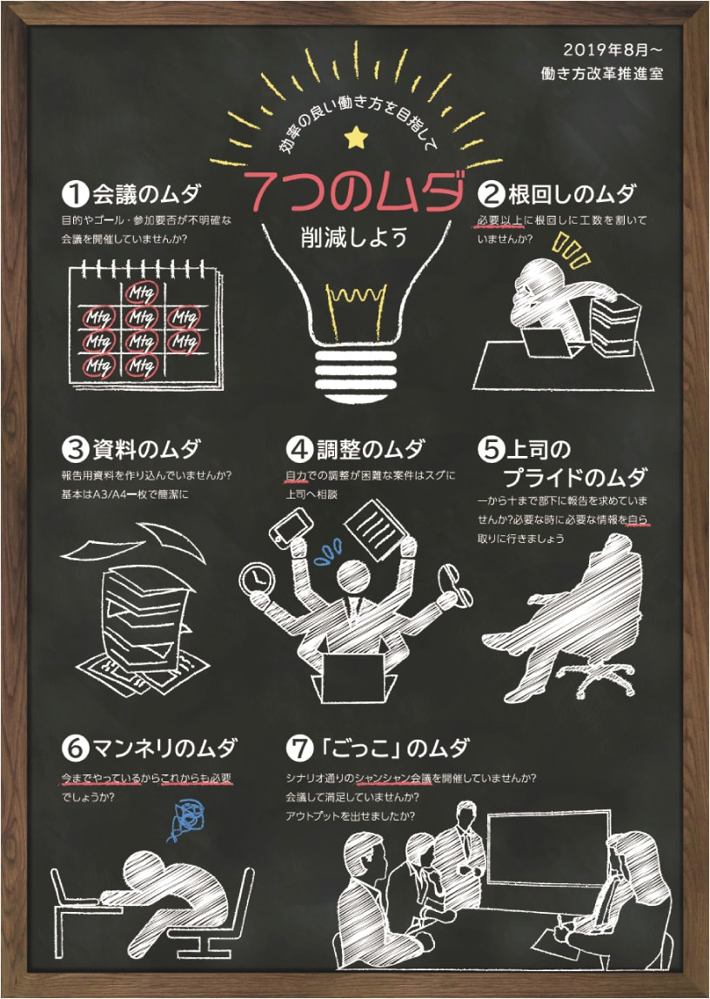

# Post by @career_koumei on X
2026-08-11
トヨタ社内に貼ってある7つのムダ  
素晴らしすぎて10000点あげたい https://t.co/Z8HgXmS1T0

## 画像の内容

### 画像1
効率の良い働き方を目指すための「7つのムダ削減しよう」というテーマが、黒板風のデザインでイラスト付きでまとめられているインフォグラフィックです。

2019年8月～ 働き方改革推進室
効率の良い働き方を目指して
7つのムダ 削減しよう
①会議のムダ 目的やゴール・参加要否が不明確な会議を開催していませんか？
②根回しのムダ 必要以上に根回しに工数を割いていませんか？
③資料のムダ 報告用資料を作り込んでいませんか？基本はA3/A4一枚で簡潔に
④調整のムダ 自力での調整が困難な案件はスグに上司へ相談
⑤上司のプライドのムダ ーから十まで部下に報告を求めていませんか？必要な時に必要な情報を自ら取りに行きましょう
⑥マンネリのムダ 今までやっているからこれからも必要でしょうか？
⑦「ごっこ」のムダ シナリオ通りのシャンシャン会議を開催していませんか？会議して満足していませんか？アウトプットを出せましたか？
