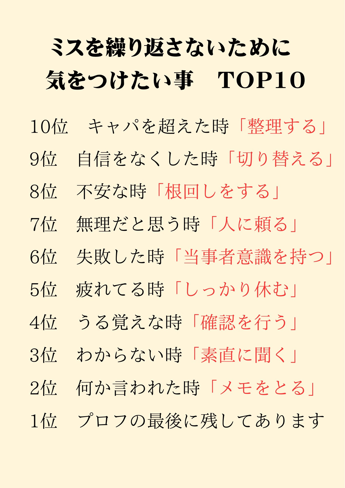

# Post by @masamune_free on X
2026-08-11
ミスを繰り返さないために気をつけたい事TOP10はこれ。 https://t.co/Rrmi2FtNto

## 画像の内容

### 画像1
ミスを繰り返さないために気をつけたいことを10位から1位までランキング形式でまとめた画像です。

ミスを繰り返さないために気をつけたい事 TOP10

10位 キャパを超えた時「整理する」
9位 自信をなくした時「切り替える」
8位 不安な時「根回しをする」
7位 無理だと思う時「人に頼る」
6位 失敗した時「当事者意識を持つ」
5位 疲れてる時「しっかり休む」
4位 うる覚えな時「確認を行う」
3位 わからない時「素直に聞く」
2位 何か言われた時「メモをとる」
1位 プロフの最後に残してあります
