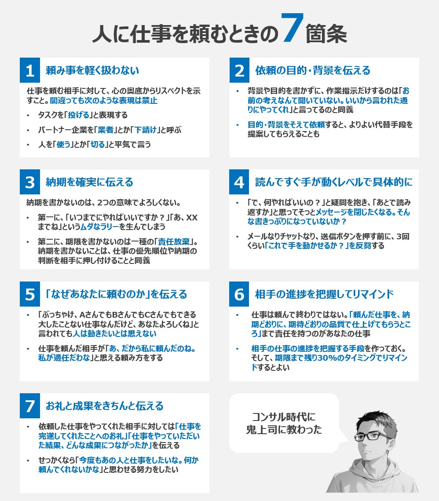

# Post by @ysk_motoyama on X
2026-08-11
コンサル時代の鬼上司に「人に仕事を頼むときに絶対守ること」と言われた7箇条 https://t.co/APkFzMq15v

## 画像の内容

### 画像1
人に仕事を頼むときの7箇条をまとめたビジネス向けのインフォグラフィック画像。リスペクトを持つこと、目的を伝えること、納期を伝えること、具体的に指示すること、依頼理由を伝えること、進捗を把握してリマインドすること、お礼と成果を伝えることの7点が解説されている。

人に仕事を頼むときの7箇条

1 頼み事を軽く扱わない
仕事を頼む相手に対して、心の奥底からリスペクトを示すこと。間違っても次のような表現は禁止
- タスクを「投げる」と表現する
- パートナー企業を「業者」とか「下請け」と呼ぶ
- 人を「使う」とか「切る」と平気で言う

2 依頼の目的・背景を伝える
- 背景や目的を書かずに、作業指示だけするのは「お前の考えなんて聞いていない。いいから言われた通りにやってくれ」と言ってるのと同義
- 目的・背景をそえて依頼すると、よりよい代替手段を提案してもらえることも

3 納期を確実に伝える
納期を書かないのは、2つの意味でよろしくない。
- 第一に、「いつまでにやればいいですか?」「あ、XXまでね」というムダなラリーを生んでしまう
- 第二に、期限を書かないのは一種の「責任放棄」。納期を書かないことは、仕事の優先順位や納期の判断を相手に押し付けることと同義

4 読んですぐ手が動くレベルで具体的に
- 「で、何やればいいの？」と疑問を抱き、「あとで読み返すか」と思ってそっとメッセージを閉じたくなる。そんな書きっぷりになっていないか？
- メールなりチャットなり、送信ボタンを押す前に、3回くらい「これで手を動かせるか？」を反芻する

5 「なぜあなたに頼むのか」を伝える
- 「ぶっちゃけ、AさんでもBさんでもCさんでもできる大したことない仕事なんだけど、あなたよろしくね」と言われても人は動きたいとは思えない
- 仕事を頼んだ相手が「あ、だから私に頼んだのね。私が適任だな」と思える頼み方をする

6 相手の進捗を把握してリマインド
- 仕事は頼んで終わりではない。「頼んだ仕事を、納期どおりに、期待どおりの品質で仕上げてもらうところ」まで責任を持つのがあなたの仕事
- 相手の仕事の進捗を把握する手段を作っておく。そして、期限まで残り30%のタイミングでリマインドするとよい

7 お礼と成果をきちんと伝える
- 依頼した仕事をやってくれた相手に対しては「仕事を完遂してくれたことへの「お礼」「仕事をやっていただけた結果、どんな成果につながったか」を伝える
- せっかくなら「今度もあの人と仕事をしたいな。何か頼んでくれないかな」と思わせる努力をしたい

コンサル時代に鬼上司に教わった
