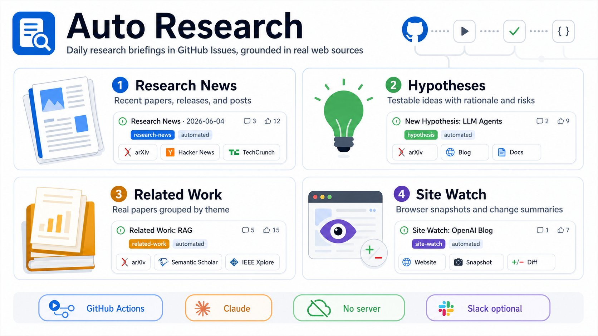
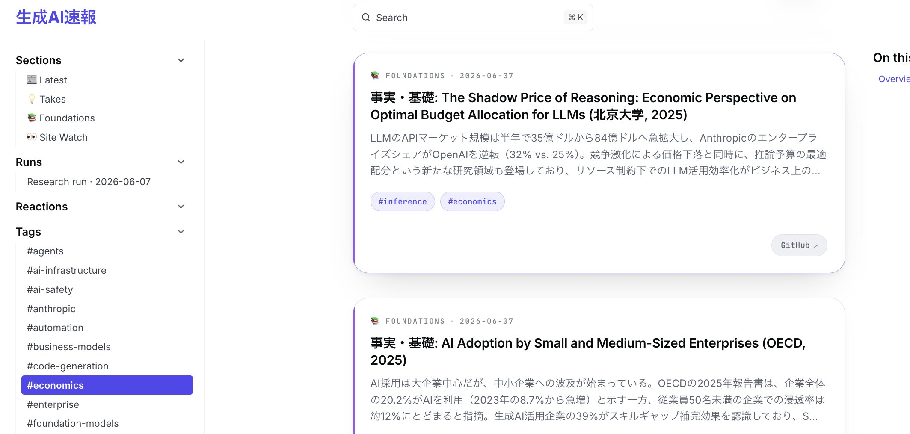
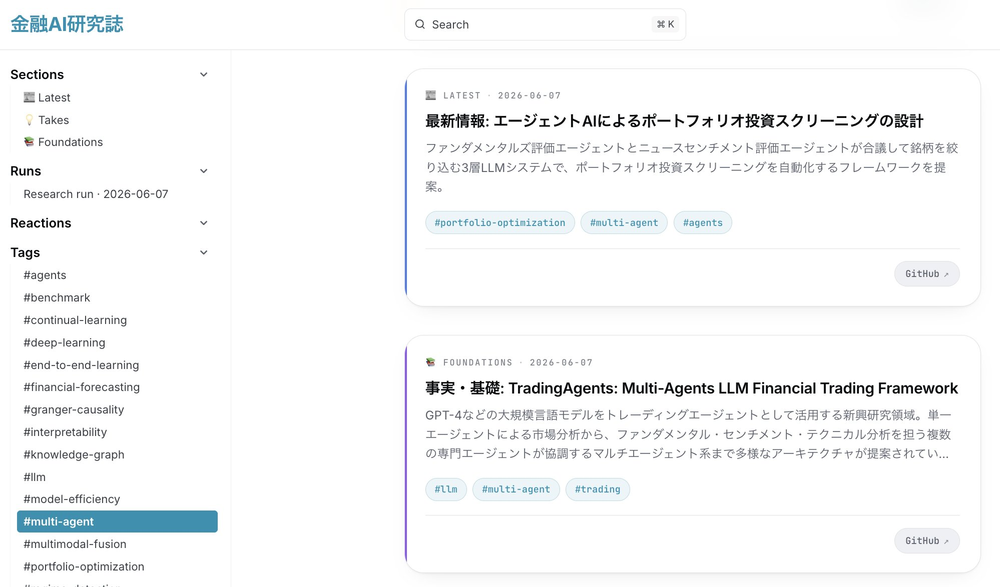

# Post by @k1ito on X
2026-08-11
明日からは人工知能学会ということで、

リサーチ業務  
・最新研究のクロール  
・Related Workの巡回  
・研究仮説生成  
・関連ラボサイト更新通知  
を自動化して、ページ公開・Slack/メール配信までClaudeが勝手にやってくれるテンプレートをOSSで公開しました〜〜〜

[https://t.co/hU0R9knBg6](https://t.co/hU0R9knBg6)　(1/N) https://t.co/cBO1OPkA1M

  

## 画像の内容

### 画像1
GitHub Issuesを活用し、実世界のWebソースに基づいて日々のリサーチ情報をまとめるシステム「Auto Research」の概要図です。「Research News」「Hypotheses」「Related Work」「Site Watch」の4つの主要機能や、GitHub Actions、Claude、No server、Slack optionalなどの要素が図解されています。
Auto Research
Daily research briefings in GitHub Issues, grounded in real web sources
1 Research News
Recent papers, releases, and posts
Research News 2026-06-04
3 12
research-news
automated
arXiv
Hacker News
TechCrunch
2 Hypotheses
Testable ideas with rationale and risks
New Hypothesis: LLM Agents
2 9
hypothesis
automated
arXiv
Blog
Docs
3 Related Work
Real papers grouped by theme
Related Work: RAG
5 15
related-work
automated
arXiv
Semantic Scholar
IEEE Xplore
4 Site Watch
Browser snapshots and change summaries
Site Watch: OpenAI Blog
1 7
site-watch
automated
Website
Snapshot
Diff
GitHub Actions
Claude
No server
Slack optional

### 画像2
「生成AI速報」というWebサイトの画面キャプチャで、ファウンデーションモデルに関する最新の研究論文の要約や関連タグ一覧が表示されています。
生成AI速報
Q Search
⌘K
Sections
Latest
Takes
Foundations
Site Watch
Runs
Research run · 2026-06-07
Reactions
Tags
#agents
#ai-infrastructure
#ai-safety
#anthropic
#automation
#business-models
#code-generation
#economics
#enterprise
#foundation-models
FOUNDATIONS 2026-06-07
事実・基礎: The Shadow Price of Reasoning: Economic Perspective on Optimal Budget Allocation for LLMs (北京大学, 2025)
LLMのAPIマーケット規模は半年で35億ドルから84億ドルへ急拡大し、AnthropicのエンタープライズシェアがOpenAIを逆転（32% vs. 25%）。競争激化による価格下落と同時に、推論予算の最適配分という新たな研究領域も登場しており、リソース制約下でのLLM活用効率化がビジネス上の…
#inference
#economics
GitHub
FOUNDATIONS 2026-06-07
事実・基礎: AI Adoption by Small and Medium-Sized Enterprises (OECD, 2025)
AI採用は大企業中心だが、中小企業への波及が始まっている。OECDの2025年報告書は、企業全体の20.2%がAIを利用（2023年の8.7%から急増）と示す一方、従業員50名未満の企業での浸透率は約12%にとどまると指摘。生成AI活用企業の39%がスキルギャップ補完効果を認識しており、S…

### 画像3
「金融AI研究誌」というWebサイトの画面キャプチャで、エージェントAIを活用したポートフォリオ投資スクリーニングや金融トレーディングフレームワークに関する論文の要約が表示されています。
金融AI研究誌
Q Search
⌘K
Sections
Latest
Takes
Foundations
Runs
Research run · 2026-06-07
Reactions
Tags
#agents
#benchmark
#continual-learning
#deep-learning
#end-to-end-learning
#financial-forecasting
#granger-causality
#interpretability
#knowledge-graph
#llm
#model-efficiency
#multi-agent
#multimodal-fusion
#portfolio-optimization
LATEST 2026-06-07
最新情報: エージェントAIによるポートフォリオ投資スクリーニングの設計
ファンダメンタルズ評価エージェントとニュースセンチメント評価エージェントが合議して銘柄を絞り込む3層LLMシステムで、ポートフォリオ投資スクリーニングを自動化するフレームワークを提案。
#portfolio-optimization
#multi-agent
#agents
GitHub
FOUNDATIONS 2026-06-07
事実・基礎: TradingAgents: Multi-Agents LLM Financial Trading Framework
GPT-4などの大規模言語モデルをトレーディングエージェントとして活用する新興研究領域。単一エージェントによる市場分析から、ファンダメンタル・センチメント・テクニカル分析を担う複数の専門エージェントが協調するマルチエージェント系まで多様なアーキテクチャが提案されてい…
#llm
#multi-agent
#trading
GitHub
