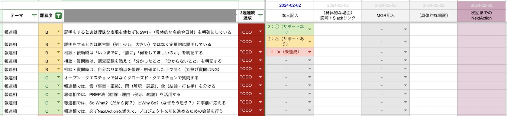

# Post by @yuzutas0 on X
2026-08-11
人材育成で一番役に立っているの、このシートかも。一見すると地味で退屈なんだけど、繰り返すうちに「主体的に問題解決するスタンスやスキル」が身につくので、結果的に専門分野のインプット＆アウトプットが爆速になる。ITエンジニアの技術相談でも、伸びる若手はこれらが出来ているよね。 https://t.co/4iRU8bV6au

## 画像の内容

### 画像1
ビジネススキルや報連相の項目と難易度、達成状況、本人記入欄などが整理されたスプレッドシートの画面です。

テーマ 難易度 3週連続達成 2024-02-02 本人記入 2024-02-02 (具体的な場面) 説明+Slackリンク MGR記入 (具体的な場面) 2024-02-02 次回までのNextAction
報連相 B 説明をするときは曖昧な表現を使わずに5W1H (具体的な名前や日付) を明確にしている TODO 3: ◯ (サポートなし) 2: △ (サポートあり) 1: ✕ (未達成) - - -
報連相 B 説明をするときは形容詞 (例: 少し、大きい) ではなく定量的に説明している TODO - - -
報連相 B 相談・依頼時は「いつまでに」「誰に」「何をしてほしいのか」を明記する TODO - - -
報連相 B 相談・質問時は、調査記録を添えて「分かったこと」「分からないこと」を明記する TODO - - -
報連相 B 相談・質問時は、自分なりに論点を整理・明確にした上で聞く (丸投げ質問はNG) TODO - - -
報連相 C オープン・クエスチョンではなくクローズド・クエスチョンで質問する TODO - - -
報連相 C 報連相では、雲 (事実・証拠)、雨 (解釈・課題)、傘 (結論・打ち手) を分ける TODO - - -
報連相 C 報連相では、PREP法 (結論→理由→例示→結論) を活用する TODO - - -
報連相 C 報連相では、So What? (だから何?) とWhy So? (なぜそう思う?) に事前に応える TODO - - -
報連相 C 報連相では、必ずNextActionを添えて、プロジェクトを前に進めるための会話を行う TODO - - -
