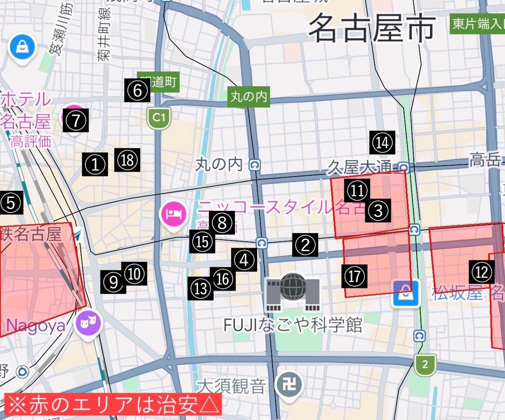

# Post by @ore_ikitai on X
2026-08-11
名古屋の治安別×コスパ良いホテルまとめ。保存推奨🔖  
\-  
①モンブランホテルラフィネ(おしゃ)  
②ドーミーインPREMIUM(サウナ)  
③ベッセルイン栄駅前(綺麗&立地便利)  
④ダイワロイネット伏見(大浴場&安定)  
⑤名鉄イン名古屋駅新幹線口(綺麗&高層)  
⑥三交インGrande(大浴場&トイレ風呂別)  
⑦ベッセルホテルカンパーナ(サウナ)  
⑧ランプライトブックスホテル(本読み放題)  
⑨くれたけインプレミアム名駅南(朝食無料)  
⑩コンフォートホテルERA名駅南(朝食無料)  
⑪ホテルビスタ錦(トイレ風呂別&繁華街)  
⑫ホテルルートイン栄(大浴場&朝食無料)  
⑬ DEL style納屋橋(安い&可愛い&狭い)  
⑭アパホテル名古屋栄北(大浴場)  
⑮ビーズホテル(安い&サウナ&古い)  
⑯クラウンホテル(安い&温泉&古い)  
⑰ガーランドホテル(安い&繁華街&古い)  
⑱スーパーホテルPremier名古屋天然温泉桜通口(大浴場&お酒無料)

※実際に泊まったホテルのみ記載  
※赤のエリアは治安△(夜に女性一人で歩きにくいという意味で)

治安についてコメントや補足あればぜひ！

特にオススメのホテルや詳細はリプに↓↓

## 画像の内容

### 画像1
名古屋市周辺の地図に、番号付きのピンと赤い治安が悪いとされるエリアが表示されています。画像内の文字は以下の通りです。
名古屋市 東片端入 笠瀬川筋 菊井町線 道道町 C1 丸ノ内 久屋大通 高岳 ホテル名古屋 高評価 鉄名古屋 Nagoya ニッコースタイル名古屋 丸の内 FUJIなごや科学館 松坂屋名 大須観音 ※赤のエリアは治安△ 1 2 3 4 5 6 7 8 9 10 11 12 13 14 15 16 17 18
