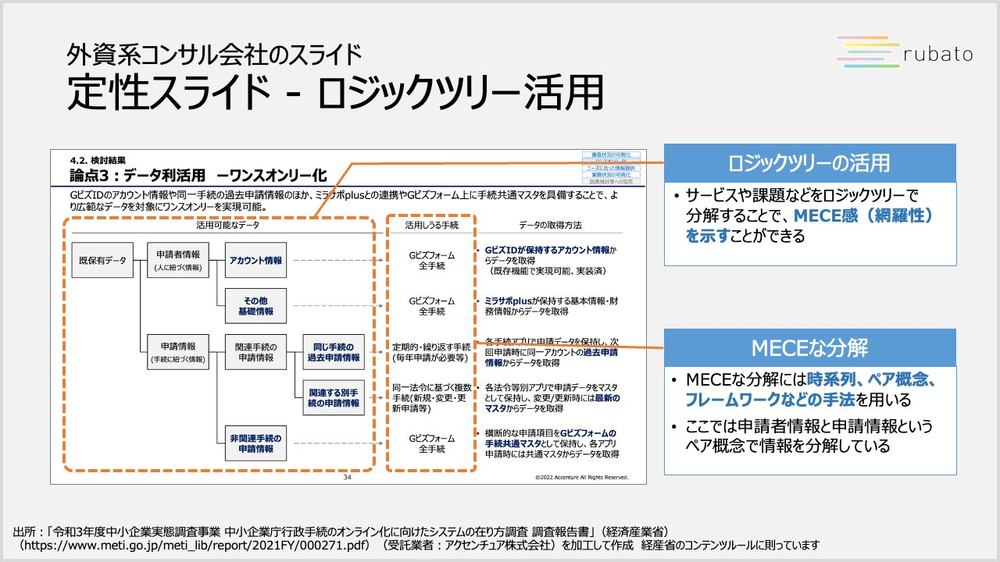
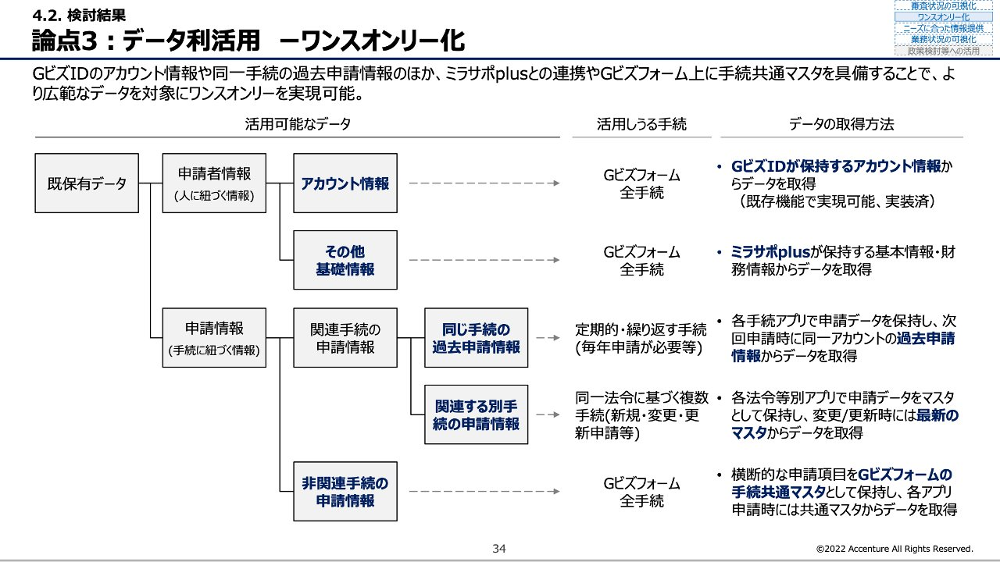

# Post by @J_Matsugami on X
2026-08-11
【外資系コンサルのスライド - ロジックツリー活用】  
アクセンチュアのスライドです

サービスや課題などを分解してロジックツリーで示すことで、MECEに検討したことを示せます

ここではMECEに分解する手法の一つであるペア概念（国内と国外のようなMECEなペア）が使われています https://t.co/Lp4TqtqeqK

 

## 画像の内容

### 画像1
外資系コンサル会社のスライドを用いた「定式スライド - ロジックツリー活用」の解説画像です。右側の青い枠内には、ロジックツリーの活用方法やMECEな分解についての補足説明が記載されています。
外資系コンサル会社のスライド 定式スライド - ロジックツリー活用
rubato
4.2. 検討結果
論点3：データ利活用 ーワンスオンリー化
GビズIDのアカウント情報や同一手続の過去申請情報のほか、ミラサポplusとの連携やGビズフォーム上に手続共通マスタを具備することで、より広範なデータを対象にワンスオンリーを実現可能。
活用可能なデータ
既保有データ
申請者情報（人に紐づく情報）
アカウント情報
その他基礎情報
申請情報（手続に紐づく情報）
関連手続の申請情報
同じ手続の過去申請情報
関連する別手続の申請情報
非関連手続の申請情報
活用しうる手続
Gビズフォーム 全手続
Gビズフォーム 全手続
定期的・繰り返す手続（毎年申請が必要等）
同一法令に基づく複数手続（新規・変更・更新申請等）
Gビズフォーム 全手続
データの取得方法
GビズIDが保持するアカウント情報からデータを取得（既存機能で実現可能、実装済）
ミラサポplusが保持する基本情報・財務情報からデータを取得
各手続アプリで申請データを保持し、次回申請時に同一アカウントの過去申請情報からデータを取得
各法令等別アプリで申請データをマスタとして保持、変更/更新時には最新のマスタからデータを取得
横断的な申請項目をGビズフォームの手続共通マスタとして保持、各アプリ申請時には共通マスタからデータを取得
34
©2022 Accenture All Rights Reserved.
ロジックツリーの活用
- サービスや課題などをロジックツリーで分解することで、MECE感（網羅性）を示すことができる
MECEな分解
- MECEな分解には時系列、ペア概念、フレームワークなどの手法を用いる
- ここでは申請者情報と申請情報というペア概念で情報を分解している
出所：「令和3年度中小企業実態調査事業 中小企業庁行政手続のオンライン化に向けたシステムの在り方調査 調査報告書」（経済産業省） （https://www.meti.go.jp/meti_lib/report/2021FY/000271.pdf）（受託業者：アクセンチュア株式会社）を加工して作成 経産省のコンテンツルールに則っています

### 画像2
「論点3：データ利活用 ーワンスオンリー化」について、データをツリー状に分類して活用しうる手続とデータの取得方法を整理したスライド画像です。
4.2. 検討結果
論点3：データ利活用 ーワンスオンリー化
GビズIDのアカウント情報や同一手続の過去申請情報のほか、ミラサポplusとの連携やGビズフォーム上に手続共通マスタを具備することで、より広範なデータを対象にワンスオンリーを実現可能。
活用可能なデータ
活用しうる手続
データの取得方法
既保有データ
申請者情報（人に紐づく情報）
アカウント情報
その他基礎情報
申請情報（手続に紐づく情報）
関連手続の申請情報
同じ手続の過去申請情報
関連する別手続の申請情報
非関連手続の申請情報
Gビズフォーム 全手続
Gビズフォーム 全手続
定期的・繰り返す手続（毎年申請が必要等）
同一法令に基づく複数手続（新規・変更・更新申請等）
Gビズフォーム 全手続
GビズIDが保持するアカウント情報からデータを取得（既存機能で実現可能、実装済）
ミラサポplusが保持する基本情報・財務情報からデータを取得
各手続アプリで申請データを保持し、次回申請時に同一アカウントの過去申請情報からデータを取得
各法令等別アプリで申請データをマスタとして保持、変更/更新時には最新のマスタからデータを取得
横断的な申請項目をGビズフォームの手続共通マスタとして保持、各アプリ申請時には共通マスタからデータを取得
34
©2022 Accenture All Rights Reserved.
