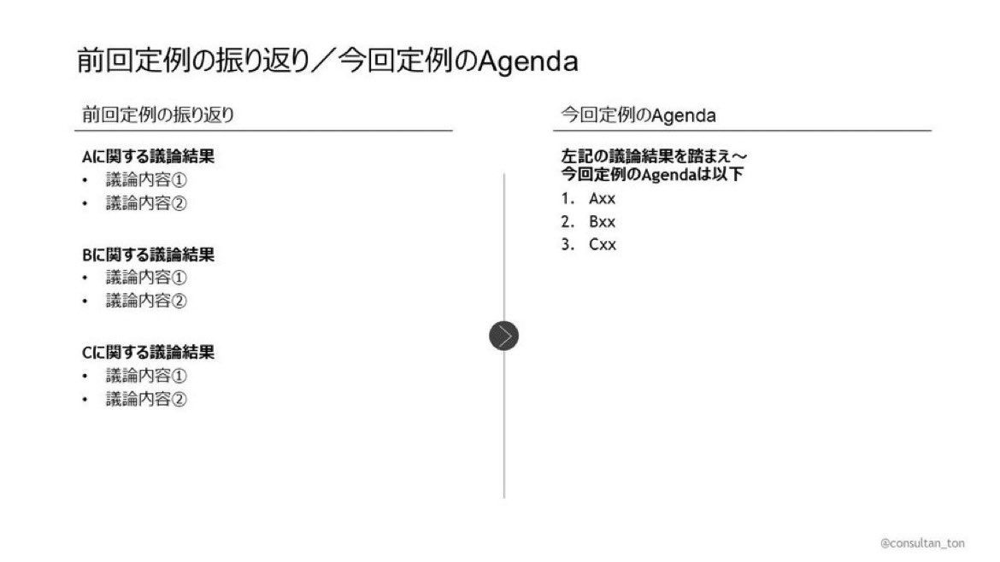

# Post by @consultan_ton on X
2026-08-11
元BCGのパートナーから「定例資料には必ず、最初に『前回定例の振り返り/今回定例のAgenda』というのを１枚入れた方が良い」と言われた。

クライアントとの限られた会議の時間を有効に使うためには必要だし、この１枚を作り続ける習慣は身に着けてよかったと思う。

昔の上司に感謝。 https://t.co/Z2TDZrPioK

## 画像の内容

### 画像1
前回定例の振り返りと今回定例のアジェンダの構成案を示すスライドの画像です。

前回定例の振り返り／今回定例のAgenda

前回定例の振り返り

Aに関する議論結果
・議論内容①
・議論内容②

Bに関する議論結果
・議論内容①
・議論内容②

Cに関する議論結果
・議論内容①
・議論内容②

今回定例のAgenda

左記の議論結果を踏まえ〜
今回定例のAgendaは以下
1. Axx
2. Bxx
3. Cxx

@consultan_ton
