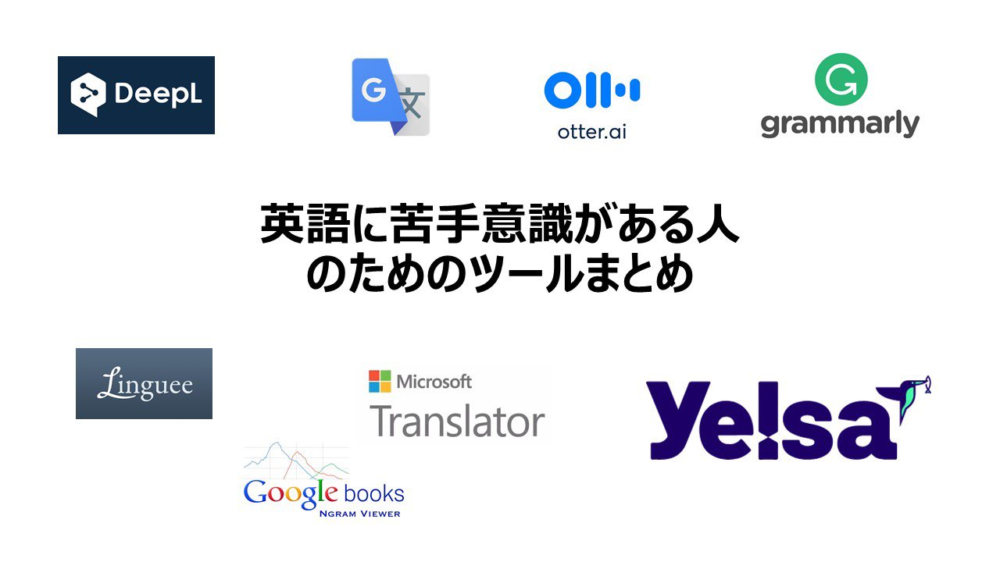
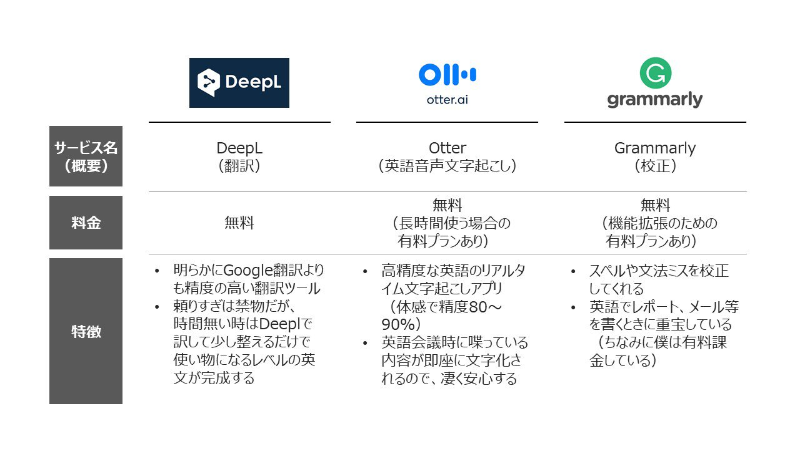
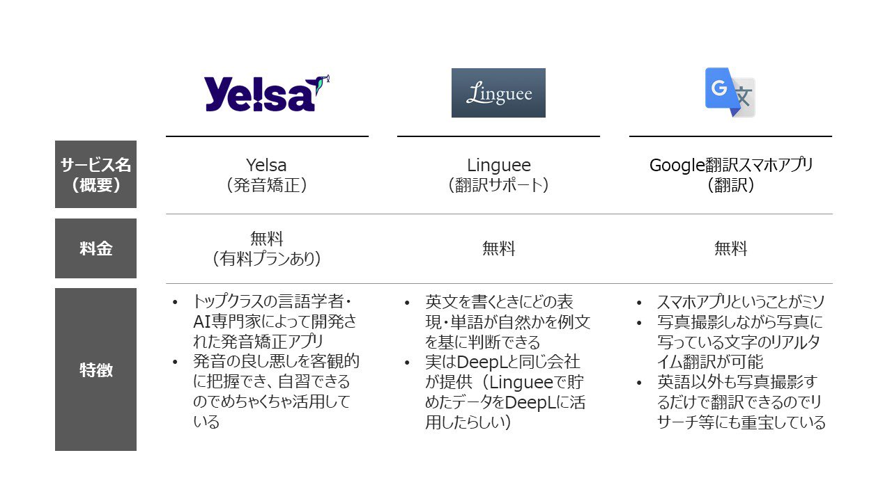
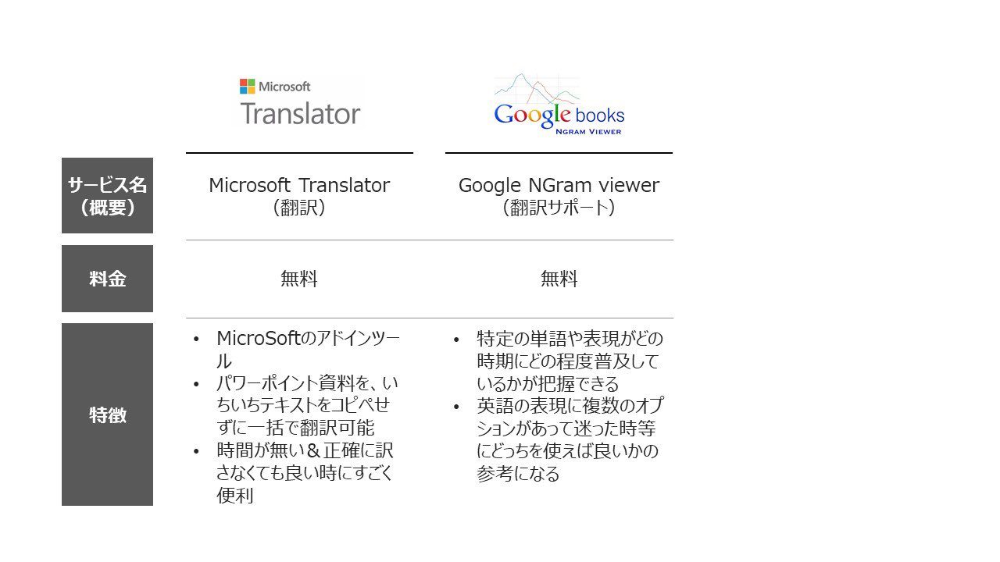

# Post by @jujulife7 on X
2026-08-11
自分が頼りまくってる英語関連の神ツールをまとめてみました✍🏻 https://t.co/X1g7qa0123

   

## 画像の内容

### 画像1
英語に苦手意識がある人のためのツールまとめというタイトルとともに、DeepL、Google翻訳、Otter.ai、Grammarly、Linguee、Microsoft Translator、Google books Ngram Viewer、Yelsaの各ツールのロゴが配置されています。
DeepL
G文
otter.ai
grammarly
英語に苦手意識がある人のためのツールまとめ
Linguee
Microsoft Translator
Yelsa
Google books Ngram Viewer

### 画像2
英語学習や翻訳に役立つ3つのツール（DeepL、Otter、Grammarly）のサービス名、料金、特徴をまとめた比較表です。
サービス名 (概要)
DeepL (翻訳)
Otter (英語音声文字起こし)
Grammarly (校正)
料金
無料
無料 (長時間使う場合の有料プランあり)
無料 (機能拡張のための有料プランあり)
特徴
明らかにGoogle翻訳よりも精度の高い翻訳ツール
頼りすぎは禁物だが、時間無い時はDeepLで訳して少し整えるだけで使い物になるレベルの英文が完成する
高精度な英語のリアルタイム文字起こしアプリ (体感で精度80～90%)
英語会議時に喋っている内容が即座に文字化されるので、凄く安心する
スペルや文法ミスを校正してくれる
英語でレポート、メール等を書くときに重宝している (ちなみに僕は有料課金している)

### 画像3
英語学習や翻訳に役立つ3つのツール（Yelsa、Linguee、Google翻訳スマホアプリ）のサービス名、料金、特徴をまとめた比較表です。
サービス名 (概要)
Yelsa (発音矯正)
Linguee (翻訳サポート)
Google翻訳スマホアプリ (翻訳)
料金
無料 (有料プランあり)
無料
無料
特徴
トップクラスの言語学者・AI専門家によって開発された発音矯正アプリ
発音の良し悪しを客観的に把握でき、自習できるのでめちゃくちゃ活用している
英文を書くときにどの表現・単語が自然かを例文を基に判断できる
実はDeepLと同じ会社が提供 (Lingueeで貯めたデータをDeepLに活用したらしい)
スマホアプリということがミソ
写真撮影しながら写真に写っている文字のリアルタイム翻訳が可能
英語以外も写真撮影するだけで翻訳できるのでリサーチ等にも重宝している

### 画像4
英語学習や翻訳に役立つ2つのツール（Microsoft Translator、Google Ngram viewer）のサービス名、料金、特徴をまとめた比較表です。
サービス名 (概要)
Microsoft Translator (翻訳)
Google Ngram viewer (翻訳サポート)
料金
無料
無料
特徴
Microsoftのアドインツール
パワーポイント資料を、いちいちテキストをコピペせずに一括で翻訳可能
時間が無い＆正確に訳さなくても良い時にすごく便利
特定の単語や表現がどの時期にどの程度普及しているかが把握できる
英語の表現に複数のオプションがあって迷った時等にどっちを使えば良いかの参考になる
