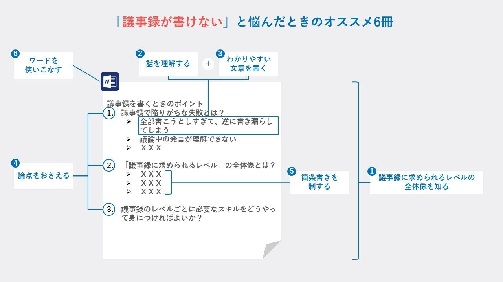
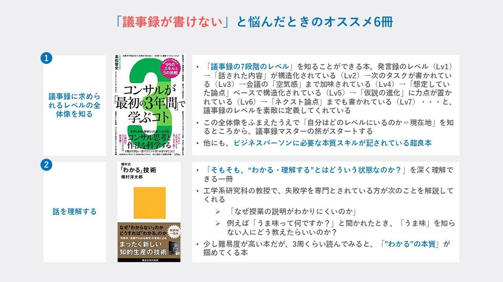
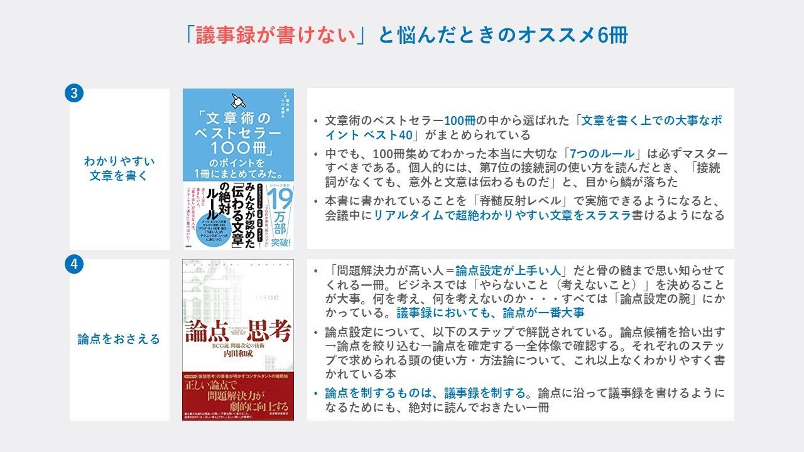
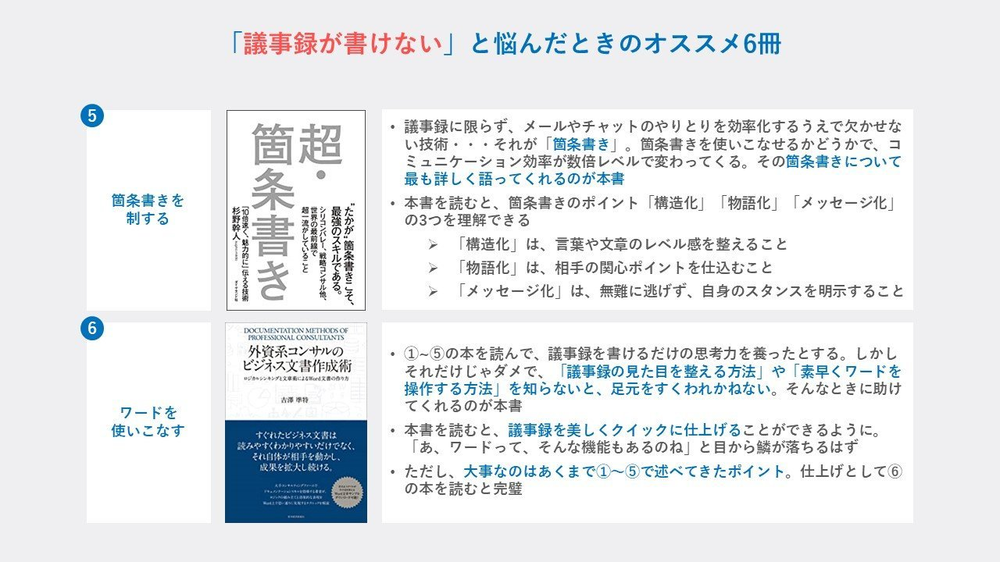

# Post by @ysk_motoyama on X
2026-08-11
「議事録が書けない」とお悩みの方に、オススメ本を6冊厳選。  
僕がコンサル時代、赤入れ無間地獄にハマったので…  
「当時の自分がどの本を読めば、定時に帰れたか」を議事録のパーツごとに考察しております。  
個別にオススメした方から「これは神チョイス」と言っていただき、選書自信アリです。 https://t.co/kv9afZg4gs

   

## 画像の内容

### 画像1
「議事録が書けない」と悩んだときのオススメ6冊というタイトルのもと、議事録作成に必要なスキルとおすすめ書籍の対応関係を図解したマップです。議事録作成で陥りがちな悩みと、それを解決するためのスキル・書籍の構成が視覚的に整理されています。

「議事録が書けない」と悩んだときのオススメ6冊

6 ワードを使いこなす
2 話を理解する + 3 わかりやすい文章を書く
4 論点をおさえる
5 箇条書きを制する
1 議事録に求められるレベルの全体像を知る

議事録を書くときのポイント
1. 議事録で陥りがちな失敗とは？
> 全部書こうとしすぎて、逆に書き漏らしてしまう
> 議論中の発言が理解できない
> X X X
2. 「議事録に求められるレベル」の全体像とは？
> X X X
> X X X
> X X X
3. 議事録のレベルごとに必要なスキルをどうやって身につければよいか？

### 画像2
「議事録が書けない」と悩んだときのオススメ6冊のうち、①「全体像を知る」と②「話を理解する」に対応する書籍2冊の紹介スライドです。『コンサルが最初の3年間で学ぶこと』と『「わかる」技術』の概要やおすすめポイントがまとめられています。

「議事録が書けない」と悩んだときのオススメ6冊

1
議事録に求められるレベルの全体像を知る

高松智史
仕事ができる人・できない人の差がつきやすい「打ち手」VS「ソリューション」
99のスキルと5の挑戦
コンサルが最初の3年間で学ぶこと
業界も業種も関係なく現場で使える武器
コンサル思考と作法を科学する
2度はできない「過ぎ去った3年間」の全てがここに！
ソシム

・「議事録の7段階のレベル」を知ることができる本。発言録のレベル（Lv1）→「話された内容」が構造化されている（Lv2）→次のタスクが書かれている（Lv3）→会議の「空気感」まで加味されている（Lv4）→「想定していた論点」ベースで構造化されている（Lv5）→「仮説の進化」に力点が置かれている（Lv6）→「ネクスト論点」までも書かれている（Lv7）・・・と、議事録のレベルを素敵に定義してくれている
・この全体像をふまえたうえで「自分はどのレベルにいるのか＝現在地」を知るところから、議事録マスターの旅がスタートする
・他にも、ビジネスパーソンに必要な本質スキルが記されている超良本

2
話を理解する

畑村式
「わかる」技術
畑村洋太郎
なぜ「わからない」のか
どうすれば「わかる」のか
「失敗学」「直観でわかる数学」の著者による
まったく新しい知的生産の技術
講談社現代新書

・「そもそも、“わかる・理解する”とはどういう状態なのか？」を深く理解できる一冊
・工学系研究科の教授で、失敗学を専門とされている方が次のことを解説してくれる
> 「なぜ授業の説明がわかりにくいのか」
> 例えば「うま味って何ですか？」と聞かれたとき、「うま味」を知らない人にどう教えたらいいのか？
・少し難易度が高い本だが、3周くらい読んでみると、「”わかる”の本質」が掴めてくる本

### 画像3
オススメ6冊のうち、③「わかりやすい文章を書く」と④「論点をおさえる」に対応する書籍2冊の紹介スライドです。『「文章術のベストセラー100冊」のポイントを1冊にまとめてみた。』と『論点思考』の解説が記載されています。

「議事録が書けない」と悩んだときのオススメ6冊

3
わかりやすい文章を書く

藤吉豊 小川真理子
「文章術のベストセラー100冊」のポイントを1冊にまとめてみた。
みんなが認めた「伝わる文章」の絶対ルール
シリーズ累計 19万部突破！
「プロの文章は、超シンプル！」
「書き出し」が苦手な人は、「フォーマット通り」に書けばいい！
メール・ビジネス文章 プレゼン・日報・SNS ブログ・ネット記事・論文… 「うまい人」のテクニックが、いっきに身につく！
サンクチュアリ出版

・文章術のベストセラー100冊の中から選ばれた「文章を書く上での大事なポイント ベスト40」がまとめられている
・中でも、100冊集めてわかった本当に大切な「7つのルール」は必ずマスターすべきである。個人的には、第7位の接続詞の使い方を読んだとき、「接続詞がなくても、意外と文意は伝わるものだ」と、目から鱗が落ちた
・本書に書かれていることを「脊髄反射レベル」で実施できるようになると、会議中にリアルタイムで超絶わかりやすい文章をスラスラ書けるようになる

4
論点をおさえる

THE BCG WAY: FINDING THE RIGHT ISSUE
issue
論点思考
BCG流 課題設定の技術
内田和成
東洋経済新報社
解説 仮説思考の著者が明かすコンサルタントの暗黙知
正しい論点で問題解決力が劇的に向上する
最も重要な問い＝問題へアプローチすること。成長するには「正しい問い」「正しい扱い」が重要だ。

・「問題解決力が高い人＝論点設定が上手い人」だと骨の髄まで思い知らせてくれる一冊。ビジネスでは「やらないこと（考えないこと）」を決めることが大事。何を考え、何を考えないのか・・・すべては「論点設定の腕」にかかっている。議事録においても、論点が一番大事
・論点設定について、以下のステップで解説されている。論点候補を洗い出す→論点を絞り込む→論点を確定する→全体像で確認する。それぞれのステップで求められる頭の使い方・方法論について、これ以上なくわかりやすく書かれている本
・論点を制するものは、議事録を制する。論点に沿って議事録を書けるようになるためにも、絶対に読んでおきたい一冊

### 画像4
オススメ6冊のうち、⑤「箇条書きを制する」と⑥「ワードを使いこなす」に対応する書籍2冊の紹介スライドです。『超・箇条書き』と『外資系コンサルのビジネス文書作成術』の内容と効果的な活用法がまとめられています。

「議事録が書けない」と悩んだときのオススメ6冊

5
箇条書きを制する

箇条書き
超・箇条書き
“たかが”箇条書きこそ、最強のスキルである。
シリコンバレー、戦略コンサル他、世界的最前線で超一流がしていること
「10倍速く、魅力的に」伝える技術
杉野幹人 ダイヤモンド社

・議事録に限らず、メールやチャットのやり取りを効率化するうえで欠かせない技術・・・それが「箇条書き」。箇条書きを使いこなせるかどうかで、コミュニケーション効率が数倍レベルで変わってくる。その箇条書きについて最も詳しく語ってくれるのが本書
・本書を読むと、箇条書きのポイント「構造化」「物語化」「メッセージ化」の3つを理解できる
> 「構造化」は、言葉や文章のレベル感を整えること
> 「物語化」は、相手の関心ポイントを仕込むこと
> 「メッセージ化」は、無難に逃げず、自身のスタンスを明示すること

6
ワードを使いこなす

DOCUMENTATION METHODS OF PROFESSIONAL CONSULTANTS
外資系コンサルのビジネス文書作成術
ロジカルシンキングと文章術によるWord文書の作り方
吉澤 準特
東洋経済新報社
すぐれたビジネス文書は読みやすくわかりやすいだけでなく、それ自体が相手を動かし、成果を拡大し続ける。
大手コンサルティングファームでドキュメンテーション講義を担当する著者が、ロジックの組み立てと効果的な表現をWord上でプロ並みに表現するテクニックを伝授！
WEBサンプルダウンロード付き

・①〜⑤の本を読んで、議事録を書けるだけの思考力を養ったとする。しかしそれだけじゃダメで、「議事録の見た目を整える方法」や「素早くワードを操作する方法」を知らないと、足元をすくわれかねない。そんなときに助けてくれるのが本書
・本書を読むと、議事録を美しくクイックに仕上げることができるように。「あ、ワードって、そんな機能もあるのね」と目から鱗が落ちるはず
・ただし、大事なのはあくまで①〜⑤で述べてきたポイント。仕上げとして⑥の本を読むと完璧
