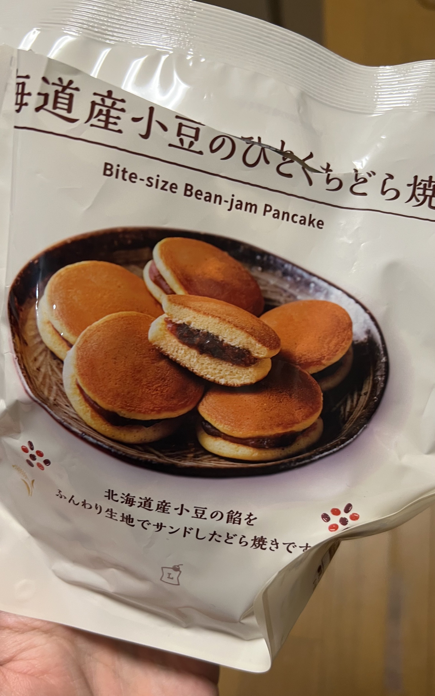

# Post by @master_mn on X
2026-08-11
巷で話題の長丁場の映画や舞台やライブの前に餅を食え！餅が食えないならどら焼きを食え！ってやつ、4時間越えのイベントで試してみたら頻尿世界王者決定戦に参加できるタイプの頻尿オタクなのに4時間1回もトイレ行きたくならなくて本当に効果あってすごかった  
これはローソンで買ったひとくちどら焼き https://t.co/VsxcFVDd9R

## 画像の内容

### 画像1
「北海道産小豆のひとくちどら焼」という商品のパッケージ写真です。皿に盛られた小さなどら焼きが複数写っており、中央のものは半分に割れて中身のあんこが見えています。

北海道産小豆のひとくちどら焼
Bite-size Bean-jam Pancake
北海道産小豆の餡をふんわり生地でサンドしたどら焼きです
