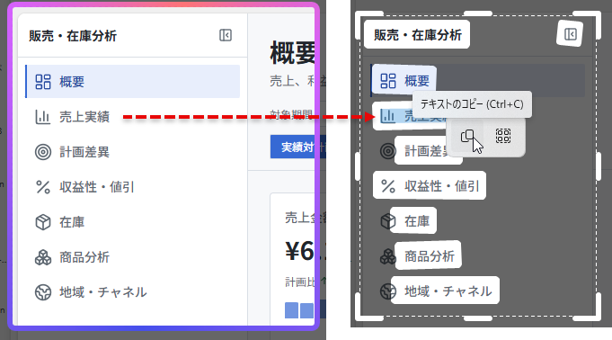

# Post by @marshal_dabao on X
2026-08-12
知らなかった……👀  
Teamsの共有画面や録画みたいな、普通はコピーできない内容でも、Win + Shift + T を使うとサクッとテキスト化できる。共有された英語スライドで「この文章大事だな」と思ったときに、そのまま日本語で理解したい時とかめちゃくちゃ便利🚀#MicrosoftTeams #Screenshot https://t.co/r1pyNQRMiF

## 画像の内容

### 画像1
Web画面のメニュー部分と、それを範囲選択してテキスト認識またはコピーを行っている様子を比較した画像です。

販売・在庫分析
概要
売上実績
計画差異
収益性・値引
在庫
商品分析
地域・チャネル
概要
売上実績
テキストのコピー (Ctrl+C)
計画差異
収益性・値引
在庫
商品分析
地域・チャネル
