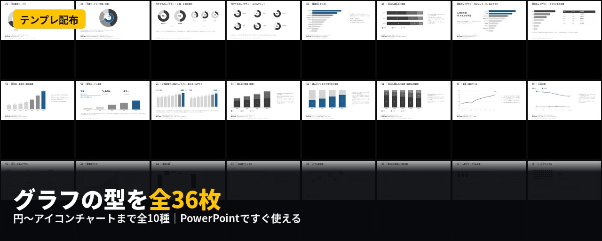
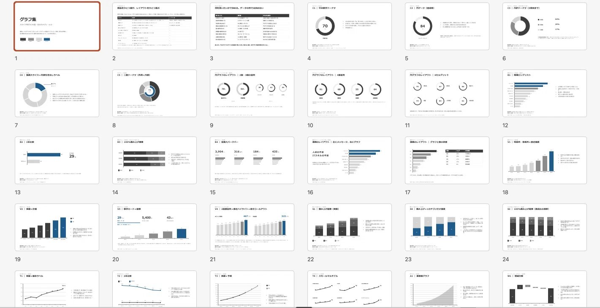

# 【テンプレ配布】グラフの型を全36枚にまとめました（円〜アイコンチャートまで全10種）
2026-08-12

円グラフのほとんどは、実は1枚の主役として使われていません。実例を分類していて気づいたことです。

今回、その分類結果をもとに、円〜アイコンチャートまで全10種・36枚のグラフテンプレートをPowerPointにまとめました。すべてネイティブグラフなので、右クリックからデータを編集すればそのまま自分の数字になります。

作るにあたって、「見やすいグラフの原則」を読むところからは始めませんでした。原則の解説はすでに大量にあります。凡例は近くに置く、色は使いすぎない、軸は0から始める。どれも正しいのですが、正しい話をもう一本増やしても仕方がない。

なので順番を変えて、**実際に世に出ているスライドを分類することから始めました。**

## 実例を分類する

使ったのは Slideland（[slideland.tech](https://x.com/fujikururi/status/slideland.tech)）です。会社紹介資料、決算説明資料、統合報告書、中期経営計画といった実物のスライドが、グラフの種類別に整理されています。

このカテゴリを開いて、こういう軸で1件ずつ見ていきました。

- 形状（円／ドーナツ／複数など）
- ラベルの付け方（凡例分離／直接ラベル／引き出し線）
- 項目数・色数
- 主役の有無

分類してみると、頭の中で「こういう型があるはず」と思っていたものと、実際に使われている形がずれていることが分かってきました。

いちばん大きかったのは、円グラフです。大きな円ひとつがスライドの主役になっているものは少数派で、多かったのは小さい円が2〜6個、数字や横棒と同居している構成でした。つまり円グラフは1枚の主役ではなく、**数字を支える部品**として置かれている。だから型も「円そのものの型（部品）」と「それをいくつどう並べるか（レイアウト）」の二層で持つことにしました。

この考え方は円グラフだけでなく、横棒・縦棒にも共通して見つかっています。詳しくは配布物の中で触れます。

## ルールの土台

見た目は、グレー3階調＋アクセント1色に統一しています。理由は単純で、グレーの濃淡で系列を見分けられるのは3段階が上限だからです。4系列目を足すと、隣り合う要素の差が読めなくなる。実際に作って確かめました。

構造のルールは、デジタル庁の「ダッシュボードデザインの実践ガイドブック」を下敷きにしています。ただしそのまま持ってくると事故ります。ダッシュボードには話者がいないので凡例を置くのが妥当ですが、スライドには話者がいて1枚1メッセージなので、凡例より直接ラベルの方が速い。同じ「正しさ」が場面によって逆を向くので、今回は構造だけ借りることにしました。

読み取り精度についての研究（Cleveland & McGillの1984年の実験など）も参考にしていて、人が図から数値を読み取る精度は「位置・長さ」が最も高く、「角度・面積」はそれより劣るという知見があります。円グラフより横棒の方が精度で勝るのはこのためで、テンプレートの中でも「これは横棒に逃がす」という判断の裏付けにしています。

## 配布するもの

ここからが本題です。36枚の中身を、カテゴリごとに紹介します。

**円グラフ（8枚）**

いちばん時間をかけたカテゴリです。部品は5つ。

- **中央数字ドーナツ**：比率をひとつだけ言うとき。中央の数字が主役で、円は「残りがある」ことを示す枠
- **円ゲージ**：達成率やスコアを複数並べるとき
- **内訳ドーナツ**：構成比が主題（3項目まで）
- **強調スライス**：1項目だけを外側の引き出しラベルで注記する型
- **二層ドーナツ**：外周と内側、ふたつの問いに1枚で答える型

これに加えて、レイアウトが4パターン（2個並列・3個並列・4個並列・6セルグリッド）。部品をひとつ選び、レイアウトをひとつ選ぶ、という組み合わせ方です。

**横棒グラフ（6枚）**

円グラフと役割がはっきり分かれています。円が「ひとつの比率」を言う型なら、横棒は「項目間の順位」を言う型。8〜15項目を降順で並べる型が最も多く実例にありました。100%積み上げ横棒、複数指標をまとめて見せる従属スパークバー、グラフと表を並べるレイアウトなども収録しています。

**縦棒グラフ（4枚）**

時系列の量を見せる用途に限定しています。単純な推移、実績から計画へ連続させる型、数字カードと組み合わせる型、そして2つの指標を並べて直近だけを強調する型です。

**積み上げ棒／100%積み上げ棒（3枚）**

このテンプレート集でいちばん制約が厳しい領域です。グレー3階調の縛りが最も効いてくるのが積み上げグラフで、実務では4〜5色を使う実例も多く見つかりました。そこで「主役は1系列だけ」という条件のときに絞って収録しています。全部を見せたい場合と、ひとつだけ強調したい場合は、そもそも設計が別物だという整理です。

**折れ線グラフ（4枚）**

単線、2本比較、実績と予測を1枚でつなぐ型、複数指標を並べて見せる型。2本比較は、凡例を別枠に置かず、グラフの左上に色ドットと名前を小さく添えるという実例の作法をそのまま反映しています。

**面グラフ（1枚）**

累積面グラフのみ収録。理由があって、Slidelandの面グラフカテゴリの中身の多くは、データの推移ではなく事業の成長イメージを三角形の層で表す概念図でした。用途が違うので、データに基づく面グラフだけに絞っています。

**ウォーターフォール（1枚）**

増減の要因分解。前期実績から当期実績まで、何が効いて増えたか減ったかを見せる型です。

**散布図（3枚）**

4象限マトリクス、バブル散布図、そして自社だけを強調した散布図。3つ目は、大量の他社データの中に自社の点だけ色を付けて浮かび上がらせる型です。

**アイコンチャート（2枚）**

人型ピクトグラムを反復させる型と、10×10のドットマトリクスで割合を面で見せる型です。

## 全部に共通していること

作り終えて振り返ると、円グラフの強調スライス、積み上げ棒の1カテゴリ強調、散布図の自社強調は、どれも同じ考え方でできています。**大量の要素をすべて同じ重みで見せるのではなく、グレーに沈めた背景の中に、言いたいことだけ色を残す。**

これは狙って全カテゴリに仕込んだわけではなく、実例を分類していくうちに、あちこちのカテゴリで同じ構図が出てきたので、テンプレート側もそれに合わせた結果です。

以下、メンバーシップの方向けに、実際のPowerPointファイル（36枚）を配布します。すべてネイティブグラフで、データはそのまま差し替えられます。

## 配布ファイルはこちら↓

[note：【テンプレ配布】グラフの型を全36枚にまとめました（円〜アイコンチャートまで全10種）](https://note.com/fuji_kururi/n/nd3f2da756a6d)

noteメンバーシップであれば、これまで紹介してきたプロンプトやGPTsは全て利用可能であり、今後も続々追加予定です！

ランチ1回分の値段で、スライド作りが確実にラクになります。

メンバーシップ：ふじくるりのAI学習室 [https://note.com/fuji\_kururi/membership](https://note.com/fuji_kururi/membership)

ぜひご検討ください。

## 画像の内容

### 画像1
PowerPointで使用できる様々なグラフのテンプレートスライドを一覧表示した画像です。下部には「グラフの型を全36枚」という黒地に白と黄色の大きな見出しテキストが配置されています。

テンプレ配布
C1 | 中央数字ドーナツ
C5 | 二重データ（外周＋内周）
円グラフのレイアウト | 2個・3個の並列
円グラフのレイアウト | 6セルグリッド
B1 | 降順ロングリスト
B3 | 100%積み上げ横棒
棒のレイアウト | 左にメッセージ、右にグラフ
人材の不足
ITスキルの不足
棒のレイアウト | グラフと表の併置
V1 | 時系列・単系列＋直近強調
V3 | 数字カード＋縦棒
29%
5,400人
43pt
V4 | 2種類直列＋直近ハイライト＋差分コールアウト
S1 | 積み上げ縦棒（実数）
S4 | 積み上げ＋1カテゴリだけ強調
S2 | 100%積み上げ縦棒（構成比の推移）
T1 | 単線＋端末ラベル
T2 | 2本比較
T4 | スモールマルチプル
A1 | 累積面グラフ
W1 | 増減分解
X1 | 4象限マトリクス
X2 | バブル散布図
X3 | 価格だけ強調した散布図
I1 | 人型ピクトグラム配列
I2 | ドットマトリクス
グラフの型を全36枚
円〜アイコンチャートまで全10種 | PowerPointですぐ使える

### 画像2
PowerPointのスライド一覧（一覧表示モード）をキャプチャした画像です。番号順に並べられた多数のグラフテンプレート用スライドのサムネイルが確認できます。

1
グラフ集
スライド作成ブログ「つの型・つのおがわ」v1.0

2
部品をひとつ選び、レイアウトをひとつ選ぶ

3
何を言いたいかで決める。データの型では決めない

4
C1 | 中央数字ドーナツ
70

5
C2 | 円ゲージ（達成率）
84

6
C3 | 内訳ドーナツ（3項目まで）

7
C4 | 強調スライス＋外側引き出しラベル

8
C5 | 二重ドーナツ（外周＋内周）

9
円グラフのレイアウト | 2個・3個の並列

10
円グラフのレイアウト | 4個並列

11
円グラフのレイアウト | 6セルグリッド

12
B1 | 降順ロングリスト

13
B2 | 2本比較
29%

14
B3 | 100%積み上げ横棒

15
B4 | 従属スパークバー
3,904 316 184 435

16
棒のレイアウト | 左にメッセージ、右にグラフ
人材の不足
ITスキルの不足

17
棒のレイアウト | グラフと表の併置

18
V1 | 時系列・単系列＋直近強調

19
V2 | 実績＋計画

20
V3 | 数字カード＋縦棒
29%
5,400人
43pt

21
V4 | 2種類直列＋直近ハイライト＋差分コールアウト

22
S1 | 積み上げ縦棒（実数）

23
S4 | 積み上げ＋1カテゴリだけ強調

24
S2 | 100%積み上げ縦棒（構成比の推移）

T1 | 単線＋端末ラベル
T2 | 2本比較
T3 | 実績＋予測
T4 | スモールマルチプル
A1 | 累積面グラフ
W1 | 増減分解
