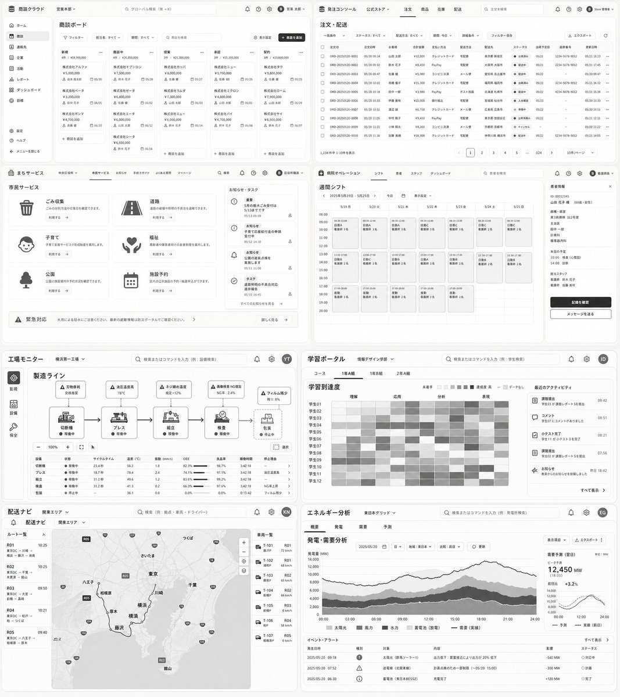
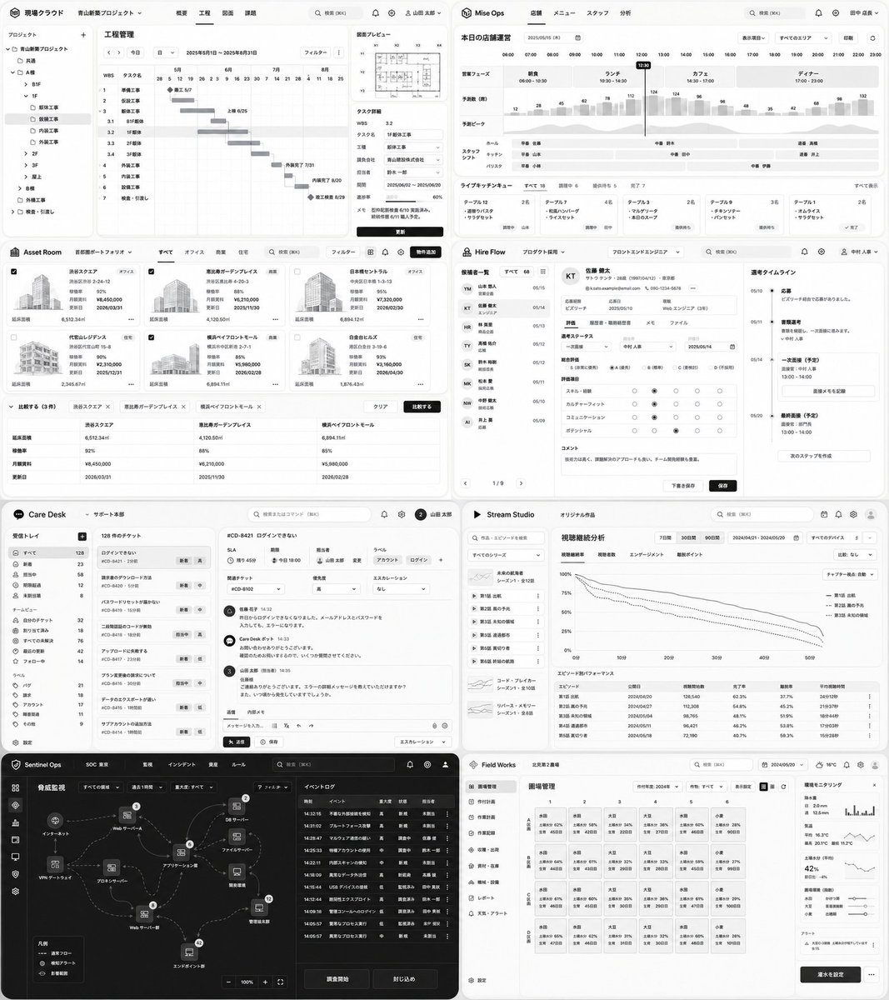

# Post by @dezainaz_ceo on X
2026-08-12
困った時に使える  
ダッシュボードのデザインレイアウト16選。 https://t.co/BU5j046Gcq

 

## 画像の内容

### 画像1
クラウド型の各種業務システム（営業管理、注文・配送管理、自治体サービス、病院シフト管理、工場監視、学習ポータル、配送管理、エネルギー分析など）のダッシュボードUIデザインが複数配置された画像です。さまざまな業種に対応したWebアプリケーションの画面構成やデザインレイアウトが一覧表示されています。

商談クラウド 営業本部 v Q グローバル検索 (⌘ + K) 発注コンソール 公式ストア v 注文 商品 在庫 配送 Q 注文を検索

商談ボード
ホーム 商談ボード フィルター 担当者：すべて v 期間：すべて v Q 商談を検索 表示設定 + 商談を追加
新規 4件 / ¥18,900,000
株式会社アルファ ¥5,000,000 山田 太郎 05/28
株式会社ベータ ¥3,200,000 田中 花子 06/05
株式会社ガンマ ¥4,700,000 佐藤 健 06/10
+ 商談を追加

商談中 4件 / ¥26,850,000
株式会社イプシロン ¥7,500,000 高橋 誠 05/28
株式会社ゼータ ¥6,600,000 山田 太郎 06/02
株式会社エータ ¥6,000,000 田中 花子 06/12
株式会社シータ ¥6,550,000 鈴木 花子 06/18

提案 3件 / ¥21,300,000
株式会社カッパ ¥8,000,000 佐藤 健 05/27
株式会社ラムダ ¥7,300,000 高橋 誠 06/03
株式会社ミュー ¥6,000,000 鈴木 花子 06/14
+ 商談を追加

承認 3件 / ¥25,200,000
株式会社ニュー ¥5,700,000 山田 太郎 05/28
株式会社ミクロン ¥4,800,000 山田 太郎 06/01
株式会社パイ ¥4,700,000 鈴木 花子 06/08
+ 商談を追加

契約 3件 / ¥23,600,000
株式会社タウ ¥9,800,000 高橋 誠 05/25
株式会社ローム ¥7,900,000 山田 太郎 05/29
株式会社サイ ¥6,900,000 鈴木 花子 06/07
+ 商談を追加

注文・配送
一括操作 v ステータス：すべて v 配送方法：すべて v 期間：今日 v 詳細条件 v フィルター保存 エクスポート
注文ID 注文日時 お客様名 合計金額 支払い方法 配送方法 配送先 ステータス 出荷予定日 追跡番号 更新日時
ORD-20250520-0001 05/20 09:14 山田 太郎 ¥12,800 クレジットカード 宅配便 東京都 新宿区 発送済み 05/21 1234-5678-9012 05/21 18:23
ORD-20250520-0002 05/20 09:32 鈴木 花子 ¥8,450 PayPay 宅配便 大阪府 大阪市 配送中 05/21 2354-5678-9012 05/21 17:45
ORD-20250520-0003 05/20 09:47 佐藤 健 ¥5,980 コンビニ決済 メール便 愛知県 名古屋市 配送中 05/22 - 05/20 09:47
ORD-20250520-0004 05/20 10:02 高橋 誠 ¥15,300 クレジットカード 宅配便 福岡県 福岡市 出荷準備中 05/21 3234-5678-9012 05/21 16:12
ORD-20250520-0005 05/20 10:18 田中 一郎 ¥3,960 PayPay ポスト投函 北海道 札幌市 配送中 05/22 4234-5678-9012 05/21 15:38
ORD-20250520-0006 05/20 10:33 伊藤 美咲 ¥22,000 銀行振込 宅配便 宮城県 仙台市 入金確認待 05/23 - 05/20 10:33
ORD-20250520-0007 05/20 10:51 渡辺 誠 ¥6,750 クレジットカード メール便 広島県 広島市 配送中 05/22 - 05/20 10:51
ORD-20250520-0008 05/20 11:05 中村 翔太 ¥9,450 PayPay 宅配便 東京都 世田谷区 発送済み 05/21 - 05/21 12:11
ORD-20250520-0009 05/20 11:21 小林 陽太 ¥4,300 コンビニ決済 メール便 京都府 京都市 キャンセル - - 05/20 11:22
ORD-20250520-0010 05/20 11:36 加藤 勇気 ¥18,900 クレジットカード 宅配便 神奈川県 横浜市 発送済み 05/22 5234-5678-9012 05/21 14:05
1,234件中 1-10件を表示 < 1 2 3 4 5 ... 124 > 10件/ページ v

まちサービス 中央区役所 v 市民サービス お知らせ 手続きガイド よくある質問 マイページ Q 検索 区役所職員 v
市民サービス
ごみ収集 ごみの分別方法や収集日を確認できます。 利用する ->
道路 道路の破損や照明の不具合を通報できます。 利用する ->
子育て 子育て支援サービスや助成制度をご案内します。 利用する ->
福祉 高齢者や障害者向けの支援制度をご案内します。 利用する ->
公園 公園の施設案内や予約状況を確認できます。 利用する ->
施設予約 区内の公共施設の予約・抽選手続ができます。 利用する ->
お知らせ・タスク
重要 5月の粗大ごみ受付は 5/13までです 05/13 09:00
お知らせ 子育て応援給付金の申請 受付中 05/12 14:30
お知らせ 公園の遊具点検を 実施します 05/11 11:00
タスク 道路照明の不具合対応 進捗報告 05/10 16:45
すべてのお知らせを見る ->
緊急対応 大雨による増水にご注意ください。最新の避難情報は防災ポータルでご確認ください。 詳しく見る ->

病院オペレーション シフト 患者 スタッフ ダッシュボード Q 患者を検索 看護師長 v
週間シフト
< 2025年5月19日 - 5月25日 > 今日 日 赤色設定 v
5/19 月 5/20 火 5/21 水 5/22 木 5/23 金 5/24 土 5/25 日
08:00
09:00 日勤A 日勤B 日勤C 日勤A 日勤B 日勤C 日勤A
10:00 看護師 3名 看護師 3名 看護師 3名 看護師 3名 看護師 3名 看護師 2名 看護師 2名
11:00
12:00
13:00 日勤B 日勤C 日勤A 日勤B 日勤C 日勤A 日勤B
14:00 看護師 2名 看護師 2名 看護師 2名 看護師 2名 看護師 2名 看護師 2名 看護師 2名
15:00
16:00
17:00 夜勤 夜勤 夜勤 夜勤 夜勤
18:00 看護師 2名 看護師 2名 看護師 2名 看護師 2名 看護師 2名
19:00
20:00
患者情報
ID: 000012345
山田 花子 様 (68歳・女性)
病棟・病室
東3病棟 312号室
主治医
田中 一郎
診療科
循環器内科
本日の予定
10:00 検査 (心電図)
14:00 診察
担当スタッフ
看護師 鈴木 花子
看護師 佐藤 勇気
記録を確認 メッセージを送る

工場モニター 横浜第一工場 v Q 検索またはコマンドを入力 (例 : 設備検索)
製造ライン
1 切断機 稼働中
2 プレス 稼働中
3 組立 稼働中
4 検査 稼働中
5 包装 停止中
▲ 刃物摩耗 交換推奨
▲ 油圧温度高 78℃
▲ ネジ締め温度 規定+12%
▲ 画像検査 NG増加 NG率 : 2.4%
▲ フィルム残少 残り : 8%
設備 状態 サイクルタイム 温度(℃) 振動(mm/s) OEE 良品率 稼働時間 停止理由
切断機 稼働中 23.4秒 56.2 1.8 82.3% 98.7% 3:42:18 - >
プレス 稼働中 18.7秒 78.4 2.4 74.1% 97.1% 3:42:18 油圧温度高 >
組立 稼働中 31.2秒 49.6 1.2 83.6% 99.2% 3:42:18 - >
検査 稼働中 31.2秒 41.3 0.2 66.3% 97.6% 3:42:18 NG率上昇 >
包装 停止中 - 36.1 0.0 0.0% 0.0% 0:15:42 フィルム残少 >

学習ポータル 情報デザイン学部 v Q 検索またはコマンドを入力 (例 : 学生検索)
コース 1年A組 1年B組 2年A組
学習到達度
理解 応用 分析 表現 未着手 達成度 高 データなし
学生01
学生02
学生03
学生04
学生05
学生06
学生07
学生08
学生09
学生10
学生11
学生12
最近のアクティビティ
課題提出 09:42 学生03が 課題レポート5を提出
コメント 08:51 学生07にコメントがありました
小テスト完了 08:21 学生11が小テスト3を完了
課題提出 07:56 学生02が 課題レポート5を提出
お知らせ 昨日 18:42 教員からのお知らせを投稿しました
すべて表示 >

配送ナビ 関東エリア v Q 検索 (例 : 拠点・車両・ドライバー)
ルート一覧 つくば さいたま 八王子 相模原 東京 千葉 川崎 横浜 厚木 藤沢 館山
R01 10:25 東京DC - 川崎 - 横浜DC - 藤沢 - 湘南
R02 10:25 東京DC - 千葉 - 木更津 - 館山
R03 09:50 東京DC - 大宮 - 前橋 - 高崎
R04 10:21 東京DC - 松戸 - 柏 - つくば
R05 09:40 東京DC - 八王子 - 相模原 - 厚木
車両一覧
T-101 富士 / 40t R01 72 km/h
T-102 浦和 / 10t R01 65 km/h
T-103 越谷 / 4t R02 65 km/h
T-104 前橋 / 2t R02 66 km/h
T-105 相模原 / 4t R03 0 km/h
T-106 柏 / 2t R04 58 km/h
T-107 相模原 / 2t R05 0 km/h

エネルギー分析 東日本グリッド v Q 検索またはコマンドを入力 (例 : 発電所検索)
概要 発電 需要 予測
発電・需要分析 2025/05/20 地域 : 東日本 v 比較 : 前日 v 更新
発電量 (MW)
14,000
12,000
10,000
8,000
6,000
4,000
2,000
0 00:00 03:00 06:00 09:00 12:00 15:00 18:00 21:00 24:00
太陽光 風力 水力 蓄電池 (放電) ― 需要 (実績)
表示項目 v エクスポート
需要予測 (翌日) 単位 : MW
ピーク予測 12,450 MW (15:00)
前日比 +3.2%
14,000
12,000
10,000
8,000
6,000 00:00 06:00 12:00 18:00 24:00
― 予測 --- 実績 (前日)
イベント・アラート すべて表示 >
発生日時 種別 対象 内容 影響 ステータス
2025/05/20 09:18 太陽光 (群馬ソーラー1) 出力低下 : 雲量接近により出力が 20% 低下 -540 MW 対応中
2025/05/20 07:52 送電線 (北関東線) 計画点検のため一部制限 (~05/20 15:00) -300 MW 計画無
2025/05/20 06:30 蓄電池 (東日本BESS2) 充電完了 +120 MW 完了

### 画像2
プロジェクト管理、店舗運営、不動産管理、採用管理、カスタマーサポート、動画配信アナリティクス、セキュリティ監視、農業管理など、多様なビジネス向けWebアプリケーションの管理画面UIデザインが並べられた画像です。ライトモードおよびダークモードを含む洗練されたインターフェース設計の事例が示されています。

現場クラウド 青山新築プロジェクト v 概要 工程 図面 課題 Q 検索 (⌘K) 山田 太郎 v Mise Ops 店舗 メニュー スタッフ 分析 Q 検索 (⌘K) 田中 店長 v

現場クラウド
プロジェクト + 工程管理
青山新築プロジェクト 2025年5月1日〜2025年8月31日 フィルター v
共通
B1F
1F
仮設工事
躯体工事
1.1 B1F躯体
3.2 1F躯体
3.3 2F躯体
3.4 3F躯体
4 外装工事
屋上
設備工事
内装工事
検査・引渡し
進捗度 60%
予定/実績 2025/06/02 〜 2025/06/20
メモ 型枠脱型検査 6/10 実施済み。鉄骨検査 6/11 導入予定。

Mise Ops
本日の店舗運営 2025/05/15 (木) 表示項目 v すべてのエリア v 印刷
営業フェーズ 朝食 06:00-10:30 ランチ 10:30-14:30 カフェ 14:30-17:00 ディナー 17:00-23:00
予測数 (席)
ピーク ホール キッチン パリスタ
ライブキッチンキュー すべて 18 調理中 6 提供待ち 5 完了 7 すべて表示
テーブル 12 2名 テーブル 7 4名 テーブル 3 2名 テーブル 9 3名 テーブル 1 2名
・週替りパスタ ・和風ハンバーグ ・マルゲリータ ・チキンソテー ・オムライス
・サラダセット ・ライスセット ・本日のスープ ・パンセット ・サラダセット

Asset Room 首都圏ポートフォリオ v すべて オフィス 商業 住宅 Q 検索(⌘K) フィルター 物件追加
渋谷スクエア オフィス 渋谷区渋谷 2-24-12 稼働率 92% 月額賃料 ¥8,450,000 更新日 2026/03/31
恵比寿ガーデンプレイス 商業 渋谷区恵比寿 4-20-3 稼働率 88% 月額賃料 ¥6,210,000 更新日 2025/11/30
日本橋セントラル オフィス 中央区日本橋 1-3-13 稼働率 95% 月額賃料 ¥7,320,000 更新日 2026/02/20
代官山レジデンス 住宅 渋谷区代官山町 15-8 稼働率 90% 月額賃料 ¥2,310,000 更新日 2025/12/31
横浜ベイフロントモール 商業 横浜市中区新港 2-7-1 稼働率 85% 月額賃料 ¥5,980,000 更新日 2026/02/28
白金台ヒルズ 住宅 港区白金台 3-19-6 稼働率 93% 月額賃料 ¥3,160,000 更新日 2026/04/30
v 比較する (3件) 渋谷スクエア x 恵比寿ガーデンプレイス x 横浜ベイフロントモール x クリア 比較する

Hire Flow プロダクト採用 v フロントエンドエンジニア v Q 検索 (⌘K) 中村 人事 v
候補者一覧 すべて 68
佐藤 健太 サトウ ケンタ 28歳 (1997/04/12)・東京都
選考タイムライン
10/10 ● 応募 ビズリーチ経由で応募がありました。
05/11 ● 書類選考 書類選考を通過し、一次面接に進みます。 v 中村 人事
05/14 ▲ 一次面接 (予定) 面接官：中村 人事 13:00 - 14:00 面接メモを記録
05/20 ▲ 最終面接 (予定) 面接官：部門長 13:00 - 14:00
選考ステータス 一次面接 (調整中) 中村 人事 2025/05/14
総合評価 S (非常に優秀) A (優秀) B (適性あり) C (検討) D (不採用)
評価項目 スキル・経験 カルチャーフィット コミュニケーション ポテンシャル
コメント 技術力は高く、課題解決のアプローチも良い。チーム開発経験も豊富。

Care Desk v サポート本部 Q 検索またはコマンド (⌘K) 2 山田 太郎
受信トレイ 128 件のチケット
#CD-8421 ログインできない
SLA 残り 45分 期日 今日 18:00 担当者 山田 太郎 変更 ラベル アカウント ログイン +
関連チケット 優先度 高 エスカレーション なし
佐藤 花子 14:32 昨日からログインできなくなりました。メールアドレスとパスワードを入力しても、エラーになります。
Care Desk ボット 14:33 お問い合わせありがとうございます。ご連絡の確認ができるまで、しばらくお待ちください。
山田 太郎 (担当者) 14:35 ご連絡ありがとうございます。エラーの詳細メッセージを教えていただけますでしょうか？また、いつ頃から発生しているでしょうか。
メッセージを入力... 送信 エスカレーション v

Stream Studio オリジナル作品 Q 検索 (⌘K)
視聴継続分析 7日間 30日間 90日間 2024/04/21 - 2024/05/20 すべてのデバイス
視聴継続率 視聴者数 エンゲージメント 離脱ポイント 比較 : なし v
第1話 旅立ち 第2話 風の予兆 第3話 未知の領域 第4話 遭遇者たち 第5話 裏切り者 第6話 終局の決戦
エピソード別パフォーマンス
エピソード 公開日 視聴開始数 完了率 離脱率 平均視聴時間
第1話 旅立ち 2024/04/20 128,540 62.3% 37.7% 24分12秒
第2話 風の予兆 2024/04/27 112,308 54.8% 45.2% 21分37秒
第3話 未知の領域 2024/05/04 98,765 48.1% 51.9% 18分44秒
第4話 遭遇者たち 2024/05/11 96,421 46.2% 53.8% 17分03秒
第5話 裏切り者 2024/05/18 72,190 40.7% 59.3% 15分28秒

Sentinel Ops SOC 東京 監視 インシデント 資産 ルール Q 検索 (⌘K)
脅威監視 すべての領域 v 過去1時間 v 重大度 : すべて v フィルター イベントログ
時刻 イベント 重大度 状態 担当者
14:32:15 不審な外部接続を検知 高 未割り当て -
14:31:02 ブルートフォース攻撃 高 未割り当て -
14:28:47 マルウェア送信の疑い 中 調査中 佐藤 健
14:25:33 特権アカウントの作成 中 調査中 鈴木 一郎
14:22:11 内部スキャンの検知 低 解決済み 中村 翔太
14:18:09 異常なデータ排出 高 調査中 高橋 誠
14:15:44 USBデバイスの接続 低 監視済み 田中 勇気
14:12:44 脆弱性エクスプロイト 高 調査中 山田 太郎
14:09:18 管理コンソールへのログイン 低 監視済み 田中 勇気
14:05:57 異常なプロセス実行 低 処理済み 永井 健太
14:05:57 異常なプロセス実行 中 未割り当て -
凡例 被害フロー 検知アラート 影響範囲 調査開始 閉じ込め

Field Works 北関東第2農場 Q 検索 (⌘K) 2024/05/20 v 16℃ ⛅
圃場管理 作付年度 : 2024年 v 作物 : すべて v 表示設定 v
1 水田 生育 45日目 水深 62%
2 水田 生育 42日目 水深 58%
3 大豆 生育 22日目 水深 34%
4 大豆 生育 27日目 水深 36%
5 水田 生育 46日目 水深 60%
6 小麦 生育 90日目 水深 28%
環境モニタリング
日照時間 2.0 mm 12.5 mm
気温 平均 16.3℃ 最高 20.1℃ 最低 11.2℃
土壌水分 (平均) 42% 前日比 -4%
圃場環境 (現在) 水田 かんまつ風 大豆 適時 小麦 出穂期
アラート A型台風の接近が予定されています 9:15 灌水を設定
