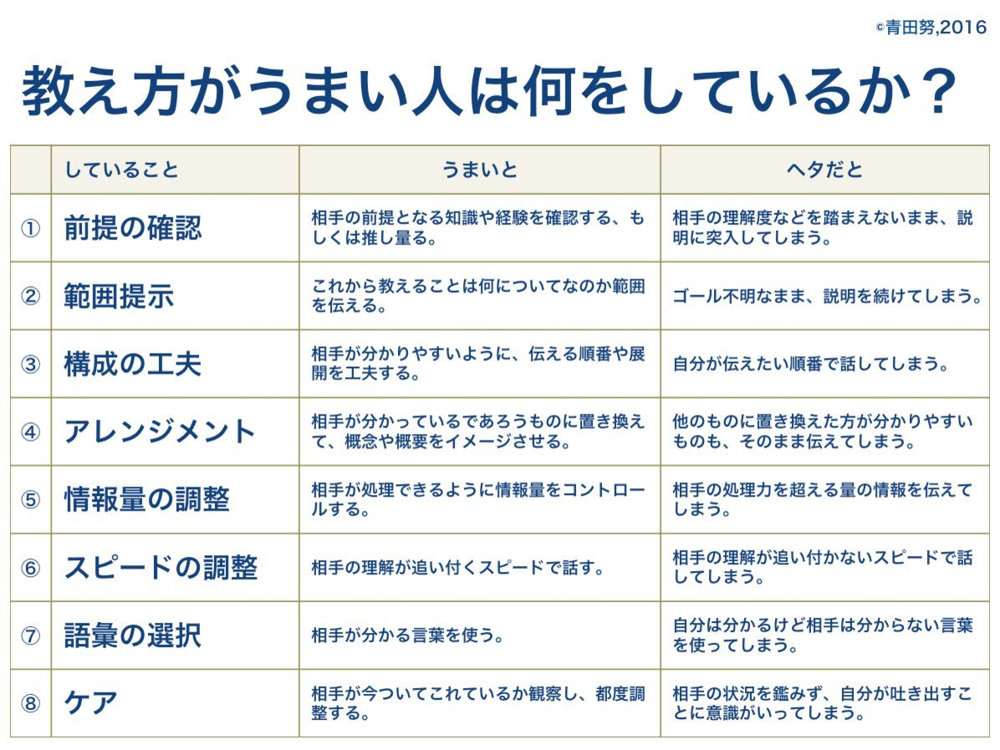

# Post by @MacopeninSUTABA on X
2026-08-12
【社会人必見】

「教え方が上手い人の考え方」が学べます https://t.co/S2MI13HR0B

## 画像の内容

### 画像1
教え方がうまい人とヘタな人の特徴を8つの項目に分け、表形式で比較・解説した画像。

©青田努,2016

教え方がうまい人は何をしているか？

していること
うまいと
ヘタだと

① 前提の確認
うまいと：相手の前提となる知識や経験を確認する、もしくは推し量る。
ヘタだと：相手の理解度などを踏まえないまま、説明に突入してしまう。

② 範囲提示
うまいと：これから教えることは何についてなのか範囲を伝える。
ヘタだと：ゴール不明なまま、説明を続けてしまう。

③ 構成の工夫
うまいと：相手が分かりやすいように、伝える順番や展開を工夫する。
ヘタだと：自分が伝えたい順番で話してしまう。

④ アレンジメント
うまいと：相手が分かっているであろうものに置き換えて、概念や概要をイメージさせる。
ヘタだと：他のものに置き換えた方が分かりやすいものも、そのまま伝えてしまう。

⑤ 情報量の調整
うまいと：相手が処理できるように情報量をコントロールする。
ヘタだと：相手の処理力を超える量の情報を伝えてしまう。

⑥ スピードの調整
うまいと：相手の理解が追い付くスピードで話す。
ヘタだと：相手の理解が追い付かないスピードで話してしまう。

⑦ 語彙の選択
うまいと：相手が分かる言葉を使う。
ヘタだと：自分は分かるけど相手は分からない言葉を使ってしまう。

⑧ ケア
うまいと：相手が今ついてこられているか観察し、都度調整する。
ヘタだと：相手の状況を鑑みず、自分が吐き出すことに意識がいってしまう。
